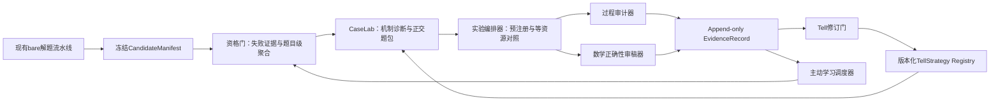

# 387号 · 非特化证据工厂——持续POC与高维正交验证系统设计

**日期**：2026-08-13

**状态**：持续设计稿；总体架构、核心数据模型、高维分类学覆盖方案、CaseLab出题协议、因果实验矩阵、过程审计/数学Judge及Tell学习与版本晋级已经用户批准；运行与验收方案尚待确认。

**文档性质**：Tell非特化研究的正式设计载体；本文件只记录设计，不启动Solver、不修改系统代码、不写数据库。

**前置文档**：277、278、280、283、372、373、380、381、382、383、385、386号。

**目标读者**：继续设计、实现或审计“长期运行的Tell非特化POC系统”的Master Agent与研究审计AI。

---

## 0. 一句话结论

本轮不再做一次孤立的“bare失败→给Hint→成功”实验，而是设计一个独立、可持续运行的**非特化证据工厂**：它从现有海量bare解题流水线接收冻结证据，围绕一个版本化TellStrategy构造高维正交题包与因果对照实验，生成不可覆盖的EvidenceRecord，再通过受控修订门反哺TellCore、HintRenderer、选择器、数学分类学和下一轮题包。

首条golden slice已经确定为：

```text
目标Tell家族：局部—全局表示切换
总体架构：独立证据工厂 + 冻结CandidateManifest
自动化边界：自动生产证据，门控Tell晋级
第一阶段目标：走通一条端到端golden slice，不同时铺开多个Tell家族
```

---

## 1. 本轮目标、边界与成功含义

### 1.1 真正目标

目标不是尽快积累“给提示后做出来”的漂亮案例，而是建立一条长期、可证伪、可重复、可审计的研究闭环：

```text
真实bare失败池
  → 失败证据复核与题目级聚合
  → 推理失败机制诊断
  → TellCore选择或候选生成
  → 正迁移/正交/假朋友/边界/诱饵/回归题包
  → 等资源、可归责的因子实验
  → thinking过程审计与数学正确性审稿
  → EvidenceRecord
  → TellStrategy版本修订
  → 主动选择下一批最有信息量的题
```

这条闭环要持续证明或反驳以下命题：

> Devin中的目标Solver在冻结的bare条件下不能稳定完成题目Q；在控制资源、重启、提示长度、脉络继承、人工选择和答案泄漏之后，一个非题目特化的TellCore经适当Renderer与当前失败脉络绑定，能够可重复地改变预期推理过程，并提高获得正确证明或关键进展的概率；在机制破坏负例上，该Tell又能够拒绝、退出或被反例修订。

### 1.2 第一阶段边界

第一阶段只验证一个Tell家族，不同时铺开26种思维力或全部Tell分类：

```text
局部—全局表示切换
```

选择它的原因：

1. 382号已经形成CasePack v0与22道CaseCard；
2. 383号已经完成候选C的字段消融与最小充分字段集；
3. 1631、1843、1709、1962已有历史bare与引导证据；
4. 1962提供了“方向正确但缺操作路径仍失败”的关键反例；
5. 该家族的过程信号清楚，便于观察模分析、p-adic赋值、表示切换和局部结论回升全局的过程。

第一阶段虽然只跑一个golden slice，但架构和数据对象必须对其他Tell家族通用，不能把“模p”“p-adic”等具体内容硬编码为系统结构。

### 1.3 自动化边界

采用“自动生产、门控晋级”：

- 系统可以自动发现失败候选、冻结证据、生成候选正交题、编排Solver、抽取过程信号并形成EvidenceRecord草稿；
- 数学正确性、机制是否保持、正交性是否成立、证据能否支持目标主张，必须经过独立审计；
- TellStrategy的`tested`、`restricted`、`validated`、`retired`状态不得由单一自动评分直接决定；
- 自动系统只能形成`RevisionProposal`，不能静默覆盖TellCore或分类学本体。

### 1.4 当前明确不做

本设计阶段不做以下工作：

- 不启动任何Devin Solver；
- 不修改现有Feeder、Runner、Collector、Reporter；
- 不把当前DB verdict直接当作题目级bare能力事实；
- 不直接更新Tell分类学v3本体；
- 不把旧POC局部PASS升级为端到端PASS；
- 不追求第一轮覆盖全部数学分支或全部Tell家族。

---

## 2. 历史证据的必要校准

### 2.1 277→278→280→283号究竟证明了什么

277号提出的强命题是：**同一个具体hint**应当能在题面、领域、对象、符号和解题步骤99%不同、仅在“hint这个点”相关的题上发挥作用。

278号把该命题操作化为五项判据，并设计A/B/C三组：

- A：bare；
- B：题目特定知识hint；
- C：两道题使用完全相同的“把问题翻译到另一种数学语言”hint文本。

280号在真正的奥赛难题上给出了负结果：同8道bare失败题中，knowledge为2/8，highlevel为1/8；唯一highlevel成功没有体现目标“翻译语言”过程。因此280号支持的是：

> 静态、一次性、抽象的同文本hint不足以证明非特化指导力。

283号给出了重要但较弱、也更工程化的阳性证据：

- 1843使用T01模算术；
- 1631使用T03二次剩余；
- 两个成功案例共享“翻译/表示切换”家族，但不是同一个具体HintInstance；
- tree组同时改变了失败脉络、题目特定方向、新AI实例和新增token预算；
- 方向仍是人工匹配；
- 没有`lineage only`或“等资源重启但无Tell”的控制臂。

所以283号最准确的证据表述是：

> “从失败thinking提取的脉络 + 人工匹配的题目化方向 + 运行时HintInstance”在3道精选bare失败题上取得2次成功，并且成功proof使用了目标方向；它初步支持完整引导包的可行性，但没有隔离TellCore、Renderer、lineage、人工选择、重启与新增预算各自的因果贡献。

因此，386号中“277号强命题已经检验通过”的表述需要在后续修订时降级为“工程化弱命题的初步阳性证据”。本文件后续实验设计必须补上缺失的因果控制。

### 2.2 token上限失败不能直接作为Tell成功证据

`failed_token_limit`是高价值候选来源，因为它往往拥有最长、最完整的thinking。但它同时是最容易制造伪因果的失败类型：

```text
bare AI耗尽25000 completion tokens
  → 启动新AI继续
  → 新AI获得新的token窗口
  → 最终成功
```

如果新AI同时获得Tell，不能仅凭成功把增益归给Tell。token上限题至少需要：

```text
同样脉络 + 同样重启 + 同样新增预算 + 无Tell
```

作为资源对照。只有目标Tell臂相对这个对照产生额外过程变化或结果增益，才能讨论Tell贡献。

### 2.3 attempt verdict不等于problem-level bare结论

`devin_problem_runs`一条记录代表一次attempt。相同`problem_id`可能有多个`exp_id`，也可能先因基础设施失败、后重试成功。正确顺序必须是：

1. 查询attempt；
2. 按`problem_id`聚合；
3. 复核物理证据；
4. 排除任何经过正确性审计的bare成功；
5. 再形成题目级baseline。

单次失败只能进入候选池，不能直接写成“Devin做不出来”。强因果POC原则上需要多次独立bare失败或明确标记其baseline不确定性。

### 2.4 当前数据接口与证据读取的已知缺口

只读审计发现以下问题，后续实现必须先解决：

1. `system/db.py`尚无针对`devin_problem_runs`和`problem_extraction_progress`的严格只读、题目级聚合接口；
2. 现有查询脚本直接连接ArangoDB，与项目“数据库操作统一通过system/db.py”的硬约束不一致；
3. Collector、380号、AGENTS.md、`build_profile.py`对部分verdict的模型/基础设施归类不完全一致；
4. 当前ATIF中主要thinking可能在`reasoning_content`，不是`agent.message`；
5. `candidate_solved`只表示存在类似proof的输出，不等于数学证明已经正确；
6. Redis失败队列是运行队列，不是长期历史真相；
7. 跨数据集同题异文、目标题与Tell来源题的语义重复尚需专门隔离。

这些缺口决定了证据工厂必须使用冻结manifest，而不能直接消费即时Redis或未经聚合的DB标签。

---

## 3. 已批准的设计决策

| 决策 | 已批准内容 | 理由 |
|---|---|---|
| 第一阶段形态 | 完整长期架构 + 单Tell家族golden slice | 同时保证科学闭环与可实施性 |
| 首条Tell家族 | 局部—全局表示切换 | 复用382/383号与历史强证据题 |
| 自动化边界 | 自动生产、门控晋级 | 兼顾不眠运行与证据可信度 |
| 总体架构 | 独立证据工厂 | 不污染生产解题流水线，便于审计与演进 |
| 系统接口 | 冻结CandidateManifest | 固定输入、环境、证据路径与哈希 |
| 原始证据策略 | append-only | 负结果、替代解释与旧版本均不可覆盖 |
| 运行方式 | 可恢复状态机 | 支持长时间运行、中断恢复和幂等重放 |

---

## 4. 总体架构（已批准）

### 4.1 架构图



### 4.2 七个逻辑组件

#### A. Snapshot Exporter

从现有生产系统读取题目与attempt证据，生成不可变`CandidateManifest`。它不负责判断Tell是否适用，也不修改原始运行状态。

#### B. Eligibility Gate

完成attempt→problem聚合、证据完整性检查、失败规范化、基础设施排除、重复题隔离与bare基线定级。

#### C. CaseLab

完成推理失败机制诊断、Tell适用性初审、同构之桥角色映射与证据题包构造。它产出的不是单道“新题”，而是一组带正负关系的CaseFamily。

#### D. Experiment Orchestrator

冻结实验计划、分配干预臂与相同资源预算，并且只通过`solver_harness`启动Solver。它不得在看到结果后改变题目角色或增删对照。

#### E. Process Auditor与Proof Judge

Process Auditor判断trigger、参数绑定、目标认知动作、进展信号、退出或让位是否发生；Proof Judge独立判断最终数学证明。二者分权，防止“结果正确”掩盖过程未采用Tell，或“过程看似正确”掩盖证明错误。

#### F. Evidence Ledger与Revision Gate

Evidence Ledger只追加EvidenceRecord。Revision Gate把多条证据聚合为修订建议，经审计后才允许改变TellStrategy状态与版本。

#### G. Active-learning Scheduler

优先选择最能区分相邻Tell假设、填补分类学覆盖空格、验证边界或复查模型漂移的下一批题，而不是单纯选择最可能成功的题。

### 4.3 三条隔离边界

1. **生产隔离**：POC结果不回写生产流水线的原始bare记录和Redis运行队列。
2. **答案隔离**：Selector、Hint生成器与Solver不可见目标题答案/标准解答；答案只在隔离的Judge阶段开放。
3. **晋级隔离**：自动评分不能直接改变TellCore或分类学本体，只能提出RevisionProposal。

---

## 5. 核心数据模型（已批准）

### 5.1 最小科学单位

最小科学单位不是“一道题”，而是：

```text
TellStrategy版本
× CaseCard
× 干预条件
× 资源契约
× 重复次数
```

这保证相同题目在不同Tell版本、不同Renderer、不同注入位置或不同预算下的结果不会被压成一个模糊PASS/FAIL。

### 5.2 核心对象

| 对象 | 唯一职责 |
|---|---|
| `CandidateManifest` | 冻结候选题、bare运行环境和物理证据 |
| `BareBaseline` | 将同题多个attempt聚合为题目级能力基线 |
| `CaseCard` | 描述题目角色、机制、分类坐标、正交变化与预期行为 |
| `CasePack` | 围绕一个TellCore冻结完整正负证据包 |
| `ExperimentPlan` | 预注册干预臂、资源、重复、过程信号与判定规则 |
| `TellCore` | 表示非特化后学到的认知策略内核 |
| `HintRenderer` | 定义如何按Solver、位置和强度渲染TellCore |
| `HintInstance` | 当前题、当前脉络、当前预算下实际注入的提示 |
| `EvidenceRecord` | 记录一次实验支持、反驳或不能支持什么 |
| `RevisionProposal` | 基于证据提出版本修订，不直接覆盖正式Tell |

### 5.3 CandidateManifest最小字段

```yaml
CandidateManifest:
  manifest_id:
  version:
  frozen_at:
  problem:
    problem_id:
    normalized_statement_hash:
    semantic_duplicate_cluster:
    source_dataset:
    taxonomy_coordinate:
    statement_ref:
  bare_contract:
    model:
    prompt_hash:
    tool_policy:
    token_budget:
    time_budget:
    solver_harness_version:
    code_commit:
  attempts:
    - exp_id:
      raw_status:
      raw_verdict:
      normalized_verdict:
      completion_tokens:
      runtime_seconds:
      evidence_paths:
      evidence_hashes:
  isolation:
    source_tell_overlap_check:
    answer_leakage_check:
    sealed_solution_ref:
  eligibility:
    baseline_status:
    confidence:
    exclusion_reasons:
```

`sealed_solution_ref`只允许Proof Judge访问。给Selector、Hint生成器和Solver的视图中不得出现答案或标准解答。

### 5.4 BareBaseline的两个正交轴

BareBaseline必须同时记录：

#### 终止原因轴

- token上限；
- thinking超时；
- 主动放弃；
- session结束但无proof；
- 输出停滞；
- 基础设施失败；
- 无效运行。

#### 推理失败机制轴

- 根分叉方向选择错误；
- line上存在分叉但AI未分叉；
- 已选正确方向但不知道操作路径；
- 方向和操作正确但计算无法收敛；
- 纯知识缺口；
- 证明核验或表达失败；
- 暂时无法从证据中判定。

两个轴不能互相替代。例如`failed_token_limit`只描述终止原因；它可能对应错误路线反复追逐，也可能对应正确路线尚未写完。

### 5.5 题目级资格状态

```text
stable_cognitive_failure
probabilistic_failure
resource_exhaustion
infrastructure_invalid
inconclusive
```

- `stable_cognitive_failure`：有足够独立bare证据，且失败机制可诊断；
- `probabilistic_failure`：同题有成功有失败，适合估计增量效应但不能声称“默认不会”；
- `resource_exhaustion`：主要证据是token或时间预算耗尽，必须使用等资源续跑控制；
- `infrastructure_invalid`：限流、连接、启动、export或工具政策等使运行无效；
- `inconclusive`：证据不足或相互矛盾。

### 5.6 状态机

```text
DISCOVERED
  → EVIDENCE_VERIFIED
  → BASELINE_CLASSIFIED
  → MECHANISM_REVIEWED
  → CASEPACK_FROZEN
  → PREREGISTERED
  → RUNNING
  → JUDGED
  → EVIDENCE_RECORDED
  → REVISION_PROPOSED
  → PROMOTED / RESTRICTED / REJECTED / RETIRED
```

任何阶段都可以进入`QUARANTINED`，但不能静默删除。每次状态转移必须记录：

- 操作者或服务；
- 精确时间；
- 输入对象ID与哈希；
- 输出对象ID与哈希；
- 判定理由；
- 使用的规则版本；
- 是否需要人工审计。

### 5.7 append-only原则

以下内容永不原地覆盖：

- 原始attempt证据；
- 旧Tell版本；
- 负EvidenceRecord；
- 替代因果解释；
- 被拒绝的RevisionProposal；
- 题目角色冻结记录；
- 分类学坐标的历史版本。

修订通过新版本和显式supersedes关系表达。这样才能审计Tell为什么被放宽、收窄、拆分、合并或退休。

---

## 6. 高维数学分类学与正交覆盖张量（已批准）

### 6.1 为什么不能只按“数学领域”做正交

“一道数论题迁移到一道代数题”只能说明题面跨了大领域，不能证明深层机制相同。反过来，两道都属于数论的题，也可能在对象、表示、操作、量词结构和证明证书上高度正交。

因此，本系统不把“正交”压成一个领域标签或单一相似度分数，而是同时建立三个相互独立的坐标系：

```text
数学内容坐标：题目在研究什么
解题机制坐标：题目怎样迫使认知转向
实验干预坐标：系统究竟改变了什么
```

三套坐标分开存储、联合查询。只有这样才能区分：

- 表面距离高、机制保持的正迁移；
- 表面很像、机制已经破坏的假朋友；
- 机制保持，但实验同时增加资源造成的伪Tell增益。

### 6.2 数学内容坐标

数学分支必须是**层级、多标签**结构，不能把一道题强制压入唯一叶节点。

```yaml
MathematicalContentCoordinate:
  taxonomy_version:
  primary_branch_path:
    - top_domain
    - branch
    - subbranch
  auxiliary_branch_paths: []
  task_type:
  object_types: []
  relation_types: []
  quantifier_shape:
  given_representation:
  target_representation:
  legal_operations: []
  target_form:
  certificate_type:
  source_tags: []
  classification_confidence:
```

各字段回答不同问题：

| 维度 | 例子 | 作用 |
|---|---|---|
| 分支路径 | 数论→初等数论→同余；代数→交换代数→局部化 | 衡量领域与子领域迁移 |
| task type | 证明、构造、分类、存在性、极值、求值 | 防止把任务形态差异误当领域差异 |
| object type | 整数、群、多项式、图、几何配置、函数空间 | 衡量对象外壳变化 |
| relation type | 整除、同余、邻接、序、度量、同构 | 记录真正参与机制的关系 |
| quantifier shape | 全称、存在、唯一、极值、对抗量词 | 揭示证明策略的逻辑骨架 |
| representation | 全局整数式、模p、p-adic、图表示、线性表示 | 记录表示切换发生在哪里 |
| legal operation | 取模、局部化、取商、对偶、投影、归约 | 区分“同名方法”下的真实操作 |
| certificate type | 矛盾、不变量、势函数、局部障碍、构造见证 | 衡量证明完成方式 |

`primary_branch_path`表示题目的主要数学落点；`auxiliary_branch_paths`记录解答真正调用的其他领域。一道“代数题通过模算术解决”的题，题面主分支与解答辅助分支必须同时保留，不能只标成“代数”或“数论”。

### 6.3 解题机制坐标

数学内容坐标描述“题是什么”；解题机制坐标描述“题怎样制造认知困难、目标Tell怎样解除困难”。

```yaml
MechanismCoordinate:
  natural_entry:
  natural_entry_why_attractive:
  failure_mechanism:
  branch_location: root | point | non_local | global
  hidden_structure:
  target_cognitive_action:
  expected_progress:
  proof_topology:
  completion_certificate:
  tell_taxonomy_coordinate:
  observation_level:
  mechanism_confidence:
```

这里必须继续区分两件事：

- Tell分类学位置是Tell的固有属性坐标；
- `local/non_local/global`是观察trace的Level参数，不是Tell固有属性。

这遵守当前Tell分类学v3的核心修正，不重新把观察方式混入Tell本体。

### 6.4 实验干预坐标

实验干预坐标专门记录一次运行改变了什么：

```yaml
InterventionCoordinate:
  bare_failure_stratum:
  case_role:
  tell_core_version:
  renderer_version:
  hint_instance_id:
  lineage_mode:
  injection_position:
  operation_path_level:
  restart_policy:
  token_budget:
  time_budget:
  solver_model:
  repetition_index:
```

把该坐标独立出来，可以防止把以下组合笼统写成“给了Tell”：

```text
换了新AI
+ 增加了token
+ 给了父节点脉络
+ 人工选中了正确方向
+ 给了题目化操作路径
```

每一项都必须能够成为对照因子或明确标注为本轮未隔离的混杂。

### 6.5 正交向量与机制关系必须分离

每一对源题—目标题都记录一个向量，而不是“99%不同”这种不可复查的总分：

```yaml
OrthogonalityVector:
  branch_distance:
  object_distance:
  representation_distance:
  operation_distance:
  quantifier_distance:
  proof_topology_distance:
  certificate_distance:
  lexical_distance:

MechanismRelation:
  status: preserved | partially_preserved | broken | unknown
  preserved_roles: []
  changed_roles: []
  broken_roles: []
  source_to_target_mapping: []
  justification:
  reviewer_confidence:
```

距离字段使用有序等级或可审计规则，不强行伪装成精确连续数值。任何`unknown`都必须作为覆盖缺口保留，不能为了填表追认为`preserved`。

### 6.6 四种核心Case关系

| Case关系 | 表面/内容距离 | 机制关系 | 预期系统行为 |
|---|---|---|---|
| 正迁移/正交题 | 中到高 | preserved | 选择并执行Tell |
| 假朋友 | 低或中，故意制造相似 | broken | 拒绝、降权或由critic拦截 |
| 最小边界题 | 只改变一个机制承载条件 | partially_preserved或broken | boundary、abstain或及时终止 |
| 无关/诱饵题 | 任意 | broken或不适用 | abstain，不制造负迁移 |

回归题不是第五种机制关系，而是从上述历史Case中抽出的固定测试集，用于检验Tell修订是否误伤旧正例、旧负例和旧边界。

### 6.7 覆盖张量

证据覆盖空间定义为：

```text
TellStrategy版本
× 迁移距离
× Case角色
× bare推理失败机制
× 干预条件
× Solver模型范围
```

对应的最小索引对象是：

```yaml
CoverageCell:
  tell_strategy_version:
  transfer_band:
  case_role:
  bare_failure_mechanism:
  intervention_family:
  solver_scope:
  case_ids: []
  evidence_ids: []
  coverage_status: empty | designed | frozen | run | supported | contradicted | inconclusive
  confidence:
  next_information_need:
```

“全相度”不等于暴力跑完整笛卡尔积。完整笛卡尔积会造成组合爆炸，也会生成大量数学上不自然的假题。第一阶段使用三层覆盖策略：

1. **强制投影覆盖**：每个关键单轴取值都至少有明确证据或明确的不可适用说明；
2. **pairwise覆盖**：优先覆盖最可能交互的二元组合，例如迁移距离×Case角色、失败机制×资源控制、Renderer×注入位置；
3. **主动学习补洞**：根据相邻Tell假设的最大分歧、边界不确定性和模型漂移选择下一格。

系统必须输出覆盖报告，区分：

- 已有阳性证据；
- 已有阴性证据；
- 证据冲突；
- 仅完成题目设计；
- 尚未覆盖；
- 数学上不适用。

未覆盖不能被当成通过，数学上不适用也不能被硬造题填充。

### 6.8 golden slice的八圈证据

围绕“局部—全局表示切换”TellStrategy，第一阶段至少形成八圈证据：

1. **source锚题**：1631、1843、1709、1962等历史来源；
2. **同子分支换对象**：仍在相近数论结构中，但对象、符号与目标改变；
3. **跨子分支**：在数论内部跨同余、赋值、素性、递推等子分支；
4. **跨大分支**：迁移到代数、组合、几何或分析中的真实局部—全局机制；
5. **假朋友**：出现模、局部或周期性表面信号，但局部化不是低成本主路；
6. **最小边界**：只改变一个使局部结论无法回升全局的必要条件；
7. **弃权诱饵**：有强烈关键词或相似对象，但目标Tell应拒绝；
8. **回归题**：固定旧正例、旧负例和旧边界，用于每次Tell修订后重跑。

跨大分支题不能为了“覆盖领域”强行制造。若审计者无法写出清楚的`MechanismRelation.preserved_roles`和严格解答，该CoverageCell应保持`empty`或`inapplicable`，不能进入正迁移题包。

### 6.9 分类学版本与证据稳定性

数学内容分类、Tell分类和机制标签都会演化，所以所有坐标必须带`taxonomy_version`。分类学修订时：

- 旧EvidenceRecord保留原坐标；
- 新版本建立显式映射或重新分类记录；
- 不因新分类覆盖旧判断；
- 如果新分类改变了某道题的Case角色，必须形成新的CasePack版本，不能修改已冻结题包。

---

## 7. CaseLab出题与准入协议（已批准）

### 7.1 CaseLab不是单一“AI出题器”

CaseLab有两条证据来源线：

```text
自然发现线：海量bare失败题 → 发现共享目标机制的现成正交题
受控生成线：CoverageCell为空 → 按MechanismContract生成新题与最小变体
```

两条线互补但证据身份不同：

- 自然发现题拥有更强的生态真实性，不容易因为“为了验证Tell而造题”产生设计偏差；
- 受控生成题可以精确改变单个维度，更适合假朋友、最小边界和组件归责；
- 自然发现题不能因为历史来源就免于机制审查；
- 受控生成题不能因为结构设计漂亮就免于bare准入和独立数学核验。

系统不得把两条来源线的结果混成同一证据等级。

### 7.2 Gate 1：来源与证据门

进入CaseLab前，必须先完成：

- 题目与数据源谱系确认；
- attempt→problem聚合；
- 模型、prompt、工具策略、预算和代码版本冻结；
- thinking、trajectory、输出与终态证据哈希；
- 跨数据集近似重复检查；
- 与Tell来源题的同题异文隔离；
- 答案泄漏和无效运行排除。

没有合格`CandidateManifest`的题不能进入后续机制分析。

### 7.3 Gate 2：双视角机制门

机制提取采用两名角色独立分析后再对齐。

#### Trace-side Analyst

只看题面、bare thinking与运行证据，不看标准解答。它回答：

- AI从哪里进入；
- 走了哪些路线；
- 根节点还是line上漏分叉；
- 哪个动作反复无进展；
- 终止原因与推理失败机制分别是什么；
- thinking中是否已经出现目标Tell的一部分。

#### Solution-side Analyst

只看题面与已经核验的解答，不看bare thinking。它回答：

- 低搜索成本主路是什么；
- 哪个隐藏结构使证明推进；
- 哪个认知动作造成关键进展；
- 哪些具体lemma只是知识，不应进入TellCore；
- 哪些变换应保持机制，哪些变换会破坏机制。

#### Adjudicator

最后才同时看到两份报告，对齐“AI实际缺口”和“正确解答机制”。若二者无法形成可证伪的对应关系，题目只能进入`inconclusive`或其他Tell候选池，不能强行归入目标题包。

这道门的目的，是防止分析者看完答案后把bare的任何失败都解释成“缺少我们想验证的Tell”。

### 7.4 Gate 3：MechanismContract门

对齐成功后冻结：

```yaml
MechanismContract:
  mechanism_id:
  version:
  source_case_ids: []
  natural_entry:
  natural_entry_why_attractive:
  failure_mechanism:
  branch_location:
  invariant_kernel:
  hidden_structure:
  target_cognitive_action:
  expected_progress_signals: []
  completion_certificate:
  allowed_transformations: []
  mechanism_breaking_transformations: []
  tell_core_relation:
  leakage_budget:
  competing_explanations: []
  confidence:
```

`MechanismContract`是出题和审计之间的公共契约。出题者不能事后修改目标机制，Process Auditor也不能在看到结果后重新解释预期过程。

### 7.5 Gate 4：变换与出题门

每道生成题先建立`TransformationPlan`，明确目标CoverageCell、保留维度和改变维度：

```yaml
TransformationPlan:
  source_case_id:
  target_coverage_cell:
  desired_case_role:
  preserved_dimensions: []
  changed_dimensions: []
  intentionally_broken_dimensions: []
  role_mapping:
    source_object_to_target_object:
    source_operation_to_target_operation:
    source_natural_entry_to_target_entry:
    source_failure_to_target_failure:
    source_hidden_structure_to_target_structure:
    source_certificate_to_target_certificate:
  predicted_wrong_path:
  predicted_tell_action:
  leakage_constraints:
```

题目生成后，`OrthogonalityVector`与`MechanismRelation`由独立审查者填写，不直接采用出题者的自评分。

### 7.6 Gate 5：数学正确性门

每道新题必须有密封`VerificationDossier`：

```yaml
VerificationDossier:
  problem_id:
  sealed_statement_version:
  sealed_solution:
  answer_or_claim:
  well_posedness_review:
  independent_reviews: []
  formal_or_computational_checks: []
  ambiguity_findings: []
  correctness_status: verified | partial | rejected
  judge_only_access:
```

第一阶段的最低建议是：

- 两名独立数学审稿者确认；或
- 一名独立审稿者，加一种适用的形式、符号或计算核验。

形式工具并非所有题都适用，所以它不能替代数学审稿。`partial`题只能作为设计素材，不能进入结果层POC。

### 7.7 Gate 6：对抗与捷径门

独立Adversarial Solver在不知道目标题意图和Tell的条件下，专门寻找：

- 标准定理或经典外壳秒杀；
- 训练记忆风险；
- 宽松阈值留下的贪心出口；
- 低阶特例直接完成；
- 条件冗余或漏洞；
- 目标Tell之外更低成本的主路；
- 题意歧义、答案不唯一或隐藏无解。

目标题Tell不需要是数学上的唯一解法，但必须是可说明的低搜索成本主路。如果存在另一个显著更直接的路线，题目不适合作为强归责正例；它可以降级为selector、边界或多路线研究素材。

### 7.8 Gate 7：bare资格与角色冻结门

在任何Tell干预前，按冻结的bare contract执行基线：

- 预注册预期自然路线和失败信号；
- 多attempt结果按problem聚合；
- 分开记录终止原因与推理失败机制；
- 发现有效bare成功时，不得继续宣称“默认做不出来”；
- `failed_token_limit`必须标记为资源失败层，等待等资源续跑控制；
- 只有证据和角色全部冻结后，才生成`CasePackVersion`。

实验后禁止移动题目角色。例如：

- 假朋友被Tell成功解决，记录为反例；
- 正迁移题在bare中稳定成功，记录为准入失败；
- 边界题暴露Tell其实适用，记录MechanismContract或边界判断错误。

后续只能新建CasePack版本，不能修改已冻结版本来适配结果。

### 7.9 CaseFamily的最小成员

围绕一个source锚题，CaseLab尽量形成：

1. 机制保持的近迁移题；
2. 机制保持的跨子分支题；
3. 机制保持的跨大分支题；
4. 表面相似、机制破坏的假朋友；
5. 只改变一个必要条件的边界题；
6. 含强关键词或熟悉外壳的诱饵题；
7. 固定正例、负例和边界回归题。

不是每个source都必须机械生成全部成员。不能严格证明机制关系的目标格保持为空，比生成伪正交题更可靠。

### 7.10 答案与角色分权

| 角色 | 可见内容 | 禁止内容 |
|---|---|---|
| Trace-side Analyst | 题面、bare thinking、运行证据 | 标准解答、目标机制标签 |
| Solution-side Analyst | 题面、核验解答 | bare thinking与失败标签 |
| Generator | MechanismContract、目标CoverageCell | 目标题未来实验结果 |
| Selector | 题面、当前problem state、Tell库 | 预注册正确标签、密封答案 |
| HintRenderer | TellCore、题面、允许的lineage | 标准解答、Judge结论 |
| Solver | 题面、对应干预提示 | 答案、标准解答、Case角色 |
| Process Auditor | thinking、预注册过程信号 | 必要时先盲于最终Judge结论 |
| Proof Judge | 最终证明、密封解答 | 非必要的干预标签 |

通过最小权限视图，避免同一个AI既看答案、又生成Hint、又判断Hint是否有效。

### 7.11 382号CasePack的迁移规则

382号不被覆盖或宣布失效。它作为`legacy CasePack v0`导入：

1. 保留原CaseCard、角色、判断和来源；
2. 为每道题补做CandidateManifest与双视角机制审查；
3. 对未核验变形题补做VerificationDossier；
4. 对历史bare记录重新做attempt→problem聚合；
5. 若角色、机制或解答需要修正，创建新的CasePack版本；
6. 用显式`supersedes`或`derived_from`关系连接旧版和新版。

这样既不重做POC-0/1，也不让旧题包未经新证据标准审查就直接进入长期工厂。

### 7.12 CaseLab输出

CaseLab每次处理最终输出：

```text
MechanismContract
TransformationPlan
VerificationDossier
AdmissionDecision
CaseCard / CaseFamily
CasePackVersion
```

其中`AdmissionDecision`必须明确：

- admitted；
- admitted_for_process_only；
- quarantined；
- rejected；
- 以及对应理由和可补证入口。

---

## 8. 因果实验矩阵（已批准）

### 8.1 先冻结要识别的因果量

历史上的一次成功可能同时包含：

```text
新AI / fresh restart
+ 新的生成预算
+ 失败thinking脉络
+ 目标题方向
+ 可执行操作路径
+ 注入位置
+ Critic纠偏
+ 人工正确选择
```

如果这些因素同时改变，最终证明成功只能支持整个干预包，不能证明其中任何一个组件单独有效。

因此本系统采用**分阶段矩阵**，不运行六因素的完整笛卡尔积。每一阶段冻结已经通过的上游组件，只随机化当前待验证因素。

总因果基线是：

> 所有Tell干预都与“等调用次数、等新增生成预算的fresh restart + problem-only”比较。原始bare失败只负责发现样本和产生冻结轨迹，不能直接充当Tell效果的确认性对照。

这条规则专门修复283号实验中lineage、方向、新AI和新token窗口同时改变的混杂。

### 8.2 共享BranchSnapshot与ResourceContract

每个确认性实验episode先在冻结配置下产生source rollout。达到预注册失败终点或分叉检查点后，生成不可变`BranchSnapshot`：

```yaml
BranchSnapshot:
  snapshot_id:
  canonical_problem_id:
  source_attempt_id:
  checkpoint_type: root | point_branch | terminal
  checkpoint_hash:
  prefix_hash:
  prefix_tokens:
  mathematical_state:
  observed_routes: []
  unexplored_branches: []
  terminal_cause:
  reasoning_failure_mechanism:
  context_headroom:
  evidence_paths: []
```

所有从该snapshot分叉的实验臂共享同一个`ResourceContract`：

```yaml
ResourceContract:
  model_and_version:
  reasoning_effort:
  base_prompt_hash:
  agent_rules_hash:
  harness_and_commit:
  tool_and_network_policy:
  child_invocation_count:
  per_invocation_generation_cap:
  total_generation_budget:
  context_limit:
  wall_clock_limit:
  retry_policy:
  stopping_rule:
  concurrency_cohort:
  cost_accounting_scope:
```

历史数据库中的原始失败记为`index_attempt`。若模型、prompt、工具、预算或证据无法与当前协议对齐，它只能用于发现候选题，不能进入确认性contrast。

Lineage传递方式必须区分：

- `native_resume`：原会话原生续跑；
- `checkpoint_clone`：由系统克隆同一冻结状态；
- `prompt_replay`：把历史脉络重新输入fresh child。

三者不是同一种干预，禁止用“续跑”一词混写。

### 8.3 Phase 0：资源与重启基线

Phase 0不验证Tell，只测量额外计算、context reset与lineage的基础效应。

| Arm | source rollout后的处理 | 新增预算 | 可支持的解释 |
|---|---|---:|---|
| S0 | 不再调用 | 0 | 只描述在原预算终点尚未解出 |
| S1 | 同session中性续跑 | B1 | 新增预算效应；仅在技术上可行时运行 |
| R | fresh restart，仅给原题 | B1 | reset、新AI和第二次尝试的综合基线 |
| L | fresh restart，原题加冻结lineage，无Tell | B1 | 相对R的lineage增量效应 |

可识别关系：

- `S1 − S0`：新增预算效应；
- `R − S1`：context reset/fresh restart效应；
- `L − R`：在fresh restart下的lineage效应。

如果Devin的单次输出上限使S1不可实现，就明确记录`restart_effect_not_separately_identified`。后续只能声称“在fresh restart条件下”的效果，不能把`S0 → guided child`称为Tell效应。

### 8.4 Phase 1：lineage × oracle direction核心2×2

这是第一阶段最重要、也最小充分的因果矩阵。所有arm都是同一source rollout后的fresh child，使用相同B1预算、调用数和运行环境。

|  | 无oracle direction | 有oracle direction |
|---|---:|---:|
| 无lineage | R：problem-only restart | D：direction-only |
| 有lineage | L：lineage-only | LD：lineage + direction |

此处的direction由预注册oracle选择，只输出冻结的最短方向，不含operation path、critic或具体lemma。它验证的是“正确Tell能否执行”，不是“系统能否自动选择Tell”。

必须预注册以下contrast：

- `L − R`：lineage效应；
- `D − R`：direction脱离lineage时的效果；
- `LD − L`：在目标状态上加入direction的增量效果，是“可执行”的核心证据；
- `(LD − L) − (D − R)`：direction是否依赖lineage/trigger state；
- `LD − R`：最小完整干预相对等资源restart的总效果。

在代表性子集增加`LX`：lineage加一个等具体度、近似等长度、但机制错误的distractor Tell。`LD − LX`用于排除“任何额外建议都可能有帮助”的替代解释。

Distractor必须来自预注册的假朋友或机制破坏邻居，不能事后挑选一个明显荒谬的错误提示。

### 8.5 Phase 2：operation path与Critic

Phase 2冻结正确lineage、oracle direction和trigger state，采用两阶段SMART设计。

第一阶段随机分配：

```text
direction-only
direction + operation path
```

到达预注册检查点仍未完成的实例，再随机分配：

```text
neutral continuation
structured critic
```

第二阶段两个arm必须拥有相同新增调用数和预算，避免把Critic与“又多了一轮思考”混为一谈。

本阶段估计：

- operation path能否把“知道往哪走”变成可执行动作；
- Critic能否识别错绑、错误操作或无效循环；
- Critic的增益是否依赖已经存在operation path；
- 完成后能否正确终止，而不是继续发散或推翻正确结果。

若Critic只给第一阶段未解者，必须在这些未解者中重新随机，而不能把接受Critic的自然失败者与第一阶段成功者直接比较。否则会产生post-treatment selection/collider bias。

Direction、operation path与Critic的文本长度不同是干预本身的一部分。系统不使用无意义垃圾文本强行padding，而是：

- 冻结每类Renderer的最大token envelope；
- 记录实际输入、输出与辅助调用成本；
- 在代表性子集运行等具体度active control；
- 对文本长度无法隔离的结果，只声称“该Renderer包有效”，不夸大成某字段的纯内容效应。

### 8.6 Phase 3：注入位置

位置至少包含：

- `root`；
- `adjudicated_trigger`；
- `delayed_after_trigger`。

每个位置都必须从冻结snapshot分别运行matched Tell和本位置neutral control：

```text
(inject - neutral)_root
(inject - neutral)_trigger
(inject - neutral)_delayed
```

然后比较三个局部处理效应，而不是直接比较三个inject arm。直接比较会把prefix长度、已经完成的推理量、剩余难度与Tell位置混在一起。

因此本阶段的准确estimand是：

> 同一Tell在不同数学状态/分叉位置上的条件效用。

它不是脱离problem state的“纯文本时机效应”。端到端policy评估还必须计入到达该位置之前已经消耗的token、墙钟时间和Solver调用。

### 8.7 Phase 4：冻结执行链后的Selector实验

只有oracle执行链通过后，才冻结Tell库、Renderer和Selector版本，验证自动选择：

| Arm | Tell来源 |
|---|---|
| N | no Tell / neutral |
| O | 预注册oracle Tell |
| A | automatic selector，包括abstain和错选 |
| X | 等具体度distractor或shuffled Tell |

题包必须同时包含：

- positive；
- false-friend；
- boundary；
- unrelated。

关键contrast：

- `O − N`：执行能力上限，不是selector证据；
- `A − N`：自动策略的真实端到端价值；
- `O − A`：selection loss；
- `O − X`：Tell内容特异性和归责证据。

`A`采用intention-to-treat口径。错选、未命中和abstain都必须保留，不能只统计selector选出Tell后的成功样本。

可选择还需要独立的离线指标：

- 对预注册可接受Tell集合的recall与precision；
- positive上的排序与校准；
- false-friend、boundary和unrelated上的rejection/abstention；
- 多个Tell都合理时对等价Tell集合的命中，而非强制单一gold标签。

### 8.8 Phase 5：向CoverageTensor扩展

完整消融不在每个CoverageCell机械重跑。每个新迁移圈先运行四个哨兵arm：

```text
R  = 等资源restart
L  = lineage-only
LD = lineage + matched Tell
LX = lineage + distractor Tell
```

只有出现以下信号时，Active-learning Scheduler才把该cell升级到Phase 2或Phase 3：

- 新型反例；
- effect在迁移距离上异常变化；
- selector高置信误触发；
- operation path或Critic成为新瓶颈；
- boundary或MechanismContract发生漂移；
- 过程证据和结果证据冲突。

第一条golden slice只验证一个Tell家族，不冒充已经验证可组合。未来出现真正需要两个TellCore的CaseCard时，另建组合矩阵：`none / A only / B only / A→B / B→A`，同时控制总调用和顺序成本。

### 8.9 `failed_token_limit`专门协议

一次截断只能称为`unsolved_at_B0`，不能称为稳定认知失败。它必须独立于root-branch、point-branch等认知失败层汇总。

进入确认性实验至少需要：

- 明确的response truncation证据；
- final metrics确实达到配置上限；
- 可读、可哈希的trajectory/reasoning；
- 同一checkpoint的prefix hash、prefix token数与context headroom；
- 所有child相同的新增调用、生成上限、工具、超时和retry policy。

解释规则：

- 若R经常成功，主要证据是restart、第二次采样或新增算力效应；
- 若`L > R`，支持lineage/状态压缩效应；
- 若`LD > L`，且过程上首次出现预注册目标动作，才支持Tell认知增量；
- 若bare已经走上正确路线、只是来不及写完，不能宣称Tell打开了新路线；
- 若无法冻结相同checkpoint与公平资源，只能判`INCONCLUSIVE`。

完整guided policy还必须与“同等总成本的独立bare重跑/多样本策略”比较，不能只胜过单次截断。

### 8.10 随机化、重复与成本口径

每个`ExperimentPlan`至少冻结：

```yaml
ExperimentPlan:
  plan_id:
  preregistration_hash:
  casepack_version:
  tell_strategy_versions: []
  source_snapshot_ids: []
  hypotheses: []
  causal_contrasts: []
  arms: []
  active_controls: []
  resource_contract:
  randomization_and_blocking:
  repetition_rule:
  minimum_and_maximum_sample_rule:
  stopping_rule:
  exclusion_and_retry_rule:
  blinding_contract:
  process_endpoints: []
  result_endpoints: []
  cost_endpoints: []
  protocol_deviation_policy:
```

运行要求：

- 按case、source rollout、失败层和迁移距离做block；
- 同一block中的arm交错运行，降低模型漂移、时段、限流和并发状态的影响；
- 重复次数、效应门槛和停止规则事前冻结，不用任意“几次全败”代替统计判断；
- 同一problem的多个child属于聚类重复测量，不能冒充独立题目；
- 基础设施失败按预注册规则重试或排除，但必须保留协议偏离记录；
- Proof Judge尽可能盲于arm，Solver盲于Case角色和目标结论；
- Tell库、Renderer、Selector和Judge在整批实验中冻结，不边测边改。

系统同时报告两个estimand：

1. **固定Solver生成预算下的efficacy**；
2. **固定端到端总成本下的policy value**。

第二种口径必须把selector、parser、lineage提取、critic、Judge、重试和工具调用的成本一并计入。

### 8.11 Contrast与六门审计的对应

| 六门 | 本矩阵的主要证据 | 不能冒充的结论 |
|---|---|---|
| 可执行 | `LD − L`、operation-path增量、目标动作与proof成功 | oracle成功不等于selector已验证 |
| 可终止 | Critic相对neutral continuation、完成证书与停止行为 | 多给一轮成功不等于Critic有效 |
| 可选择 | `A − N`、`O − A`、负例abstention/rejection | 排除错选和abstain后的成功率 |
| 可组合 | 未来A/B顺序与单组件矩阵 | 单Tell家族golden slice不验证组合 |
| 可归责 | 等资源R、lineage消融、distractor、位置内对照、first divergence | proof中出现方向词不等于因果成立 |
| 可持续学习 | 后续冻结版本的prospective holdout | 在同一测试集修订后变好 |

每个`EvidenceRecord`只对预注册的具体`causal_claim`给出：

```text
supports
contradicts
does_not_support
inconclusive_due_to_protocol
```

一个实验可以支持“整个干预包有效”，同时对“TellCore单独有效”给出`does_not_support`。系统禁止把不同证据粒度压成一个总成功标签。

---

## 9. 过程审计与数学Judge（已批准）

### 9.1 三种真值必须分开

这一层独立回答三个问题：

1. 最终结论与证明在数学上是否正确；
2. Solver是否真的执行了目标题机制；
3. 成功是否来自合法Tell，而不是答案泄漏或运行污染。

三者不能压成一个`solved=true`。尤其禁止：

- 从最终答对反推“采纳了Tell”；
- 从proof中出现方向词反推“认知动作已发生”；
- 从`candidate_solved`或`PROOF COMPLETE`反推证明完整；
- 从一次运行同时判断数学正确、机制归因与泄漏清洁。

### 9.2 审计流水线与角色分权

```text
不可变RunArtifactBundle
        ↓
Artifact / Protocol Auditor + Blinding Broker
        ↓
        ├── Process View → Reasoning Event Extractor → Process Auditor ─┐
        ├── Proof View   → Proof Judge ──────────────────────────────────┼→ Evidence Assembler
        └── Leakage View → Leakage Auditor ─────────────────────────────┘
```

| 角色 | 可见内容 | 必须盲化或禁止 |
|---|---|---|
| Artifact/Protocol Auditor | 原始文件、hash、资源记录、arm manifest | 不做数学效果判断 |
| Blinding Broker | 冻结manifest与三类访问契约 | 只做脱敏、乱序代号、视图hash和sealed join，不做语义判断 |
| Reasoning Event Extractor | 题面、thinking、trajectory、tool events | 标准解答、目标arm标签、最终实验结论 |
| Process Auditor | 结构化事件、MechanismContract、注入位置 | 密封解答、Proof Judge结论 |
| Proof Judge | 题面、最终证明、必要时VerificationDossier | Tell、实验arm、过程审计结论 |
| Leakage Auditor | Prompt链、Hint、lineage、工具/文件访问、密封解答 | 最终效果结论 |
| Evidence Assembler | 各独立verdict | 不得改写底层判断以追求一致 |

这些角色可以由独立AI调用或AI加人工审查承担，不等于必须配置同等数量的长期人工岗位。硬约束是最小权限视图和独立上下文，禁止同一上下文既看答案、又生成Hint、又评价Hint是否有效。三个审计报告各自sealed之后，Evidence Assembler才可以按view hash连接它们；Aggregator不得让任一Judge看到另一份报告后回改原判。

### 9.3 RunArtifactBundle

每次运行都冻结原件、哈希、字节数和解析状态：

```yaml
RunArtifactBundle:
  identity:
    run_id:
    attempt_id:
    arm_id:
    source_snapshot_id:
  problem_statement_hash:
  complete_prompt_chain_hashes: []
  tell_core_and_renderer_hashes: []
  exact_hint_instance_hash:
  lineage_and_prefix_hashes: []
  conversation_export:
    path:
    sha256:
    schema_version:
    parse_status:
  trajectory_export:
    path:
    sha256:
    parse_status:
  raw_thinking_hash:
  normalized_trajectory_hash:
  final_output_hash:
  tool_event_hash:
  token_and_time_metrics:
  model_harness_and_commit:
  resource_contract_hash:
  terminal_evidence: []
  protocol_deviations: []
```

当前Devin物证的首要来源应明确为：

- `exports/conversation.json`：完整system/user输入、agent steps中的`reasoning_content`、可见`message`、`tool_calls`、`observation.results`、逐步metrics和final metrics；
- `sessions_db/trajectory.jsonl`：`node_id/parent_node_id`、时间序列、thinking、message和工具调用，用于lineage与过程定位；
- 实际Solver `AGENTS.md`、题面文件、注入文本和运行manifest；
- session信息、runner/collector终止事件、timeout/kill/truncation/rate-limit/export状态；
- tmux日志与pane snapshot只作旁证，不能作为完整thinking的主来源。

原始trajectory中即使存在重复节点，也只允许在派生审计视图中去重，不能覆盖原件。

工具证据必须读取结构化`tool_calls`与`observation.results`。缺少工具证据源时不能fail-open地假设“没有调用工具”。每批实验还必须冻结到底采用：

```text
no_tools
```

还是：

```text
computation_allowed_but_no_answer_search
```

规则与Collector判定不一致时，该attempt不能进入确认性证据。

### 9.4 Reasoning Event Schema

过程审计不靠关键词命中，而把trace切成与Tell理论一致的分支事件：

```yaml
ReasoningEvent:
  event_id:
  source_step_or_node_ids: []
  pre_state:
  route_history:
  available_or_missing_branch:
  cognitive_action:
  bound_parameters:
  representation_before:
  representation_after:
  post_state:
  progress_delta:
  local_mathematical_validity:
  observation_status: observed | absent | ambiguous | contradicted | not_evaluable
  execution_status: mention_only | initiated | partial | completed | misexecuted | not_applicable
  provenance_status: preexisting_prefix | solver_derived | prompt_supplied | tool_supplied | unknown
  evidence_span_hashes: []
  alternative_interpretations: []
  confidence:
```

它对应现有理论中的：

```text
e = (s, h, b, a, s', delta, y)
```

方向词或Tell文本的复述只能证明表面uptake。只有认知动作造成可核验的`post_state`变化或`progress_delta`，才构成机制执行证据。

### 9.5 Process Causal Chain

每次处理分别判断：

```text
trigger reached
→ parameters bound correctly
→ target action attempted
→ expected progress appeared
→ progress mathematically valid
→ completion certificate reached
→ correctly terminated
```

每一环独立取值：

```text
TRUE | FALSE | UNKNOWN | NOT_APPLICABLE
```

由此形成可诊断过程状态：

| 状态 | 含义 |
|---|---|
| `TRIGGER_NOT_REACHED` | Solver未到Tell适用状态，不能评价Renderer执行性 |
| `REACHED_NO_UPTAKE` | 到达状态但没有采用目标动作 |
| `DIRECTION_MENTION_ONLY` | 复述Hint或方向词，但没有绑定对象和执行动作 |
| `WRONG_BINDING` | 采用了形式，但对象或参数绑定错误 |
| `ACTION_NO_PROGRESS` | 做了目标动作，但没有预注册进展 |
| `PROGRESS_INVALID` | 表面推进，但局部数学不成立 |
| `PROGRESS_NO_COMPLETION` | 目标机制有效，但下游知识、操作、预算或终止仍不足 |
| `COMPLETED_ON_MECHANISM` | 按目标题机制完成证明 |
| `OFF_MECHANISM_SUCCESS` | 证明正确，但主要依靠另一条路线 |
| `HARMFUL_MISAPPLICATION` | Tell造成错分叉或负迁移 |
| `APPROPRIATE_ABSTENTION_OR_EXIT` | 在假朋友或边界题上正确拒绝/退出 |
| `PREMATURE_OR_MISSING_TERMINATION` | 过早停止或已有完成证书仍继续发散 |
| `PROCESS_INCONCLUSIVE` | 证据不足或多种解释无法裁决 |

1962号历史案例应优先审计为`ACTION_NO_PROGRESS`或`PROGRESS_NO_COMPLETION`候选，而不是简单记作“Hint失败”：它可能已经采用p-adic方向，但缺少后续可执行操作路径。

### 9.6 First Divergence

First divergence不是第一个token、措辞或符号差异，而是：

> 在干预可生效之后，treated trajectory第一次相对matched reference trajectories进入不同数学状态、分支选择、角色绑定或认知动作的事件。

一个事件只有同时满足以下条件，才标为`target_aligned_first_divergence`：

- 冻结prefix中尚未出现；
- 晚于注入或预注册可作用时点；
- 与目标action和role binding一致；
- 不只是一次复述，而是持续到预注册观察窗口或造成可验证progress；
- 在同snapshot的neutral/distractor arm中不是同频自然出现。

具体通过配对轨迹对齐得到：

1. 按数学状态而非token位置对齐共同前缀；
2. 定位注入后最早的实质性分叉；
3. 比较treated与本位置neutral control的动作；
4. 判断分叉是否匹配预注册目标动作；
5. 检查目标动作是否在注入前已经出现；
6. 检查no-Tell或distractor臂是否同样出现。

```yaml
DivergenceRecord:
  treated_run_id:
  control_run_id:
  aligned_pre_state:
  injection_event_id:
  treated_first_action:
  control_first_action:
  divergence_location:
  divergence_kind: mathematical_state | branch_choice | binding | target_action | progress | lexical_only | tool_only
  matches_target_action:
  persistence: transient | sustained | led_to_progress
  target_action_already_present_before_injection:
  subsequent_progress_relation:
  evidence_span_hashes: []
  alternative_causes: []
  confidence:
```

First divergence只是过程证据。独立随机运行天然可能分叉，所以它必须与预注册的随机化contrast结合，不能仅凭一对不同thinking声明因果。

### 9.7 Proof Judge

Proof Judge不要求复现密封解答路线，只判断数学正确性：

- 结论是否回答原题；
- 推导是否完整；
- 是否使用未证断言、循环论证或遗漏case；
- 构造题的witness是否满足全部条件；
- 分类题是否穷尽；
- 计算或形式核验是否与证明一致；
- 题面与参考解答是否存在歧义。

答案正确与证明完整分开记录：

```yaml
ProofJudgment:
  final_answer_correct: PASS | FAIL | NOT_APPLICABLE | INCONCLUSIVE
  proof_status:
    verified_correct
    substantively_correct_but_incomplete
    incorrect
    no_proof
    unverifiable
  mathematical_solution_present_in_trace:
  final_deliverable_complete:
  critical_gaps: []
  formal_or_computational_checks: []
  independent_review_status:
```

这样可以区分：

- thinking中已经形成完整证明，但最终输出被截断；
- 只有正确答案，没有证明；
- 证明路线与参考解答不同但仍然正确；
- Solver自报完成，但逻辑实际上不闭合。

进入Tell晋级证据的正例必须经过两份独立数学判断，或一份独立数学判断加一种适用的形式/计算核验。未解决的Judge分歧记为`INCONCLUSIVE`。

### 9.8 Leakage Auditor

泄漏审计分实验前和实验后两次。

实验前检查：

- Hint是否包含答案、关键lemma、题目特定常数、最终case split或完成证书；
- lineage是否由看过标准答案的角色生成；
- source与target是否为同题异文或语义重复；
- 工作目录、Prompt链和工具策略是否暴露密封解答；
- HintInstance的参数绑定是否越过预注册`leakage_budget`。

实验后检查：

- Solver是否通过工具或网络检索题目答案；
- 工具参数与返回结果实际提供了什么信息；
- 最终证明是否异常复制Hint或密封解答；
- 某个关键事实是否无推导地突然出现；
- classic-problem训练记忆风险是否足以改变证据等级。

```text
CLEAN
LOW_RISK
SUSPECTED
CONFIRMED
UNAUDITABLE
```

`CONFIRMED`直接隔离；`SUSPECTED`只能保留为过程材料，不能用于Tell晋级；`UNAUDITABLE`不能进入确认性证据。合法Tell参数绑定和题目特化lemma必须由MechanismContract、Renderer契约与leakage budget明确区分。

`leakage_budget`不能只写“低/中/高”，还必须冻结：

```yaml
LeakageAuditContract:
  allowed_information_atoms: []
  forbidden_information_atoms: []
  allowed_binding_granularity:
  forbidden_solution_specific_bindings: []
  forbidden_key_lemmas: []
  forbidden_proof_skeletons: []
  duplicate_and_memorization_policy:
```

### 9.9 RunAudit与EvidenceRecord分层

单次运行只产生`RunAudit`：

```yaml
RunAudit:
  artifact_integrity:
  protocol_validity:
  run_integrity: CLEAN | CONTAMINATED | INFRA_INVALID | INCONCLUSIVE
  process_chain:
  divergence_record:
  proof_judgment:
  leakage_verdict:
  blinded_view_hashes:
    process:
    proof:
    leakage:
  cost_record:
  review_status:
```

它不能单独宣称Tell具有因果效果。episode层只允许支持“某事件发生”“某证明正确”“发生某类泄漏”等观察主张。跨arm、跨重复、按problem/source rollout聚合后的randomized contrast或case-family层，才允许对Tell因果效应生成`EvidenceRecord.status=supports`。

组合规则：

- 证明正确、过程匹配、无泄漏且预注册contrast成立：对相应claim给`supports`；
- 证明正确但走其他路线：记录Solver成功，同时对目标题机制给`does_not_support`；
- 目标动作与进展成立但最终证明失败：支持局部过程链，不支持完整可执行；
- Tell造成错误绑定或负迁移：对适用边界或安全claim给`contradicts`；
- 协议破坏、泄漏、缺证据或Judge冲突：`inconclusive_due_to_protocol`；
- 协议完整但干预稳定无效：这是合法负证据，不能降格成`INCONCLUSIVE`。

经完整物证确认的token截断，是“在该预算下未完成”的有效结果，不是`INCONCLUSIVE`。只有无法区分真实截断与collector/export/基础设施故障时，才判`INCONCLUSIVE`。

### 9.10 自动化与人工门控

| 层级 | 执行内容 | 可产生的状态 |
|---|---|---|
| Tier 0 | 程序完成hash、文件完整性、资源和协议偏离检查 | `AUTOMATED_CHECKED`或隔离 |
| Tier 1 | 相互盲化的AI完成事件提取、过程审计、Proof Judge与泄漏审计 | `AUTOMATED_PROVISIONAL` |
| Tier 2 | Tell晋级、边界修改、强负证据或审计分歧进入独立复核 | `INDEPENDENTLY_CONFIRMED`或`DISPUTED` |
| Tier 3 | 无法裁决的争议进入人工/更强审查 | `QUARANTINED`或保持`DISPUTED` |

系统不得用多数投票自动消灭真实的不确定性。Evidence Assembler保留所有底层verdict、分歧理由和可补证入口。

最终证据状态为：

```text
AUTOMATED_PROVISIONAL
INDEPENDENTLY_CONFIRMED
DISPUTED
QUARANTINED
```

这样，证据工厂可以持续自动生产候选证据，但不会自动把候选结果写成“Tell已经被证明”。

第一条golden slice中的确认性episode建议全部进入独立复核；只有积累出稳定的审计一致性数据后，规模化阶段才允许“自动低风险通过 + 风险分层抽样”，但所有Tell晋级、边界修改和退休仍必须经过Revision Gate。

---

## 10. Tell学习、反例吸收与版本晋级（已批准）

### 10.1 学习不是原地改Hint

核心规则是：

> Tell不能被原地“学着改”。学习只能生成新的不可变候选版本，并用未参与修改的前瞻证据验证。

如果系统在同一道失败题或同一组已看题上反复修改Hint直到成功，它只证明完成了retrospective fit或题目特化，不证明可持续学习。

一个合格学习动作必须同时满足：

- 由已确认EvidenceRecord触发；
- 先定位应修改的组件；
- 冻结RevisionProposal与候选版本；
- 隔离用于拟合和用于确认的证据；
- 在未见prospective evidence上验证；
- 保留旧正例、负例和边界回归；
- 显式切换active release pointer；
- 保留全部失败版本与回滚记录。

### 10.2 Failure Localization：先找对学习对象

| 独立确认的证据模式 | 优先修订对象 | 禁止的误判 |
|---|---|---|
| Oracle Tell有效，自动Selector错选或未选 | Selector、trigger、abstention | 修改TellCore |
| 到达trigger但只复述方向 | HintRenderer | 宣称Core错误 |
| 对象或参数绑定错误 | binding rules、Renderer | 扩大适用范围 |
| 已采纳方向但执行失败 | internal policy、operation path | 继续重复抽象方向 |
| 有有效进展但证明未完成 | 下游知识、资源、组合或termination | 直接否定TellCore |
| 正确证明走另一条路线 | Case角色或MechanismContract | 给目标题机制记成功 |
| 假朋友上发生有害误触发 | negative boundary、guard、Critic、Selector | 只提高Hint强度 |
| 新远迁移题完整走通目标链 | validated scope扩大候选 | 立即宣称全域泛化 |
| 两组案例需要不兼容policy | TellCore拆分候选 | 用越来越长的统一Hint覆盖 |
| 多个Tell在trigger/action/boundary上不可分 | 合并候选 | 仅因术语或embedding相似就合并 |
| 协议完整、长期无增益或持续有害 | 收窄、降级或退休 | 把负结果改成“不确定” |

系统必须允许`NO_TELL_CHANGE`。若真正原因是题目错误、Judge错误、资源不足、模型数学能力或Case分类错误，应修复对应对象，而不是为了展示“系统会学习”而制造Tell新版本。

### 10.3 RevisionProposal

所有变化先生成proposal：

```yaml
RevisionProposal:
  proposal_id:
  created_at:
  proposal_status: drafted | frozen | evaluating | promoted | restricted | rejected | quarantined
  source_release:
    tell_id:
    strategy_release_id:
    component_versions_and_hashes: {}
    declared_scope_hash:
  revision_type: expand | narrow | split | merge | renderer_only | selector_only | critic_or_termination | case_repair | retire | rollback | no_change
  target_components: []
  trigger:
    evidence_record_ids: []
    evidence_lineage_groups: []
    observed_failure_pattern:
    contradicted_or_missing_claim:
  hypothesis:
    causal_diagnosis:
    competing_diagnoses: []
    predicted_process_change:
    predicted_no_harm_scope:
  semantic_diff:
    fields_added: []
    fields_removed: []
    fields_changed: []
    invariant_kernel_changed:
    target_action_changed:
    boundary_changed:
    renderer_only_assertion:
  candidate_release:
    proposed_tell_ids: []
    proposed_component_versions: {}
    exact_artifact_hashes: []
    compatibility_and_migration:
  evidence_partition:
    discovery_ids: []
    revision_fit_ids: []
    prospective_pack_id_and_hash:
    regression_pack_id_and_hash:
    forbidden_seen_holdouts: []
  preregistered_acceptance:
    process_claims: []
    result_claims: []
    negative_transfer_limits:
    leakage_limits:
    required_contrasts: []
    no_harm_regression_rules: []
    stopping_rule:
    maximum_candidate_or_proposal_rule:
  evidence_inheritance_plan:
    inherited_ids: []
    provenance_only_ids: []
    invalidated_ids: []
    deduplication_rule:
  rollback_plan:
    prior_active_release:
    automatic_tripwires: []
    scope_of_rollback:
  independent_reviews: []
  final_decision:
```

Revision Gate审查的是因果诊断、证据用途、测试计划和回滚边界，不只是“新文本听起来是否更好”。

原则上一次Proposal只修改一个可归责组件。存在多个竞争解释时，应冻结多个并行候选版本并通过消融选择；禁止同时修改Core、Renderer、Selector和预算，然后把全部增益写成Tell学习。

### 10.4 组件版本与复合Release

系统不使用一个模糊的`Tell v1.2.3`代表全部行为。实验冻结一个复合release：

```yaml
TellStrategyRelease:
  strategy_release_id:
  tell_id:
  core_semver:
  applicability_boundary_version:
  renderer_set_version:
  selector_policy_version:
  injection_policy_version:
  critic_and_composition_version:
  case_scope_version:
  taxonomy_version:
  mechanism_contract_version:
  model_resource_regime:
  exact_hash_manifest:
  parent_releases: []
  supersedes: []
  validated_scope:
  excluded_scope:
```

版本规则：

- **Core MAJOR**：invariant kernel、目标认知动作、参数角色语义或因果身份改变；split/merge通常创建新Tell ID，而不是偷偷升级父Tell；
- **Core MINOR**：同一因果身份内扩大/收窄trigger边界、allowed transformations、negative guards、binding、termination或critic；
- **Core PATCH**：纯schema澄清、错字和非语义metadata；任何会改变选择或执行行为的变化都不得藏在PATCH；
- **Renderer独立版本**：措辞、脚手架强度、token envelope、注入格式或Solver适配变化；
- **Selector独立版本**：检索特征、ranking、阈值、abstention和calibration变化。

SemVer只是人类兼容标签，实验身份始终由精确component hash manifest决定。

### 10.5 允许的学习动作

| 动作 | 适用条件 | 必须新增的前瞻验证 |
|---|---|---|
| `EXPAND` | 边界外有干净目标题链正例，且新增触发条件可在处理前识别 | 新区域未见正例、相邻假朋友、最小边界和旧回归 |
| `NARROW/RESTRICT` | 稳定误触发或伤害，且缺失条件可在处理前识别 | 新边界两侧正负例、旧正例保留、coverage损失 |
| `SPLIT` | 一个Core包含处理前可区分的不兼容trigger/binding/action/policy | 每个child独立未见正例、假朋友、cross-swap和交叉拒绝 |
| `MERGE` | 多个Core因果内核与边界等价且cross-swap可互换 | union CasePack、跨域硬负例、交叉替换和去重holdout |
| `RENDERER_ONLY` | Core正确但表达导致mention-only、过载或泄漏 | 新旧Renderer对照，同Core/Selector/资源 |
| `SELECTOR_ONLY` | Oracle O有效而automatic A损失 | 冻结Tell库的ITT `A vs N/O/X`与负例拒绝 |
| `CRITIC_OR_TERMINATION` | 错绑、循环、漏停或假朋友误用 | neutral continuation对照与正确退出案例 |
| `CASE_OR_CONTRACT_REPAIR` | Case角色或机制契约被推翻 | 新CasePack版本；不改写旧Case或Tell证据 |
| `DEPRECATE/RETIRE` | 多版本、未见case上无增益或不可接受伤害 | 替代组件排除、独立复核和shadow观察 |
| `ROLLBACK` | 新release触发严重回归、泄漏、成本或伤害 | 原子恢复旧精确hash并隔离失败release |
| `NO_CHANGE` | 证据不指向Tell组件 | 记录理由，不制造无意义版本 |

补充边界：

- `O有效、A无效`优先Selector；
- 同Core一个Renderer有效、另一个无效，优先Renderer；
- 所有Renderer都产生wrong binding或假朋友误用，才考虑Core/boundary；
- 目标题过程成立但proof失败，优先定位operation path或下游数学能力；
- off-mechanism正确proof不触发Core扩张；
- 每遇到一题失败就split，会退化为题目ID记忆树，必须用最小区分题证明子机制真实存在。

### 10.6 四类证据用途必须隔离

每个RevisionProposal冻结四个互斥集合：

1. **Discovery Evidence**：发现问题、提出竞争假设；
2. **Revision Fit Pack**：用于具体写patch、调阈值或改Renderer；
3. **Regression Pack**：旧版本已经确认的正例、负例、边界和回归哨兵；
4. **Sealed Prospective Confirmation Pack**：Proposal冻结后才解封，Proposal生成者此前不可见，只使用一次。

同一EvidenceRecord对同一Proposal不得同时充当fit和confirmation。

Holdout一旦被任何可修改候选版本的角色看到，无论结果PASS还是FAIL，都立即变为`consumed_confirmation_evidence`并转入Regression Pack。随后在同一holdout上继续调参，只能标记：

```text
retrospective_fit
exploratory
```

不能再用于持续学习或版本晋级。

同一source的换壳题、最小变体、同题异文共享`evidence_lineage_group_id`。即使落在不同CoverageCell，也不能自动视为独立holdout。停止规则、最大Proposal/候选数和选择指标必须预注册，防止不断试版本直到偶然通过。

### 10.7 旧证据继承矩阵

每条旧EvidenceRecord对新release标记：

```text
DIRECT
COMPONENT_REUSABLE
REGRESSION_ONLY
HISTORICAL_PRIOR
PROVENANCE_ONLY
NOT_APPLICABLE
DUPLICATE_NOT_COUNTED
```

| 修订类型 | 可以继承 | 不能继承为新版本PASS |
|---|---|---|
| Renderer-only / Selector-only | 未变化Core的直接语义证据 | 新组件的efficacy、泄漏、成本与端到端效果 |
| Injection policy / Critic变化 | TellCore结构与适用性证据 | 新位置、纠偏、终止与运行时效果 |
| NARROW | 完全落在新scope内的旧正证据 | 新边界的拒绝能力与coverage损失 |
| EXPAND | 旧scope内的回归证据 | 新增区域的任何泛化主张 |
| SPLIT | 父证据作provenance，并单归属某child或ambiguous | 父总胜率；同一run复制给多个child计数 |
| MERGE | parents兼容证据，按problem/source/duplicate cluster去重 | union边界、交叉假朋友与新组合行为 |
| Core MAJOR | 谱系、Case数学正确性、协议经验 | 新因果claim |
| 模型/系统漂移 | 历史事实 | 新model scope上的当前适用性 |

题面与VerificationDossier hash不变时，Case的数学正确性可以继承；过程、Hint泄漏、选择和效果必须按新release重审。

任何新release都要建立自己的`claim → exact evidence applicability`映射，禁止“最新版自动继承历史胜率”。

### 10.8 两条正交状态轴

证据成熟度与运行启用状态必须分开。

#### Evidence Maturity

```text
HYPOTHESIS
→ TESTED_COMPONENT
→ VALIDATION_PENDING
→ VALIDATED_WITHIN_SCOPE
→ REVALIDATION_REQUIRED
```

#### Operational Lifecycle

```text
DRAFT
→ SHADOW
→ ACTIVE
→ RESTRICTED_ACTIVE
→ DEPRECATED
→ RETIRED
```

任何阶段都可进入：

```text
QUARANTINED
```

高严重度confirmed leakage或harmful negative transfer可触发：

```text
ACTIVE → EMERGENCY_RESTRICTED / QUARANTINED
```

这是安全停止使用，不自动证明Tell因果内核错误。永久收窄或退休仍需Revision Gate。

候选版本的修订状态机为：

```text
ACTIVE_RELEASE
→ REVISION_PROPOSED
→ CANDIDATE_RELEASE_FROZEN
→ DEVELOPMENT_EVALUATED
→ REGRESSION_EVALUATED
→ PROSPECTIVE_EVALUATED
→ INDEPENDENT_REVIEWED
   ├─ PROMOTED
   ├─ RESTRICTED
   ├─ REJECTED
   ├─ NEEDS_NEW_HYPOTHESIS
   └─ QUARANTINED
```

`PROMOTED`只表示成为active release，不自动扩大理论适用范围。

### 10.9 晋级门

`TESTED_COMPONENT`至少要求：

- 一条`INDEPENDENTLY_CONFIRMED`的组件级EvidenceRecord；
- 无confirmed leakage；
- 明确模型、Case角色、迁移scope和精确组件版本；
- 不把组件证据外推到端到端claim。

`VALIDATED_WITHIN_SCOPE`与`PROMOTED`要求：

- candidate在冻结未见holdout上通过预注册randomized contrast；
- positive上trigger→binding→action→valid progress链按预期改变；
- Proof、Leakage与Protocol审计合格；
- false-friend、boundary和unrelated上的拒绝或负迁移在预注册限制内；
- 相对旧版没有不可接受的遗忘、泄漏或成本退化；
- 不是被旧策略在全部目标维度上严格支配；
- 独立审查批准明确的`validated_scope`。

晋级默认是范围受限的。Selector在`validated_scope`之外优先abstain，不能把局部成功自动升级成全局Tell。

`RESTRICTED_ACTIVE`分为：

- `emergency_restriction`：安全动作，立即停止某scope，但证据成熟度不自动改变；
- `evidence_confirmed_restriction`：新的窄scope已经通过回归与前瞻边界测试。

模型进步使Tell失去边际价值时，退休理由应标为`obsolete_for_model_scope`，而不是改写为“这个Tell从未有因果价值”。

所有retired release保留不可删除的tombstone、最后有效模型/资源范围、退休原因与历史重放入口。

### 10.10 持续学习的证据链

一次合格循环必须呈现：

```text
vN出现已确认反例
→ EvidenceRecord定位失败组件
→ 冻结RevisionProposal与证据用途
→ 不看prospective pack构造vN+1
→ 修复fit反例
→ 保持Regression Pack
→ 解封一次性prospective cases
→ 产生目标题过程链并控制负迁移
→ 独立审计
→ 切换active release pointer
```

在Discovery或Revision Fit反例上从失败变成功，只证明“修复了已见案例”。第一轮完整前瞻循环只能称为“反例驱动版本修订的初步阳性证据”。名副其实的可持续学习需要后续多个前瞻循环持续成立且没有灾难性遗忘，但不用一个武断固定轮数代替证据质量。

### 10.11 Append-only回滚、漂移与证据谱系

Rollback不是删除失败版本或把版本号改回去，而是原子切换registry中的`active_release_pointer`：

```yaml
RollbackRecord:
  rollback_id:
  from_release:
  to_release:
  trigger_evidence_ids: []
  affected_scope:
  reason: safety | leakage | negative_transfer | regression | cost | protocol
  state_of_failed_release: quarantined | deprecated
  evidence_preserved: true
  revalidation_requirement:
```

如果旧release对应的模型或环境已经漂移，它只能先进入shadow/revalidation，不能因为“以前有效”就盲目恢复。

证据谱系是append-only DAG：

```text
RunArtifactBundle
→ RunAudit
→ randomized Contrast EvidenceRecord
→ RevisionProposal
→ CandidateRelease
→ ProspectiveEvaluation
→ Promotion / Restriction / RollbackRecord
```

边至少包含：

```text
derived_from
triggered_by
used_for_discovery
used_for_fit
evaluated_on
supports
contradicts
supersedes
inherits_exact
inherits_subscope
provenance_only
duplicate_of
```

每条边记录source/target hash、规则版本、时间、actor、scope与evidence lineage group。系统必须能回答：

- 这个版本看过哪些题；
- 哪些题被用于写patch；
- 哪批题在版本冻结后才解封；
- 哪些证据只是父版本的历史先验；
- 一共试过多少候选Proposal；
- 为什么当前active pointer指向这个release。

### 10.12 最高风险的伪学习

以下行为一律不能作为持续学习证据：

- 同一holdout上改到通过；
- 逐题偷看holdout或选择性停止；
- 结果后移动Case角色或MechanismContract；
- 收窄到只剩成功题却不报告coverage崩塌；
- 单个惊喜正例直接触发全域EXPAND；
- 每个失败都SPLIT，最终得到题目记忆树；
- 仅凭embedding或术语相似MERGE；
- Renderer/Selector改善却把功劳写给Core；
- off-mechanism成功当作Core新正例；
- 同一source的多道换壳题冒充独立证据；
- 只继承阳性、不继承失败和争议证据；
- 新版本同时更换模型、Prompt、预算和harness；
- Revision agent通过密封答案把关键lemma编码进binding或Renderer；
- 多次Proposal中只报告最好的一版；
- Rollback时删除失败版本或覆盖历史指标。

---

## 11. 尚待逐节确认的设计部分

以下部分尚未获得用户批准，因此本版只冻结问题边界，不提前写死方案：

1. **长期运行与故障恢复**：队列、幂等、重试、限流、停止条件、告警、人工审计工作台；
2. **golden slice验收标准**：第一阶段什么状态算闭环成立，什么只能算PARTIAL或FAIL。

这些部分将在对话中逐节确认，并持续补入本文件。确认前不进入代码实现。

---

## 12. 当前设计Verdict

```text
目标边界：APPROVED
首条Tell家族：APPROVED
自动化边界：APPROVED
总体架构：APPROVED
核心数据模型：APPROVED
实验矩阵：APPROVED
分类学覆盖方案：APPROVED
CaseLab出题协议：APPROVED
过程审计与数学Judge：APPROVED
Tell学习与版本晋级：APPROVED
运行与验收方案：NOT YET REVIEWED
实现授权：NOT GRANTED
```

当前最准确的阶段判断是：

> 非特化证据工厂已经完成目标、隔离边界、总体架构、数据契约、高维分类学覆盖方案、CaseLab出题协议、因果实验矩阵、过程审计/数学Judge和Tell学习/版本晋级的第一轮设计确认；它还不是可实施规格，更不是已经实现的系统。下一步应确认长期运行、故障恢复和golden slice验收。
