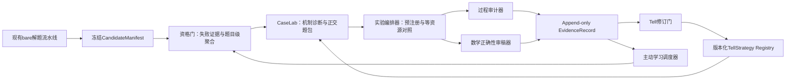

# 387号 · 非特化证据工厂——持续POC与高维正交验证系统设计

**日期**：2026-08-13

**状态**：持续设计稿；总体架构、核心数据模型、高维分类学覆盖方案与CaseLab出题协议已经用户批准；实验矩阵、审计学习与运行方案尚待逐节确认。

**文档性质**：Tell非特化研究的正式设计载体；本文件只记录设计，不启动Solver、不修改系统代码、不写数据库。

**前置文档**：277、278、280、283、372、373、380、381、382、383、385、386号。

**目标读者**：继续设计、实现或审计“长期运行的Tell非特化POC系统”的Master Agent与研究审计AI。

---

## 0. 一句话结论

本轮不再做一次孤立的“bare失败→给Hint→成功”实验，而是设计一个独立、可持续运行的**非特化证据工厂**：它从现有海量bare解题流水线接收冻结证据，围绕一个版本化TellStrategy构造高维正交题包与因果对照实验，生成不可覆盖的EvidenceRecord，再通过受控修订门反哺TellCore、HintRenderer、选择器、数学分类学和下一轮题包。

首条golden slice已经确定为：

```text
目标Tell家族：局部—全局表示切换
总体架构：独立证据工厂 + 冻结CandidateManifest
自动化边界：自动生产证据，门控Tell晋级
第一阶段目标：走通一条端到端golden slice，不同时铺开多个Tell家族
```

---

## 1. 本轮目标、边界与成功含义

### 1.1 真正目标

目标不是尽快积累“给提示后做出来”的漂亮案例，而是建立一条长期、可证伪、可重复、可审计的研究闭环：

```text
真实bare失败池
  → 失败证据复核与题目级聚合
  → 推理失败机制诊断
  → TellCore选择或候选生成
  → 正迁移/正交/假朋友/边界/诱饵/回归题包
  → 等资源、可归责的因子实验
  → thinking过程审计与数学正确性审稿
  → EvidenceRecord
  → TellStrategy版本修订
  → 主动选择下一批最有信息量的题
```

这条闭环要持续证明或反驳以下命题：

> Devin中的目标Solver在冻结的bare条件下不能稳定完成题目Q；在控制资源、重启、提示长度、脉络继承、人工选择和答案泄漏之后，一个非题目特化的TellCore经适当Renderer与当前失败脉络绑定，能够可重复地改变预期推理过程，并提高获得正确证明或关键进展的概率；在机制破坏负例上，该Tell又能够拒绝、退出或被反例修订。

### 1.2 第一阶段边界

第一阶段只验证一个Tell家族，不同时铺开26种思维力或全部Tell分类：

```text
局部—全局表示切换
```

选择它的原因：

1. 382号已经形成CasePack v0与22道CaseCard；
2. 383号已经完成候选C的字段消融与最小充分字段集；
3. 1631、1843、1709、1962已有历史bare与引导证据；
4. 1962提供了“方向正确但缺操作路径仍失败”的关键反例；
5. 该家族的过程信号清楚，便于观察模分析、p-adic赋值、表示切换和局部结论回升全局的过程。

第一阶段虽然只跑一个golden slice，但架构和数据对象必须对其他Tell家族通用，不能把“模p”“p-adic”等具体内容硬编码为系统结构。

### 1.3 自动化边界

采用“自动生产、门控晋级”：

- 系统可以自动发现失败候选、冻结证据、生成候选正交题、编排Solver、抽取过程信号并形成EvidenceRecord草稿；
- 数学正确性、机制是否保持、正交性是否成立、证据能否支持目标主张，必须经过独立审计；
- TellStrategy的`tested`、`restricted`、`validated`、`retired`状态不得由单一自动评分直接决定；
- 自动系统只能形成`RevisionProposal`，不能静默覆盖TellCore或分类学本体。

### 1.4 当前明确不做

本设计阶段不做以下工作：

- 不启动任何Devin Solver；
- 不修改现有Feeder、Runner、Collector、Reporter；
- 不把当前DB verdict直接当作题目级bare能力事实；
- 不直接更新Tell分类学v3本体；
- 不把旧POC局部PASS升级为端到端PASS；
- 不追求第一轮覆盖全部数学分支或全部Tell家族。

---

## 2. 历史证据的必要校准

### 2.1 277→278→280→283号究竟证明了什么

277号提出的强命题是：**同一个具体hint**应当能在题面、领域、对象、符号和解题步骤99%不同、仅在“hint这个点”相关的题上发挥作用。

278号把该命题操作化为五项判据，并设计A/B/C三组：

- A：bare；
- B：题目特定知识hint；
- C：两道题使用完全相同的“把问题翻译到另一种数学语言”hint文本。

280号在真正的奥赛难题上给出了负结果：同8道bare失败题中，knowledge为2/8，highlevel为1/8；唯一highlevel成功没有体现目标“翻译语言”过程。因此280号支持的是：

> 静态、一次性、抽象的同文本hint不足以证明非特化指导力。

283号给出了重要但较弱、也更工程化的阳性证据：

- 1843使用T01模算术；
- 1631使用T03二次剩余；
- 两个成功案例共享“翻译/表示切换”家族，但不是同一个具体HintInstance；
- tree组同时改变了失败脉络、题目特定方向、新AI实例和新增token预算；
- 方向仍是人工匹配；
- 没有`lineage only`或“等资源重启但无Tell”的控制臂。

所以283号最准确的证据表述是：

> “从失败thinking提取的脉络 + 人工匹配的题目化方向 + 运行时HintInstance”在3道精选bare失败题上取得2次成功，并且成功proof使用了目标方向；它初步支持完整引导包的可行性，但没有隔离TellCore、Renderer、lineage、人工选择、重启与新增预算各自的因果贡献。

因此，386号中“277号强命题已经检验通过”的表述需要在后续修订时降级为“工程化弱命题的初步阳性证据”。本文件后续实验设计必须补上缺失的因果控制。

### 2.2 token上限失败不能直接作为Tell成功证据

`failed_token_limit`是高价值候选来源，因为它往往拥有最长、最完整的thinking。但它同时是最容易制造伪因果的失败类型：

```text
bare AI耗尽25000 completion tokens
  → 启动新AI继续
  → 新AI获得新的token窗口
  → 最终成功
```

如果新AI同时获得Tell，不能仅凭成功把增益归给Tell。token上限题至少需要：

```text
同样脉络 + 同样重启 + 同样新增预算 + 无Tell
```

作为资源对照。只有目标Tell臂相对这个对照产生额外过程变化或结果增益，才能讨论Tell贡献。

### 2.3 attempt verdict不等于problem-level bare结论

`devin_problem_runs`一条记录代表一次attempt。相同`problem_id`可能有多个`exp_id`，也可能先因基础设施失败、后重试成功。正确顺序必须是：

1. 查询attempt；
2. 按`problem_id`聚合；
3. 复核物理证据；
4. 排除任何经过正确性审计的bare成功；
5. 再形成题目级baseline。

单次失败只能进入候选池，不能直接写成“Devin做不出来”。强因果POC原则上需要多次独立bare失败或明确标记其baseline不确定性。

### 2.4 当前数据接口与证据读取的已知缺口

只读审计发现以下问题，后续实现必须先解决：

1. `system/db.py`尚无针对`devin_problem_runs`和`problem_extraction_progress`的严格只读、题目级聚合接口；
2. 现有查询脚本直接连接ArangoDB，与项目“数据库操作统一通过system/db.py”的硬约束不一致；
3. Collector、380号、AGENTS.md、`build_profile.py`对部分verdict的模型/基础设施归类不完全一致；
4. 当前ATIF中主要thinking可能在`reasoning_content`，不是`agent.message`；
5. `candidate_solved`只表示存在类似proof的输出，不等于数学证明已经正确；
6. Redis失败队列是运行队列，不是长期历史真相；
7. 跨数据集同题异文、目标题与Tell来源题的语义重复尚需专门隔离。

这些缺口决定了证据工厂必须使用冻结manifest，而不能直接消费即时Redis或未经聚合的DB标签。

---

## 3. 已批准的设计决策

| 决策 | 已批准内容 | 理由 |
|---|---|---|
| 第一阶段形态 | 完整长期架构 + 单Tell家族golden slice | 同时保证科学闭环与可实施性 |
| 首条Tell家族 | 局部—全局表示切换 | 复用382/383号与历史强证据题 |
| 自动化边界 | 自动生产、门控晋级 | 兼顾不眠运行与证据可信度 |
| 总体架构 | 独立证据工厂 | 不污染生产解题流水线，便于审计与演进 |
| 系统接口 | 冻结CandidateManifest | 固定输入、环境、证据路径与哈希 |
| 原始证据策略 | append-only | 负结果、替代解释与旧版本均不可覆盖 |
| 运行方式 | 可恢复状态机 | 支持长时间运行、中断恢复和幂等重放 |

---

## 4. 总体架构（已批准）

### 4.1 架构图



### 4.2 七个逻辑组件

#### A. Snapshot Exporter

从现有生产系统读取题目与attempt证据，生成不可变`CandidateManifest`。它不负责判断Tell是否适用，也不修改原始运行状态。

#### B. Eligibility Gate

完成attempt→problem聚合、证据完整性检查、失败规范化、基础设施排除、重复题隔离与bare基线定级。

#### C. CaseLab

完成推理失败机制诊断、Tell适用性初审、同构之桥角色映射与证据题包构造。它产出的不是单道“新题”，而是一组带正负关系的CaseFamily。

#### D. Experiment Orchestrator

冻结实验计划、分配干预臂与相同资源预算，并且只通过`solver_harness`启动Solver。它不得在看到结果后改变题目角色或增删对照。

#### E. Process Auditor与Proof Judge

Process Auditor判断trigger、参数绑定、目标认知动作、进展信号、退出或让位是否发生；Proof Judge独立判断最终数学证明。二者分权，防止“结果正确”掩盖过程未采用Tell，或“过程看似正确”掩盖证明错误。

#### F. Evidence Ledger与Revision Gate

Evidence Ledger只追加EvidenceRecord。Revision Gate把多条证据聚合为修订建议，经审计后才允许改变TellStrategy状态与版本。

#### G. Active-learning Scheduler

优先选择最能区分相邻Tell假设、填补分类学覆盖空格、验证边界或复查模型漂移的下一批题，而不是单纯选择最可能成功的题。

### 4.3 三条隔离边界

1. **生产隔离**：POC结果不回写生产流水线的原始bare记录和Redis运行队列。
2. **答案隔离**：Selector、Hint生成器与Solver不可见目标题答案/标准解答；答案只在隔离的Judge阶段开放。
3. **晋级隔离**：自动评分不能直接改变TellCore或分类学本体，只能提出RevisionProposal。

---

## 5. 核心数据模型（已批准）

### 5.1 最小科学单位

最小科学单位不是“一道题”，而是：

```text
TellStrategy版本
× CaseCard
× 干预条件
× 资源契约
× 重复次数
```

这保证相同题目在不同Tell版本、不同Renderer、不同注入位置或不同预算下的结果不会被压成一个模糊PASS/FAIL。

### 5.2 核心对象

| 对象 | 唯一职责 |
|---|---|
| `CandidateManifest` | 冻结候选题、bare运行环境和物理证据 |
| `BareBaseline` | 将同题多个attempt聚合为题目级能力基线 |
| `CaseCard` | 描述题目角色、机制、分类坐标、正交变化与预期行为 |
| `CasePack` | 围绕一个TellCore冻结完整正负证据包 |
| `ExperimentPlan` | 预注册干预臂、资源、重复、过程信号与判定规则 |
| `TellCore` | 表示非特化后学到的认知策略内核 |
| `HintRenderer` | 定义如何按Solver、位置和强度渲染TellCore |
| `HintInstance` | 当前题、当前脉络、当前预算下实际注入的提示 |
| `EvidenceRecord` | 记录一次实验支持、反驳或不能支持什么 |
| `RevisionProposal` | 基于证据提出版本修订，不直接覆盖正式Tell |

### 5.3 CandidateManifest最小字段

```yaml
CandidateManifest:
  manifest_id:
  version:
  frozen_at:
  problem:
    problem_id:
    normalized_statement_hash:
    semantic_duplicate_cluster:
    source_dataset:
    taxonomy_coordinate:
    statement_ref:
  bare_contract:
    model:
    prompt_hash:
    tool_policy:
    token_budget:
    time_budget:
    solver_harness_version:
    code_commit:
  attempts:
    - exp_id:
      raw_status:
      raw_verdict:
      normalized_verdict:
      completion_tokens:
      runtime_seconds:
      evidence_paths:
      evidence_hashes:
  isolation:
    source_tell_overlap_check:
    answer_leakage_check:
    sealed_solution_ref:
  eligibility:
    baseline_status:
    confidence:
    exclusion_reasons:
```

`sealed_solution_ref`只允许Proof Judge访问。给Selector、Hint生成器和Solver的视图中不得出现答案或标准解答。

### 5.4 BareBaseline的两个正交轴

BareBaseline必须同时记录：

#### 终止原因轴

- token上限；
- thinking超时；
- 主动放弃；
- session结束但无proof；
- 输出停滞；
- 基础设施失败；
- 无效运行。

#### 推理失败机制轴

- 根分叉方向选择错误；
- line上存在分叉但AI未分叉；
- 已选正确方向但不知道操作路径；
- 方向和操作正确但计算无法收敛；
- 纯知识缺口；
- 证明核验或表达失败；
- 暂时无法从证据中判定。

两个轴不能互相替代。例如`failed_token_limit`只描述终止原因；它可能对应错误路线反复追逐，也可能对应正确路线尚未写完。

### 5.5 题目级资格状态

```text
stable_cognitive_failure
probabilistic_failure
resource_exhaustion
infrastructure_invalid
inconclusive
```

- `stable_cognitive_failure`：有足够独立bare证据，且失败机制可诊断；
- `probabilistic_failure`：同题有成功有失败，适合估计增量效应但不能声称“默认不会”；
- `resource_exhaustion`：主要证据是token或时间预算耗尽，必须使用等资源续跑控制；
- `infrastructure_invalid`：限流、连接、启动、export或工具政策等使运行无效；
- `inconclusive`：证据不足或相互矛盾。

### 5.6 状态机

```text
DISCOVERED
  → EVIDENCE_VERIFIED
  → BASELINE_CLASSIFIED
  → MECHANISM_REVIEWED
  → CASEPACK_FROZEN
  → PREREGISTERED
  → RUNNING
  → JUDGED
  → EVIDENCE_RECORDED
  → REVISION_PROPOSED
  → PROMOTED / RESTRICTED / REJECTED / RETIRED
```

任何阶段都可以进入`QUARANTINED`，但不能静默删除。每次状态转移必须记录：

- 操作者或服务；
- 精确时间；
- 输入对象ID与哈希；
- 输出对象ID与哈希；
- 判定理由；
- 使用的规则版本；
- 是否需要人工审计。

### 5.7 append-only原则

以下内容永不原地覆盖：

- 原始attempt证据；
- 旧Tell版本；
- 负EvidenceRecord；
- 替代因果解释；
- 被拒绝的RevisionProposal；
- 题目角色冻结记录；
- 分类学坐标的历史版本。

修订通过新版本和显式supersedes关系表达。这样才能审计Tell为什么被放宽、收窄、拆分、合并或退休。

---

## 6. 高维数学分类学与正交覆盖张量（已批准）

### 6.1 为什么不能只按“数学领域”做正交

“一道数论题迁移到一道代数题”只能说明题面跨了大领域，不能证明深层机制相同。反过来，两道都属于数论的题，也可能在对象、表示、操作、量词结构和证明证书上高度正交。

因此，本系统不把“正交”压成一个领域标签或单一相似度分数，而是同时建立三个相互独立的坐标系：

```text
数学内容坐标：题目在研究什么
解题机制坐标：题目怎样迫使认知转向
实验干预坐标：系统究竟改变了什么
```

三套坐标分开存储、联合查询。只有这样才能区分：

- 表面距离高、机制保持的正迁移；
- 表面很像、机制已经破坏的假朋友；
- 机制保持，但实验同时增加资源造成的伪Tell增益。

### 6.2 数学内容坐标

数学分支必须是**层级、多标签**结构，不能把一道题强制压入唯一叶节点。

```yaml
MathematicalContentCoordinate:
  taxonomy_version:
  primary_branch_path:
    - top_domain
    - branch
    - subbranch
  auxiliary_branch_paths: []
  task_type:
  object_types: []
  relation_types: []
  quantifier_shape:
  given_representation:
  target_representation:
  legal_operations: []
  target_form:
  certificate_type:
  source_tags: []
  classification_confidence:
```

各字段回答不同问题：

| 维度 | 例子 | 作用 |
|---|---|---|
| 分支路径 | 数论→初等数论→同余；代数→交换代数→局部化 | 衡量领域与子领域迁移 |
| task type | 证明、构造、分类、存在性、极值、求值 | 防止把任务形态差异误当领域差异 |
| object type | 整数、群、多项式、图、几何配置、函数空间 | 衡量对象外壳变化 |
| relation type | 整除、同余、邻接、序、度量、同构 | 记录真正参与机制的关系 |
| quantifier shape | 全称、存在、唯一、极值、对抗量词 | 揭示证明策略的逻辑骨架 |
| representation | 全局整数式、模p、p-adic、图表示、线性表示 | 记录表示切换发生在哪里 |
| legal operation | 取模、局部化、取商、对偶、投影、归约 | 区分“同名方法”下的真实操作 |
| certificate type | 矛盾、不变量、势函数、局部障碍、构造见证 | 衡量证明完成方式 |

`primary_branch_path`表示题目的主要数学落点；`auxiliary_branch_paths`记录解答真正调用的其他领域。一道“代数题通过模算术解决”的题，题面主分支与解答辅助分支必须同时保留，不能只标成“代数”或“数论”。

### 6.3 解题机制坐标

数学内容坐标描述“题是什么”；解题机制坐标描述“题怎样制造认知困难、目标Tell怎样解除困难”。

```yaml
MechanismCoordinate:
  natural_entry:
  natural_entry_why_attractive:
  failure_mechanism:
  branch_location: root | point | non_local | global
  hidden_structure:
  target_cognitive_action:
  expected_progress:
  proof_topology:
  completion_certificate:
  tell_taxonomy_coordinate:
  observation_level:
  mechanism_confidence:
```

这里必须继续区分两件事：

- Tell分类学位置是Tell的固有属性坐标；
- `local/non_local/global`是观察trace的Level参数，不是Tell固有属性。

这遵守当前Tell分类学v3的核心修正，不重新把观察方式混入Tell本体。

### 6.4 实验干预坐标

实验干预坐标专门记录一次运行改变了什么：

```yaml
InterventionCoordinate:
  bare_failure_stratum:
  case_role:
  tell_core_version:
  renderer_version:
  hint_instance_id:
  lineage_mode:
  injection_position:
  operation_path_level:
  restart_policy:
  token_budget:
  time_budget:
  solver_model:
  repetition_index:
```

把该坐标独立出来，可以防止把以下组合笼统写成“给了Tell”：

```text
换了新AI
+ 增加了token
+ 给了父节点脉络
+ 人工选中了正确方向
+ 给了题目化操作路径
```

每一项都必须能够成为对照因子或明确标注为本轮未隔离的混杂。

### 6.5 正交向量与机制关系必须分离

每一对源题—目标题都记录一个向量，而不是“99%不同”这种不可复查的总分：

```yaml
OrthogonalityVector:
  branch_distance:
  object_distance:
  representation_distance:
  operation_distance:
  quantifier_distance:
  proof_topology_distance:
  certificate_distance:
  lexical_distance:

MechanismRelation:
  status: preserved | partially_preserved | broken | unknown
  preserved_roles: []
  changed_roles: []
  broken_roles: []
  source_to_target_mapping: []
  justification:
  reviewer_confidence:
```

距离字段使用有序等级或可审计规则，不强行伪装成精确连续数值。任何`unknown`都必须作为覆盖缺口保留，不能为了填表追认为`preserved`。

### 6.6 四种核心Case关系

| Case关系 | 表面/内容距离 | 机制关系 | 预期系统行为 |
|---|---|---|---|
| 正迁移/正交题 | 中到高 | preserved | 选择并执行Tell |
| 假朋友 | 低或中，故意制造相似 | broken | 拒绝、降权或由critic拦截 |
| 最小边界题 | 只改变一个机制承载条件 | partially_preserved或broken | boundary、abstain或及时终止 |
| 无关/诱饵题 | 任意 | broken或不适用 | abstain，不制造负迁移 |

回归题不是第五种机制关系，而是从上述历史Case中抽出的固定测试集，用于检验Tell修订是否误伤旧正例、旧负例和旧边界。

### 6.7 覆盖张量

证据覆盖空间定义为：

```text
TellStrategy版本
× 迁移距离
× Case角色
× bare推理失败机制
× 干预条件
× Solver模型范围
```

对应的最小索引对象是：

```yaml
CoverageCell:
  tell_strategy_version:
  transfer_band:
  case_role:
  bare_failure_mechanism:
  intervention_family:
  solver_scope:
  case_ids: []
  evidence_ids: []
  coverage_status: empty | designed | frozen | run | supported | contradicted | inconclusive
  confidence:
  next_information_need:
```

“全相度”不等于暴力跑完整笛卡尔积。完整笛卡尔积会造成组合爆炸，也会生成大量数学上不自然的假题。第一阶段使用三层覆盖策略：

1. **强制投影覆盖**：每个关键单轴取值都至少有明确证据或明确的不可适用说明；
2. **pairwise覆盖**：优先覆盖最可能交互的二元组合，例如迁移距离×Case角色、失败机制×资源控制、Renderer×注入位置；
3. **主动学习补洞**：根据相邻Tell假设的最大分歧、边界不确定性和模型漂移选择下一格。

系统必须输出覆盖报告，区分：

- 已有阳性证据；
- 已有阴性证据；
- 证据冲突；
- 仅完成题目设计；
- 尚未覆盖；
- 数学上不适用。

未覆盖不能被当成通过，数学上不适用也不能被硬造题填充。

### 6.8 golden slice的八圈证据

围绕“局部—全局表示切换”TellStrategy，第一阶段至少形成八圈证据：

1. **source锚题**：1631、1843、1709、1962等历史来源；
2. **同子分支换对象**：仍在相近数论结构中，但对象、符号与目标改变；
3. **跨子分支**：在数论内部跨同余、赋值、素性、递推等子分支；
4. **跨大分支**：迁移到代数、组合、几何或分析中的真实局部—全局机制；
5. **假朋友**：出现模、局部或周期性表面信号，但局部化不是低成本主路；
6. **最小边界**：只改变一个使局部结论无法回升全局的必要条件；
7. **弃权诱饵**：有强烈关键词或相似对象，但目标Tell应拒绝；
8. **回归题**：固定旧正例、旧负例和旧边界，用于每次Tell修订后重跑。

跨大分支题不能为了“覆盖领域”强行制造。若审计者无法写出清楚的`MechanismRelation.preserved_roles`和严格解答，该CoverageCell应保持`empty`或`inapplicable`，不能进入正迁移题包。

### 6.9 分类学版本与证据稳定性

数学内容分类、Tell分类和机制标签都会演化，所以所有坐标必须带`taxonomy_version`。分类学修订时：

- 旧EvidenceRecord保留原坐标；
- 新版本建立显式映射或重新分类记录；
- 不因新分类覆盖旧判断；
- 如果新分类改变了某道题的Case角色，必须形成新的CasePack版本，不能修改已冻结题包。

---

## 7. CaseLab出题与准入协议（已批准）

### 7.1 CaseLab不是单一“AI出题器”

CaseLab有两条证据来源线：

```text
自然发现线：海量bare失败题 → 发现共享目标机制的现成正交题
受控生成线：CoverageCell为空 → 按MechanismContract生成新题与最小变体
```

两条线互补但证据身份不同：

- 自然发现题拥有更强的生态真实性，不容易因为“为了验证Tell而造题”产生设计偏差；
- 受控生成题可以精确改变单个维度，更适合假朋友、最小边界和组件归责；
- 自然发现题不能因为历史来源就免于机制审查；
- 受控生成题不能因为结构设计漂亮就免于bare准入和独立数学核验。

系统不得把两条来源线的结果混成同一证据等级。

### 7.2 Gate 1：来源与证据门

进入CaseLab前，必须先完成：

- 题目与数据源谱系确认；
- attempt→problem聚合；
- 模型、prompt、工具策略、预算和代码版本冻结；
- thinking、trajectory、输出与终态证据哈希；
- 跨数据集近似重复检查；
- 与Tell来源题的同题异文隔离；
- 答案泄漏和无效运行排除。

没有合格`CandidateManifest`的题不能进入后续机制分析。

### 7.3 Gate 2：双视角机制门

机制提取采用两名角色独立分析后再对齐。

#### Trace-side Analyst

只看题面、bare thinking与运行证据，不看标准解答。它回答：

- AI从哪里进入；
- 走了哪些路线；
- 根节点还是line上漏分叉；
- 哪个动作反复无进展；
- 终止原因与推理失败机制分别是什么；
- thinking中是否已经出现目标Tell的一部分。

#### Solution-side Analyst

只看题面与已经核验的解答，不看bare thinking。它回答：

- 低搜索成本主路是什么；
- 哪个隐藏结构使证明推进；
- 哪个认知动作造成关键进展；
- 哪些具体lemma只是知识，不应进入TellCore；
- 哪些变换应保持机制，哪些变换会破坏机制。

#### Adjudicator

最后才同时看到两份报告，对齐“AI实际缺口”和“正确解答机制”。若二者无法形成可证伪的对应关系，题目只能进入`inconclusive`或其他Tell候选池，不能强行归入目标题包。

这道门的目的，是防止分析者看完答案后把bare的任何失败都解释成“缺少我们想验证的Tell”。

### 7.4 Gate 3：MechanismContract门

对齐成功后冻结：

```yaml
MechanismContract:
  mechanism_id:
  version:
  source_case_ids: []
  natural_entry:
  natural_entry_why_attractive:
  failure_mechanism:
  branch_location:
  invariant_kernel:
  hidden_structure:
  target_cognitive_action:
  expected_progress_signals: []
  completion_certificate:
  allowed_transformations: []
  mechanism_breaking_transformations: []
  tell_core_relation:
  leakage_budget:
  competing_explanations: []
  confidence:
```

`MechanismContract`是出题和审计之间的公共契约。出题者不能事后修改目标机制，Process Auditor也不能在看到结果后重新解释预期过程。

### 7.5 Gate 4：变换与出题门

每道生成题先建立`TransformationPlan`，明确目标CoverageCell、保留维度和改变维度：

```yaml
TransformationPlan:
  source_case_id:
  target_coverage_cell:
  desired_case_role:
  preserved_dimensions: []
  changed_dimensions: []
  intentionally_broken_dimensions: []
  role_mapping:
    source_object_to_target_object:
    source_operation_to_target_operation:
    source_natural_entry_to_target_entry:
    source_failure_to_target_failure:
    source_hidden_structure_to_target_structure:
    source_certificate_to_target_certificate:
  predicted_wrong_path:
  predicted_tell_action:
  leakage_constraints:
```

题目生成后，`OrthogonalityVector`与`MechanismRelation`由独立审查者填写，不直接采用出题者的自评分。

### 7.6 Gate 5：数学正确性门

每道新题必须有密封`VerificationDossier`：

```yaml
VerificationDossier:
  problem_id:
  sealed_statement_version:
  sealed_solution:
  answer_or_claim:
  well_posedness_review:
  independent_reviews: []
  formal_or_computational_checks: []
  ambiguity_findings: []
  correctness_status: verified | partial | rejected
  judge_only_access:
```

第一阶段的最低建议是：

- 两名独立数学审稿者确认；或
- 一名独立审稿者，加一种适用的形式、符号或计算核验。

形式工具并非所有题都适用，所以它不能替代数学审稿。`partial`题只能作为设计素材，不能进入结果层POC。

### 7.7 Gate 6：对抗与捷径门

独立Adversarial Solver在不知道目标题意图和Tell的条件下，专门寻找：

- 标准定理或经典外壳秒杀；
- 训练记忆风险；
- 宽松阈值留下的贪心出口；
- 低阶特例直接完成；
- 条件冗余或漏洞；
- 目标Tell之外更低成本的主路；
- 题意歧义、答案不唯一或隐藏无解。

目标题Tell不需要是数学上的唯一解法，但必须是可说明的低搜索成本主路。如果存在另一个显著更直接的路线，题目不适合作为强归责正例；它可以降级为selector、边界或多路线研究素材。

### 7.8 Gate 7：bare资格与角色冻结门

在任何Tell干预前，按冻结的bare contract执行基线：

- 预注册预期自然路线和失败信号；
- 多attempt结果按problem聚合；
- 分开记录终止原因与推理失败机制；
- 发现有效bare成功时，不得继续宣称“默认做不出来”；
- `failed_token_limit`必须标记为资源失败层，等待等资源续跑控制；
- 只有证据和角色全部冻结后，才生成`CasePackVersion`。

实验后禁止移动题目角色。例如：

- 假朋友被Tell成功解决，记录为反例；
- 正迁移题在bare中稳定成功，记录为准入失败；
- 边界题暴露Tell其实适用，记录MechanismContract或边界判断错误。

后续只能新建CasePack版本，不能修改已冻结版本来适配结果。

### 7.9 CaseFamily的最小成员

围绕一个source锚题，CaseLab尽量形成：

1. 机制保持的近迁移题；
2. 机制保持的跨子分支题；
3. 机制保持的跨大分支题；
4. 表面相似、机制破坏的假朋友；
5. 只改变一个必要条件的边界题；
6. 含强关键词或熟悉外壳的诱饵题；
7. 固定正例、负例和边界回归题。

不是每个source都必须机械生成全部成员。不能严格证明机制关系的目标格保持为空，比生成伪正交题更可靠。

### 7.10 答案与角色分权

| 角色 | 可见内容 | 禁止内容 |
|---|---|---|
| Trace-side Analyst | 题面、bare thinking、运行证据 | 标准解答、目标机制标签 |
| Solution-side Analyst | 题面、核验解答 | bare thinking与失败标签 |
| Generator | MechanismContract、目标CoverageCell | 目标题未来实验结果 |
| Selector | 题面、当前problem state、Tell库 | 预注册正确标签、密封答案 |
| HintRenderer | TellCore、题面、允许的lineage | 标准解答、Judge结论 |
| Solver | 题面、对应干预提示 | 答案、标准解答、Case角色 |
| Process Auditor | thinking、预注册过程信号 | 必要时先盲于最终Judge结论 |
| Proof Judge | 最终证明、密封解答 | 非必要的干预标签 |

通过最小权限视图，避免同一个AI既看答案、又生成Hint、又判断Hint是否有效。

### 7.11 382号CasePack的迁移规则

382号不被覆盖或宣布失效。它作为`legacy CasePack v0`导入：

1. 保留原CaseCard、角色、判断和来源；
2. 为每道题补做CandidateManifest与双视角机制审查；
3. 对未核验变形题补做VerificationDossier；
4. 对历史bare记录重新做attempt→problem聚合；
5. 若角色、机制或解答需要修正，创建新的CasePack版本；
6. 用显式`supersedes`或`derived_from`关系连接旧版和新版。

这样既不重做POC-0/1，也不让旧题包未经新证据标准审查就直接进入长期工厂。

### 7.12 CaseLab输出

CaseLab每次处理最终输出：

```text
MechanismContract
TransformationPlan
VerificationDossier
AdmissionDecision
CaseCard / CaseFamily
CasePackVersion
```

其中`AdmissionDecision`必须明确：

- admitted；
- admitted_for_process_only；
- quarantined；
- rejected；
- 以及对应理由和可补证入口。

---

## 8. 尚待逐节确认的设计部分

以下部分尚未获得用户批准，因此本版只冻结问题边界，不提前写死方案：

1. **因果实验矩阵**：lineage、Tell方向、操作路径、注入位置、重启和资源预算怎样正交控制；
2. **过程审计与数学Judge**：怎样检测目标认知动作、first divergence、进展信号、证明正确性和答案泄漏；
3. **Tell学习与版本晋级**：什么证据触发扩大、收窄、拆分、合并、降级或退休；
4. **长期运行与故障恢复**：队列、幂等、重试、限流、停止条件、告警、人工审计工作台；
5. **golden slice验收标准**：第一阶段什么状态算闭环成立，什么只能算PARTIAL或FAIL。

这些部分将在对话中逐节确认，并持续补入本文件。确认前不进入代码实现。

---

## 9. 当前设计Verdict

```text
目标边界：APPROVED
首条Tell家族：APPROVED
自动化边界：APPROVED
总体架构：APPROVED
核心数据模型：APPROVED
实验矩阵：NOT YET REVIEWED
分类学覆盖方案：APPROVED
CaseLab出题协议：APPROVED
审计与学习方案：NOT YET REVIEWED
运行与验收方案：NOT YET REVIEWED
实现授权：NOT GRANTED
```

当前最准确的阶段判断是：

> 非特化证据工厂已经完成目标、隔离边界、总体架构、数据契约、高维分类学覆盖方案和CaseLab出题协议的第一轮设计确认；它还不是可实施规格，更不是已经实现的系统。下一步应确认因果实验矩阵。
