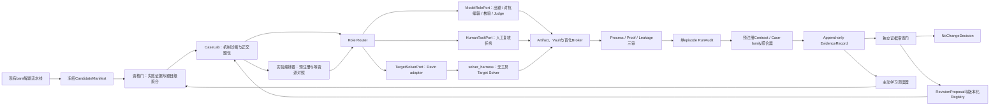

# 387号 · 非特化证据工厂——持续POC与高维正交验证系统设计

**日期**：2026-08-13

**状态**：持续设计稿；此前设计部分已经用户逐节批准；2026-08-14先吸收“目标Solver与认知执行面分离”，随后按用户最新要求修正为“只有目标Solver进入solver_harness，但Devin CLI也可经ModelRolePort承载全部机器认知角色，并与Codex并列”；长期运行与golden slice验收已纳入。端口、双Gate、双认知adapter与Bakeoff是工作规格，不等于逐字段实现验收，且本轮只授权完善文档、未授权live实现或调用。

**文档性质**：Tell非特化研究的正式设计载体；本文件只记录设计，不启动Solver、不修改系统代码、不写数据库。

**前置文档**：277、278、280、283、372、373、380、381、382、383、385、386号。

**目标读者**：继续设计、实现或审计“长期运行的Tell非特化POC系统”的Master Agent与研究审计AI。

---

## 0. 一句话结论

本轮不再做一次孤立的“bare失败→给Hint→成功”实验，而是设计一个独立、可持续运行的**非特化证据工厂**：它从现有海量bare解题流水线接收冻结证据，围绕一个版本化TellStrategy构造高维正交题包与因果对照实验，生成不可覆盖的EvidenceRecord，再通过受控修订门反哺TellCore、HintRenderer、选择器、数学分类学和下一轮题包。

2026-08-14进一步冻结执行架构：**只有被研究的Target Solver作业可以进入`DevinSolverAdapter → solver_harness`；Devin CLI并不专属于Solver。** 出题、对抗编辑、数学核验、Proof Judge等认知角色统一通过provider-neutral的`ModelRolePort`运行，该端口同时允许物理隔离的`DevinCliModelRoleAdapter`与`CodexExecModelRoleAdapter`。Devin认知角色的首个精确候选是`glm-5-2`（本机catalog显示GLM-5.2 High，effort由model UID编码），Codex/Responses中的`gpt-5.6-sol`高推理配置是并列候选；两者都必须先通过角色级能力探测、单adapter纵切、盲化`AuthoringBakeoff`和未见brief qualification，不得预写为唯一赢家。旧文档中Devin承载Telling AI的方案可作为adapter历史来源，但不再等同于角色本体或Solver执行面。

首条golden slice已经确定为：

```text
目标Tell家族：局部—全局表示切换
总体架构：独立证据工厂 + 冻结CandidateManifest
自动化边界：自动生产证据，门控Tell晋级
第一阶段目标：走通一条端到端golden slice，不同时铺开多个Tell家族
```

---

## 1. 本轮目标、边界与成功含义

### 1.1 真正目标

目标不是尽快积累“给提示后做出来”的漂亮案例，而是建立一条长期、可证伪、可重复、可审计的研究闭环：

```text
真实bare失败池
  → 失败证据复核与题目级聚合
  → 推理失败机制诊断
  → TellCore选择或候选生成
  → 正迁移/正交/假朋友/边界/诱饵/回归题包
  → 等资源、可归责的因子实验
  → thinking过程审计与数学正确性审稿
  → EvidenceRecord
  → 独立人审：NoChangeDecision或RevisionProposal
  → 若修订，再做前瞻确认与TellStrategy版本决定
  → 主动选择下一批最有信息量的题
```

这条闭环要持续证明或反驳以下命题：

> Devin中的目标Solver在冻结的bare条件下不能稳定完成题目Q；在控制资源、重启、提示长度、脉络继承、人工选择和答案泄漏之后，一个非题目特化的TellCore经适当Renderer与当前失败脉络绑定，能够可重复地改变预期推理过程，并提高获得正确证明或关键进展的概率；在机制破坏负例上，该Tell又能够拒绝、退出或被反例修订。

### 1.2 第一阶段边界

第一阶段只验证一个Tell家族，不同时铺开26种思维力或全部Tell分类：

```text
局部—全局表示切换
```

选择它的原因：

1. 382号已经形成CasePack v0与22道CaseCard；
2. 383号已经完成候选C的字段消融与最小充分字段集；
3. 1631、1843、1709、1962已有历史bare与引导证据；
4. 1962提供了“方向正确但缺操作路径仍失败”的关键反例；
5. 该家族的过程信号清楚，便于观察模分析、p-adic赋值、表示切换和局部结论回升全局的过程。

第一阶段虽然只跑一个golden slice，但架构和数据对象必须对其他Tell家族通用，不能把“模p”“p-adic”等具体内容硬编码为系统结构。

### 1.3 自动化边界

采用“自动生产、门控晋级”：

- 系统可以自动发现失败候选、冻结证据、生成候选正交题、编排Solver、抽取过程信号并形成EvidenceRecord草稿；
- 系统通过Role Router把目标Solver作业与出题/审稿/审计作业路由到不同执行面；角色契约独立于具体provider、模型别名和CLI；
- 数学正确性、机制是否保持、正交性是否成立、证据能否支持目标主张，必须经过独立审计；
- TellStrategy的`tested`、`restricted`、`validated`、`retired`状态不得由单一自动评分直接决定；
- 自动系统只能形成`RevisionProposal`，不能静默覆盖TellCore或分类学本体。

### 1.4 当前明确不做

本设计阶段不做以下工作：

- 不启动任何Devin Solver；
- 不启动Devin、Codex或其他认知模型worker，不把本机配置、CLI帮助或模型目录当作端到端有效能力证明；
- 不修改现有Feeder、Runner、Collector、Reporter；
- 不把当前DB verdict直接当作题目级bare能力事实；
- 不直接更新Tell分类学v3本体；
- 不把旧POC局部PASS升级为端到端PASS；
- 不追求第一轮覆盖全部数学分支或全部Tell家族。

---

## 2. 历史证据的必要校准

### 2.1 277→278→280→283号究竟证明了什么

277号提出的强命题是：**同一个具体hint**应当能在题面、领域、对象、符号和解题步骤99%不同、仅在“hint这个点”相关的题上发挥作用。

278号把该命题操作化为五项判据，并设计A/B/C三组：

- A：bare；
- B：题目特定知识hint；
- C：两道题使用完全相同的“把问题翻译到另一种数学语言”hint文本。

280号在真正的奥赛难题上给出了负结果：同8道bare失败题中，knowledge为2/8，highlevel为1/8；唯一highlevel成功没有体现目标“翻译语言”过程。因此280号支持的是：

> 静态、一次性、抽象的同文本hint不足以证明非特化指导力。

283号给出了重要但较弱、也更工程化的阳性证据：

- 1843使用T01模算术；
- 1631使用T03二次剩余；
- 两个成功案例共享“翻译/表示切换”家族，但不是同一个具体HintInstance；
- tree组同时改变了失败脉络、题目特定方向、新AI实例和新增token预算；
- 方向仍是人工匹配；
- 没有`lineage only`或“等资源重启但无Tell”的控制臂。

所以283号最准确的证据表述是：

> “从失败thinking提取的脉络 + 人工匹配的题目化方向 + 运行时HintInstance”在3道精选bare失败题上取得2次成功，并且成功proof使用了目标方向；它初步支持完整引导包的可行性，但没有隔离TellCore、Renderer、lineage、人工选择、重启与新增预算各自的因果贡献。

因此，386号中“277号强命题已经检验通过”的表述需要在后续修订时降级为“工程化弱命题的初步阳性证据”。本文件后续实验设计必须补上缺失的因果控制。

### 2.2 token上限失败不能直接作为Tell成功证据

`failed_token_limit`是高价值候选来源，因为它往往拥有最长、最完整的thinking。但它同时是最容易制造伪因果的失败类型：

```text
bare AI耗尽25000 completion tokens
  → 启动新AI继续
  → 新AI获得新的token窗口
  → 最终成功
```

如果新AI同时获得Tell，不能仅凭成功把增益归给Tell。token上限题至少需要：

```text
同样脉络 + 同样重启 + 同样新增预算 + 无Tell
```

作为资源对照。只有目标Tell臂相对这个对照产生额外过程变化或结果增益，才能讨论Tell贡献。

### 2.3 attempt verdict不等于problem-level bare结论

`devin_problem_runs`一条记录代表一次attempt。相同`problem_id`可能有多个`exp_id`，也可能先因基础设施失败、后重试成功。正确顺序必须是：

1. 查询attempt；
2. 按`problem_id`聚合；
3. 复核物理证据；
4. 排除任何经过正确性审计的bare成功；
5. 再形成题目级baseline。

单次失败只能进入候选池，不能直接写成“Devin做不出来”。强因果POC原则上需要多次独立bare失败或明确标记其baseline不确定性。

### 2.4 当前数据接口与证据读取的已知缺口

只读审计发现以下问题，后续实现必须先解决：

1. `system/db.py`尚无针对`devin_problem_runs`和`problem_extraction_progress`的严格只读、题目级聚合接口；
2. 现有查询脚本直接连接ArangoDB，与项目“数据库操作统一通过system/db.py”的硬约束不一致；
3. Collector、380号、AGENTS.md、`build_profile.py`对部分verdict的模型/基础设施归类不完全一致；
4. 当前ATIF中主要thinking可能在`reasoning_content`，不是`agent.message`；
5. `candidate_solved`只表示存在类似proof的输出，不等于数学证明已经正确；
6. Redis失败队列是运行队列，不是长期历史真相；
7. 跨数据集同题异文、目标题与Tell来源题的语义重复尚需专门隔离。

这些缺口决定了证据工厂必须使用冻结manifest，而不能直接消费即时Redis或未经聚合的DB标签。

这里的`system/db.py`是题海来源侧的历史读取缺口，不是要求Seven import第六代`system.*`。Seven实现侧继续由自身`StrictDatabasePort`拥有数据库边界；两边只能通过冻结对象和显式接口对接。

它们同时形成六项**实现前P0能力阻塞**，不能由设计文档中的接口名称冒充已经存在：

1. **数据库能力阻塞**：当前`system/db.py`的读取路径仍可能通过`_ensure_collection`产生写副作用，也没有本设计需要的严格只读入口、expected-DB fail-closed、append-only ledger、outbox、CAS/事务和唯一索引。实现前必须先建立`DatabaseCapabilityReport`，逐项证明这些能力；否则P0只能`BLOCKED`。
2. **Harness资源能力阻塞**：当前Solver Harness未必能够强制`reasoning_effort`、每次生成上限、context limit等全部`ResourceContract`字段。实现前必须生成`HarnessCapabilityReport`，把每个资源字段标为`requested / enforced / observed / unavailable`。任何公平性依赖于某字段、但该字段无法强制或核验的contrast只能判`INCONCLUSIVE_DUE_TO_PROTOCOL`，不能启动确认性解释。
3. **Solver无工具能力阻塞**：当前“prompt要求不要调用工具”与缺失工具事件都不能证明tool surface不存在。live Solver前必须由独立`NoToolSolverCapabilityReport`证明工具注册表/API表面不可达、trajectory可观测且任意工具事件都会使run失效。
4. **安全启动阻塞**：当前Harness存在把prompt或路径拼入shell命令的风险；任意Hint中的单引号等字符都可能破坏启动语义。确认性运行前必须改为结构化argv或安全prompt文件传递，并保存启动receipt、argv摘要和Solver最终可见prompt hash。
5. **物理答案隔离阻塞**：同一Unix身份、`dangerous`权限和“JSON字段不下发”不构成答案隔离。实现前必须提供独立Vault/服务身份或容器边界、按角色物化的只读视图、路径不可达保证、一次性访问token和append-only access log；否则所有确认性证据只能判协议不可裁决。
6. **认知worker能力阻塞**：当前Seven System尚无`ModelRolePort`、`DevinCliModelRoleAdapter`、`CodexExecModelRoleAdapter`、角色级能力报告或调用收据实现。出题、对抗编辑、数学核验和Judge在进入live lane前，必须按“角色 × 精确adapter profile”分别生成`CognitiveWorkerCapabilityReport`，证明requested/effective模型、推理强度、编排模式、工具/网络/沙箱、结构化输出、原始事件留存和取消语义。模型别名、当前本机配置、CLI帮助文本或`models list`不能冒充端到端能力PASS。

这六项是**未来实现的前置验收项**，不是本轮被授权实施的改造任务。

---

## 3. 已批准的设计决策

| 决策 | 已批准内容 | 理由 |
|---|---|---|
| 第一阶段形态 | 完整长期架构 + 单Tell家族golden slice | 同时保证科学闭环与可实施性 |
| 首条Tell家族 | 局部—全局表示切换 | 复用382/383号与历史高信息量候选题 |
| 自动化边界 | 自动生产、门控晋级 | 兼顾不眠运行与证据可信度 |
| 总体架构 | 独立证据工厂 | 不污染生产解题流水线，便于审计与演进 |
| 系统接口 | 冻结CandidateManifest | 固定输入、环境、证据路径与哈希 |
| 原始证据策略 | append-only | 负结果、替代解释与旧版本均不可覆盖 |
| 运行方式 | 可恢复状态机 | 支持长时间运行、中断恢复和幂等重放 |

---

## 4. 总体架构（已批准）

### 4.1 架构图



### 4.2 八个逻辑组件

#### A. Snapshot Exporter

从现有生产系统读取题目与attempt证据，生成不可变`CandidateManifest`。它不负责判断Tell是否适用，也不修改原始运行状态。

#### B. Eligibility Gate

完成attempt→problem聚合、证据完整性检查、失败规范化、基础设施排除、重复题隔离与bare基线定级。

#### C. CaseLab

完成推理失败机制诊断、Tell适用性初审、同构之桥角色映射与证据题包构造。它产出的不是单道“新题”，而是一组带正负关系的CaseFamily。自然发现线优先提供真实bare失败；受控生成线只填补明确CoverageCell空格，并且必须经过版本化草稿、独立审稿和人工QuestionRelease Gate。

#### D. Experiment Orchestrator

冻结实验计划、角色执行契约、分配干预臂与相同资源预算。Target Solver只能经`TargetSolverPort → DevinSolverAdapter → solver_harness`启动；出题、对抗编辑、核验与Judge只能经provider-neutral `ModelRolePort`的已批准Devin/Codex或其他adapter启动。认知Devin不得借用solver harness，任何认知adapter也不得从阶段代码旁路调用；系统不得在看到结果后改变题目角色、adapter或增删对照。

#### E. Artifact、Vault、Blinding与三路Auditor

Artifact/Protocol Auditor先判断物证与协议是否完整，Vault保存作者原始输出、候选解答和替代解法，Blinding Broker机械生成不可互相回看的角色视图。Process Auditor判断trigger、参数绑定、目标认知动作、进展信号、退出或让位是否发生；Proof Judge独立判断最终数学证明；Leakage Auditor独立检查完整Solver可见payload与密封答案的越界信息。三种真值分权，防止“结果正确”掩盖过程未采用Tell，或“过程看似正确”掩盖证明错误与泄漏。

#### F. RunAudit与Contrast Aggregator

每个episode只形成观察性的`RunAudit`。预注册的随机化contrast按problem/source-rollout聚类后，才形成因果`EvidenceRecord`；CaseFamily层只能聚合已经存在的contrast级EvidenceRecord以讨论迁移范围，不能用多数票代替随机对照。

#### G. Evidence Ledger与Revision Gate

Evidence Ledger只追加EvidenceRecord。Revision Gate把多条证据聚合为修订建议，经审计后才允许改变TellStrategy状态与版本。

#### H. Active-learning Scheduler

优先选择最能区分相邻Tell假设、填补分类学覆盖空格、验证边界或复查模型漂移的下一批题，而不是单纯选择最可能成功的题。

### 4.3 四条隔离边界

1. **生产隔离**：POC结果不回写生产流水线的原始bare记录和Redis运行队列。
2. **答案隔离**：Selector、Hint生成器、Solver与Process Auditor永久不可见目标题答案/标准解答；Solution-side/Verification、Proof Judge、Leakage Auditor分别通过独立capability取得最小必要视图，所有访问可审计。逻辑字段隐藏不能替代物理Vault/身份/路径隔离。
3. **晋级隔离**：自动评分不能直接改变TellCore或分类学本体，只能提出RevisionProposal。
4. **carrier隔离**：Target Solver与认知worker是不同执行面；即使两者都由Devin CLI承载，也必须使用不同port、adapter profile、workspace、session、配置、权限、收据和资源池。角色语义不得绑定Devin、Codex或任一具体provider，adapter也不得扩大角色可见内容。

---

## 5. 核心数据模型（已批准）

### 5.1 最小科学单位

最小科学单位不是“一道题”，而是：

```text
TellStrategy版本
× CaseCard
× 干预条件
× 资源契约
× 重复次数
```

这保证相同题目在不同Tell版本、不同Renderer、不同注入位置或不同预算下的结果不会被压成一个模糊PASS/FAIL。

### 5.2 核心对象

| 对象 | 唯一职责 |
|---|---|
| `CandidateManifest` | 冻结候选题、bare运行环境和物理证据 |
| `BareBaseline` | 将同题多个attempt聚合为题目级能力基线 |
| `RoleExecutionContract` | 冻结一个认知或Solver角色的carrier、可见视图、能力、资源与重试契约 |
| `CognitiveWorkerCapabilityReport` | 证明某adapter的requested/effective模型、推理、隔离、结构化输出与原始事件能力 |
| `AIInvocationReceipt` | 保存一次模型调用的有效请求、版本、事件、用量、终态与不可变输入输出hash |
| `ReviewIndependenceRecord` | 区分新上下文、同模型、异模型、异provider与AI+人工/形式工具的独立性等级 |
| `QuestionDraftVersion` / `QuestionRelease` | 分别冻结受控生成草稿及经人门批准、可进入bare准入的题目release |
| `CaseCard` | 描述题目角色、机制、分类坐标、正交变化与预期行为 |
| `CasePack` / `CasePackVersion` | `CasePack`是逻辑题包；`CasePackVersion`是围绕一个TellCore冻结的不可变正负证据包 |
| `BranchSnapshot` | 冻结可重放的分叉状态、精确prefix与构造谱系 |
| `ResourceContract` | 声明请求、可强制、可观测与不可用的资源约束 |
| `ExperimentPlan` | 预注册干预臂、资源、重复、过程信号与判定规则 |
| `TellCore` | 表示非特化后学到的认知策略内核 |
| `HintRenderer` | 定义如何按Solver、位置和强度渲染TellCore |
| `HintInstance` | 当前题、当前脉络、当前预算下实际注入的提示 |
| `TellStrategyRelease` | 锁定Core、运行时policy、Renderer、Selector与范围的精确复合release |
| `RunArtifactBundle` | 冻结一次物理运行的完整原始物证与自校验manifest |
| `RunAudit` | 记录单episode发生了什么，不宣称Tell因果效应 |
| `EvidenceRecord` | 记录预注册contrast或既有contrast的case-family聚合支持、反驳或不能支持什么 |
| `RevisionProposal` | 基于证据提出版本修订，不直接覆盖正式Tell |
| `RuntimeManifest` / `GateDecision` | 冻结Epoch编排输入并记录阶段门判定 |

### 5.3 多模型角色执行对象

Role Router只理解角色契约，不在业务代码中写死某个模型名称：

```text
Role Router
├── TargetSolverPort
│   └── DevinSolverAdapter
│       └── solver_harness
│           └── no-tool Target Solver
└── ModelRolePort
    ├── DevinCliModelRoleAdapter（首个候选：`glm-5-2` / GLM-5.2 High）
    ├── CodexExecModelRoleAdapter（GPT-5.6高推理候选）
    └── future provider/model adapters
HumanTaskPort
└── HumanReviewQueue（不能签发GateDecision）
HumanGateService
└── signed HumanGateDecision（不可由ModelRolePort调用者自批）
```

接口只规定生命周期语义；adapter负责把语义翻译为CLI或API：

```python
class TargetSolverPort(Protocol):
    def launch(self, contract, input_view): ...
    def observe(self, invocation_id): ...
    def collect(self, invocation_id): ...
    def cancel(self, invocation_id, fencing_token): ...

class ModelRolePort(Protocol):
    def submit(self, contract, input_view): ...
    def observe(self, invocation_id): ...
    def collect(self, invocation_id): ...
    def cancel(self, invocation_id, fencing_token): ...
```

`invocation_id`是端口返回的稳定ticket标识；它必须一一引用对应的`ExecutionAttempt`或`RoleInvocationAttempt`，旧fence不得取消、提交或覆盖新attempt。

本文以`ModelRolePort`作为唯一机器AI接口名；“Cognitive Worker”是该执行子系统和worker类别的名称，不再另定义一个平行的`CognitiveWorkerPort` Schema。人工复核经单独`HumanTaskPort`收集，人门由`HumanGateService`签发；两者都不填写模型、effort或provider字段，且ModelRole worker不能批准自己的产物。

`QuestionArchitectPort`、`AdversarialEditorPort`、`MathVerifierPort`、`ProofJudgePort`和各Auditor是`ModelRolePort`之上的语义角色封装，不是新的模型专用控制面。每个job至少冻结：

```yaml
RoleExecutionContract:
  epoch_id:
  job_id:
  role:
  input_view_ref:
  input_view_hash:
  carrier:
  provider:
  adapter_name_and_version:
  requested_model:
  requested_reasoning_effort:
  requested_reasoning_mode:
  requested_orchestration_mode:
  model_release_hash:
  role_prompt_release_hash:
  tool_network_sandbox_policy_hash:
  output_schema_hash:
  resource_budget:
  cost_budget:
  seed_support:
  requested_seed:
  idempotency_key:
  retry_contract:
  concurrency_class:
  acl_and_view_capability:
  required_independence_class:
  required_capability_reports:
    - kind:
      report_id:
      report_hash:
      subject_or_profile_hash:
  required_effective_observability: []
  requested_effective_mismatch_action: BLOCK | QUARANTINE
```

adapter进入live lane前还要冻结能力事实，而不是只接受配置声明：

```yaml
CognitiveWorkerCapabilityReport:
  report_id:
  tested_role:
  provider:
  adapter_name_version_and_hash:
  role_policy_hash:
  view_acl_policy_hash:
  probed_at:
  probe_contract_hash:
  tested_profile:
    requested_model:
    requested_reasoning_effort:
    requested_reasoning_mode:
    requested_orchestration_mode:
    tool_network_sandbox_policy_hash:
    output_schema_hash:
  observed_profile:
    effective_model:
    effective_reasoning_effort:
    effective_reasoning_mode:
    effective_orchestration_mode:
    observability_status_by_field:
  tested_profile_hash:
  tested_profile_verdict: PASS | PARTIAL | FAIL | BLOCKED
  tool_network_sandbox_enforcement:
  view_acl_enforcement:
  structured_output_schema_enforcement:
  raw_event_retention:
  usage_and_cost_observability:
    usage_scope_semantics:
    cache_write_tokens_observable:
    provider_billed_amount_observable:
    child_usage_reconciliation_supported:
    pricing_snapshot_available:
  budget_enforcement: enforced | observed_only | unavailable
  cancel_and_timeout_semantics:
  ephemeral_context_and_user_config_isolation:
  unsupported_or_unverifiable_capabilities: []
  evidence_artifact_hashes: []
  verdict: PASS | PARTIAL | FAIL | BLOCKED
```

一次调用完成后生成不可覆盖的收据：

```yaml
AIInvocationReceipt:
  invocation_id:
  logical_job_id:
  attempt_id:
  role_contract_hash:
  cli_or_api_version:
  executable_or_adapter_hash:
  provider_response_or_thread_id:
  sanitized_effective_request_ref_and_hash:
  restricted_effective_request_vault_ref_and_hash:
  effective_model:
  effective_reasoning_effort:
  effective_reasoning_mode:
  effective_orchestration_mode:
  observed_child_invocation_refs: []
  observed_orchestration_topology_ref:
  orchestration_observability: observed | partial | unobservable
  effective_seed_or_unsupported:
  input_artifact_hashes: []
  output_artifact_hashes: []
  security_classification: public | restricted | solution_bearing | holdout_bearing
  storage_sink_ref:
  acl_capability_hash:
  raw_event_log_ref_and_hash:
  raw_event_schema_version:
  event_parser_version:
  tool_events_ref:
  observed_tool_policy_verdict:
  observed_network_and_sandbox_verdict:
  output_schema_validation_verdict:
  provider_usage:
    input_tokens:
    output_tokens:
    cached_tokens:
    cache_write_tokens:
    reasoning_tokens:
    tool_tokens:
    usage_source:
    usage_scope: provider_aggregate_includes_children | parent_only | per_child | unknown
    child_usage_breakdown_refs: []
  usage_completeness: complete | partial | unobservable
  parent_child_reconciliation_verdict: reconciled_no_double_count | reconciled_gap | not_applicable | unobservable
  provider_billed_amount:
  currency:
  cost_observability: provider_billed | derived_complete | derived_partial | unobservable
  budget_enforcement_verdict: enforced | observed_only | exceeded | unobservable
  pricing_snapshot_ref_and_hash:
  derived_cost_algorithm_version:
  wallclock_ms:
  started_at:
  ended_at:
  exit_and_final_reason:
  capability_report_id_and_hash:
  retry_and_replay_lineage:
  failure_or_quarantine_state:
```

若provider只返回滚动模型别名，收据必须写`UNPINNED_ALIAS`，并把实际观察到的信息原样保存。这里的“可重放”指输入、配置、事件与产物可审计，不承诺未来模型位级重现。

当成本是Bakeoff排序、Gate或预注册endpoint时，`usage_completeness/cost_observability`为`partial/unobservable`、父子用量未对账，或预算只可观察不可强制，必须按预注册规则`BLOCK/QUARANTINE`或从成本endpoint排除，不能以0补缺、重复加总parent/child或仍宣称成本可比。价格表必须取历史`pricing_snapshot_ref/hash`重算，不能用当前价格覆盖历史账。

Architect、Editor、Math Verifier、Proof Judge和Leakage Auditor的request、raw event与output只要可能包含候选解、密封解答、关键lemma或holdout内容，就必须标`solution_bearing/holdout_bearing`并写入对应受限Vault sink；普通receipt与ledger只保留ref/hash和访问分类。不能只保护Architect原始输出而把Judge复述的完整解答写入普通日志。

审稿独立性另存`ReviewIndependenceRecord`：

```yaml
ReviewIndependenceRecord:
  review_id:
  role:
  reviewed_object_hash:
  input_view_hash:
  reviewer_carrier_provider_model:
  context_relation: fresh_no_prior_context | fresh_declared_prior_artifacts | reused_context
  model_relation: same_model | different_model | not_applicable
  provider_relation: same_provider | different_provider | not_applicable
  reviewer_kind: ai | human | formal_tool | ai_plus_human | ai_plus_formal
  derived_independence_tier:
  related_invocation_ids: []
  sealed_before_other_reviews: true | false
  limitations: []
```

同模型fresh session只证明上下文独立，不得冒充模型异质性。

### 5.4 CandidateManifest最小字段

```yaml
CandidateManifest:
  manifest_id:
  version:
  frozen_at:
  problem:
    problem_id:
    normalized_statement_hash:
    semantic_duplicate_cluster:
    source_dataset:
    taxonomy_coordinate:
    statement_ref:
  bare_contract:
    model:
    prompt_hash:
    tool_policy:
    token_budget:
    time_budget:
    solver_harness_version:
    code_commit:
  attempts:
    - attempt_key:
      exp_id:
      batch_id:
      started_at:
      ended_at:
      per_attempt_contract_hash:
      per_attempt_contract_ref:
      effective_contract:
        model_and_version:
        prompt_hash:
        tool_policy:
        reasoning_effort:
        context_limit:
        per_invocation_generation_cap:
        total_generation_budget:
        wall_clock_limit:
        retry_policy:
        harness_version_and_commit:
        capability_status_by_field: {}
      raw_status:
      raw_verdict:
      normalized_verdict:
      completion_tokens:
      runtime_seconds:
      generation_started:
      evidence_completeness:
      evidence_paths:
      evidence_hashes:
      proof_review_ref:
      leakage_review_ref:
      inclusion_status:
      inclusion_or_exclusion_reason:
  isolation:
    source_tell_overlap_check:
    answer_leakage_check:
    sealed_solution_ref:
    sealed_solution_acl:
      verification_view:
      proof_view:
      leakage_view:
      permanently_denied_roles: [selector, renderer, solver, process_auditor]
      access_log_ref:
  eligibility:
    baseline_status:
    confidence:
    exclusion_reasons:
    aggregation_rule_version:
    attempt_set_hash:
```

`sealed_solution_ref`不是“只允许Proof Judge”这一条粗ACL。Solution-side/Verification只获得核验视图，Proof Judge只获得证明裁决视图，Leakage Auditor只获得信息边界对照视图；三种capability、访问时间和访问日志彼此独立。给Selector、Hint生成器、Solver和Process Auditor的视图中永远不得出现答案或标准解答。

### 5.5 BareBaseline的两个正交轴

BareBaseline必须同时记录：

#### 终止原因轴

- token上限；
- thinking超时；
- 主动放弃；
- session结束但无proof；
- 输出停滞；
- 基础设施失败；
- 无效运行。

#### 推理失败机制轴

- 根分叉方向选择错误；
- line上存在分叉但AI未分叉；
- 已选正确方向但不知道操作路径；
- 方向和操作正确但计算无法收敛；
- 纯知识缺口；
- 证明核验或表达失败；
- 暂时无法从证据中判定。

两个轴不能互相替代。例如`failed_token_limit`只描述终止原因；它可能对应错误路线反复追逐，也可能对应正确路线尚未写完。

题目级聚合必须形成正式对象，而不是一段自由文本：

```yaml
BareBaseline:
  baseline_id:
  canonical_problem_id:
  eligible_attempt_keys: []
  excluded_attempts_with_reasons: []
  attempt_set_hash:
  per_attempt_contract_hashes: []
  aggregation_rule_version:
  success_review_results: []
  termination_cause_distribution: {}
  reasoning_failure_distribution: {}
  problem_level_status:
  confidence_and_uncertainty:
  evidence_completeness:
```

### 5.6 题目级资格状态

```text
stable_cognitive_failure
probabilistic_failure
resource_exhaustion
infrastructure_invalid
inconclusive
```

- `stable_cognitive_failure`：有足够独立bare证据，且失败机制可诊断；
- `probabilistic_failure`：同题有成功有失败，适合估计增量效应但不能声称“默认不会”；
- `resource_exhaustion`：主要证据是token或时间预算耗尽，必须使用等资源续跑控制；
- `infrastructure_invalid`：限流、连接、启动、export或工具政策等使运行无效；
- `inconclusive`：证据不足或相互矛盾。

### 5.7 Case与证据工作流状态机

```text
DISCOVERED
  → EVIDENCE_VERIFIED
  → BASELINE_CLASSIFIED
  → MECHANISM_REVIEWED
  → CASEPACK_FROZEN
  → PREREGISTERED
  → RUNNING
  → RUN_AUDITED
  → CONTRAST_AGGREGATED
  → EVIDENCE_RECORDED
     ├─→ INDEPENDENT_NO_CHANGE
     └─→ REVISION_PROPOSED
```

`REVISION_PROPOSED`之后进入§10定义的独立候选release状态机；不能把Case/episode工作流与Tell release的成熟度、启用状态压成一条状态轴。

任何阶段都可以进入`QUARANTINED`，但不能静默删除。每次状态转移必须记录：

- 操作者或服务；
- 精确时间；
- 输入对象ID与哈希；
- 输出对象ID与哈希；
- 判定理由；
- 使用的规则版本；
- 是否需要人工审计。

### 5.8 append-only原则

以下内容永不原地覆盖：

- 原始attempt证据；
- 旧Tell版本；
- 负EvidenceRecord；
- 替代因果解释；
- 被拒绝的RevisionProposal；
- 题目角色冻结记录；
- 分类学坐标的历史版本。

修订通过新版本和显式supersedes关系表达。这样才能审计Tell为什么被放宽、收窄、拆分、合并或退休。

---

## 6. 高维数学分类学与正交覆盖张量（已批准）

### 6.1 为什么不能只按“数学领域”做正交

“一道数论题迁移到一道代数题”只能说明题面跨了大领域，不能证明深层机制相同。反过来，两道都属于数论的题，也可能在对象、表示、操作、量词结构和证明证书上高度正交。

因此，本系统不把“正交”压成一个领域标签或单一相似度分数，而是同时建立三个相互独立的坐标系：

```text
数学内容坐标：题目在研究什么
解题机制坐标：题目怎样迫使认知转向
实验干预坐标：系统究竟改变了什么
```

三套坐标分开存储、联合查询。只有这样才能区分：

- 表面距离高、机制保持的正迁移；
- 表面很像、机制已经破坏的假朋友；
- 机制保持，但实验同时增加资源造成的伪Tell增益。

### 6.2 数学内容坐标

数学分支必须是**层级、多标签**结构，不能把一道题强制压入唯一叶节点。

```yaml
MathematicalContentCoordinate:
  taxonomy_version:
  primary_branch_path:
    - top_domain
    - branch
    - subbranch
  auxiliary_branch_paths: []
  task_type:
  object_types: []
  relation_types: []
  quantifier_shape:
  given_representation:
  target_representation:
  legal_operations: []
  target_form:
  certificate_type:
  source_tags: []
  classification_confidence:
```

各字段回答不同问题：

| 维度 | 例子 | 作用 |
|---|---|---|
| 分支路径 | 数论→初等数论→同余；代数→交换代数→局部化 | 衡量领域与子领域迁移 |
| task type | 证明、构造、分类、存在性、极值、求值 | 防止把任务形态差异误当领域差异 |
| object type | 整数、群、多项式、图、几何配置、函数空间 | 衡量对象外壳变化 |
| relation type | 整除、同余、邻接、序、度量、同构 | 记录真正参与机制的关系 |
| quantifier shape | 全称、存在、唯一、极值、对抗量词 | 揭示证明策略的逻辑骨架 |
| representation | 全局整数式、模p、p-adic、图表示、线性表示 | 记录表示切换发生在哪里 |
| legal operation | 取模、局部化、取商、对偶、投影、归约 | 区分“同名方法”下的真实操作 |
| certificate type | 矛盾、不变量、势函数、局部障碍、构造见证 | 衡量证明完成方式 |

`primary_branch_path`表示题目的主要数学落点；`auxiliary_branch_paths`记录解答真正调用的其他领域。一道“代数题通过模算术解决”的题，题面主分支与解答辅助分支必须同时保留，不能只标成“代数”或“数论”。

### 6.3 解题机制坐标

数学内容坐标描述“题是什么”；解题机制坐标描述“题怎样制造认知困难、目标Tell怎样解除困难”。

```yaml
MechanismCoordinate:
  natural_entry:
  natural_entry_why_attractive:
  failure_mechanism:
  branch_location: root | point | multiple | not_observable
  hidden_structure:
  target_cognitive_action:
  expected_progress:
  proof_topology:
  completion_certificate:
  tell_taxonomy_coordinate:
  observation_level: local | non_local | global
  mechanism_confidence:
```

这里必须继续区分两件事：

- Tell分类学位置是Tell的固有属性坐标；
- `root/point/multiple`描述分叉在解题树中的位置；
- `local/non_local/global`只描述审计trace的观察Level，不是分叉位置，更不是Tell固有属性。

这遵守当前Tell分类学v3的核心修正，不重新把观察方式混入Tell本体。

### 6.4 实验干预坐标

实验干预坐标专门记录一次运行改变了什么：

```yaml
InterventionCoordinate:
  bare_failure_stratum:
  provenance_role:
  mechanism_case_relation:
  transfer_band:
  evidence_usage:
  tell_core_version:
  renderer_version:
  hint_instance_id:
  lineage_mode:
  injection_position:
  operation_path_level:
  restart_policy:
  token_budget:
  time_budget:
  solver_model:
  repetition_index:
```

把该坐标独立出来，可以防止把以下组合笼统写成“给了Tell”：

```text
换了新AI
+ 增加了token
+ 给了父节点脉络
+ 人工选中了正确方向
+ 给了题目化操作路径
```

每一项都必须能够成为对照因子或明确标注为本轮未隔离的混杂。

这里有四条不能再压成单一`case_role`的轴：

- `provenance_role`：source anchor / naturally discovered / generated variant；
- `mechanism_case_relation`：`positive_preserved / false_friend_broken / minimal_boundary / unrelated_decoy`；
- `transfer_band`：`source / near_same_leaf / same_subbranch / cross_subbranch / cross_domain`；
- `evidence_usage`：`discovery / revision_fit / regression / prospective_confirmation / shadow`。

Regression是证据用途，不是第五种机制关系；同一道false-friend可以同时是`evidence_usage=regression`。

### 6.5 正交向量与机制关系必须分离

每一对源题—目标题都记录一个向量，而不是“99%不同”这种不可复查的总分：

```yaml
OrthogonalityVector:
  branch_distance:
  task_type_distance:
  object_distance:
  relation_distance:
  representation_distance:
  operation_distance:
  quantifier_distance:
  target_form_distance:
  proof_topology_distance:
  certificate_distance:
  lexical_distance:

MechanismRelation:
  status: preserved | partially_preserved | broken | unknown | not_applicable
  preserved_roles: []
  changed_roles: []
  broken_roles: []
  source_to_target_mapping: []
  justification:
  reviewer_confidence:
```

距离字段使用有序等级或可审计规则，不强行伪装成精确连续数值。任何`unknown`都必须作为“证据未知”保留，不能为了填表追认为`preserved`；`not_applicable`表示数学关系本来不适用，二者不能混用。

`transfer_band`不是人工拍脑袋标签，而由版本化规则派生：

```yaml
TransferBandRule:
  rule_version:
  taxonomy_distance_rule:
  orthogonality_axis_thresholds: {}
  lexical_score_policy: never_sufficient_alone
  output_bands: [source, near_same_leaf, same_subbranch, cross_subbranch, cross_domain]
  adjudication_rule:
```

规则读取完整`OrthogonalityVector`与数学分类树距离，并按以下优先级产生互斥band：同一canonical case为`source`；同一taxonomy leaf且非词汇轴距离都低于版本阈值为`near_same_leaf`；拥有规则指定的同一subbranch祖先但不满足near为`same_subbranch`；同一top domain但跨subbranch为`cross_subbranch`；top domain不同为`cross_domain`。任何人工override必须保留原派生值、理由和Reviewer。这样“近迁移/跨域”才是可重放结论。

### 6.6 四种核心Case关系

| Case关系 | 表面/内容距离 | 机制关系 | 预期系统行为 |
|---|---|---|---|
| 正迁移/正交题 | 中到高 | preserved | 选择并执行Tell |
| 假朋友 | 低或中，故意制造相似 | broken | 拒绝、降权或由critic拦截 |
| 最小边界题 | 只改变一个机制承载条件 | partially_preserved或broken | boundary、abstain或及时终止 |
| 无关/诱饵题 | 任意 | broken或不适用 | abstain，不制造负迁移 |

回归题不是第五种机制关系，而是从上述历史Case中抽出的固定测试集，用于检验Tell修订是否误伤旧正例、旧负例和旧边界。

### 6.7 覆盖张量

证据覆盖空间定义为：

```text
TellStrategy版本
× 迁移距离
× 机制Case关系
× 来源角色
× 证据用途
× bare推理失败机制
× 干预条件
× Solver模型范围
```

对应的最小索引对象是：

```yaml
CoverageCell:
  tell_strategy_version:
  transfer_band:
  provenance_role:
  mechanism_case_relation:
  evidence_usage:
  bare_failure_mechanism:
  intervention_family:
  solver_scope:
  case_ids: []
  evidence_ids: []
  coverage_status: empty | designed | frozen | run | supported | contradicted | inconclusive | not_applicable | unavailable
  confidence:
  next_information_need:
```

“全相度”不等于暴力跑完整笛卡尔积。完整笛卡尔积会造成组合爆炸，也会生成大量数学上不自然的假题。第一阶段使用三层覆盖策略：

1. **强制投影覆盖**：每个关键单轴取值都至少有明确证据或明确的不可适用说明；
2. **pairwise覆盖**：优先覆盖最可能交互的二元组合，例如迁移距离×机制Case关系、失败机制×资源控制、Renderer×注入位置；
3. **主动学习补洞**：根据相邻Tell假设的最大分歧、边界不确定性和模型漂移选择下一格。

系统必须输出覆盖报告，区分：

- 已有阳性证据；
- 已有阴性证据；
- 证据冲突；
- 仅完成题目设计；
- 尚未覆盖；
- 数学上不适用。

未覆盖不能被当成通过，数学上不适用也不能被硬造题填充。

枚举含义固定为：`empty`是尚未覆盖；`unavailable`是当前无法构造或资源不足；`not_applicable`是数学上不适用；`inconclusive`是已经有运行但证据不可裁决。四者不得互相替换。

### 6.8 golden slice的八圈证据

围绕“局部—全局表示切换”TellStrategy，第一阶段使用以下八圈作为**覆盖切片框架**，不是八个互斥Case角色：

1. **source锚题**：1631、1843、1709、1962等历史来源；
2. **同子分支换对象**：仍在相近数论结构中，但对象、符号与目标改变；
3. **跨子分支**：在数论内部跨同余、赋值、素性、递推等子分支；
4. **跨大分支**：迁移到代数、组合、几何或分析中的真实局部—全局机制；
5. **假朋友**：出现模、局部或周期性表面信号，但局部化不是低成本主路；
6. **最小边界**：只改变一个使局部结论无法回升全局的必要条件；
7. **弃权诱饵**：有强烈关键词或相似对象，但目标Tell应拒绝；
8. **回归题**：固定旧正例、旧负例和旧边界，用于每次Tell修订后重跑。

每一圈必须有显式CoverageCell状态：clean evidence，或`empty / unavailable / not_applicable / inconclusive`及理由。跨大分支题不能为了“覆盖领域”强行制造。若审计者无法写出清楚的`MechanismRelation.preserved_roles`和严格解答，该CoverageCell应保持`empty`、`unavailable`或`not_applicable`，不能进入正迁移题包。

`Factory PASS`只要求覆盖账本完整，不要求伪造八圈证据；但任何缺少clean evidence的圈都不进入`validated_scope`，taxonomy/transfer verdict至多`PARTIAL`，也禁止对该圈或更远距离写`SUPPORTS`。

### 6.9 分类学版本与证据稳定性

数学内容分类、Tell分类和机制标签都会演化，所以所有坐标必须带`taxonomy_version`。分类学修订时：

- 旧EvidenceRecord保留原坐标；
- 新版本建立显式映射或重新分类记录；
- 不因新分类覆盖旧判断；
- 如果新分类改变了某道题的来源、机制关系、迁移带或证据用途，必须形成新的CasePack版本，不能修改已冻结题包。

---

## 7. CaseLab出题与准入协议（已批准）

### 7.1 CaseLab不是单一“AI出题器”

CaseLab有两条证据来源线：

```text
自然发现线：海量bare失败题 → 发现共享目标机制的现成正交题
受控生成线：CoverageCell为空 → 按MechanismContract生成新题与最小变体
```

两条线互补但证据身份不同：

- 自然发现题拥有更强的生态真实性，不容易因为“为了验证Tell而造题”产生设计偏差；
- 受控生成题可以精确改变单个维度，更适合假朋友、最小边界和组件归责；
- 自然发现题不能因为历史来源就免于机制审查；
- 受控生成题不能因为结构设计漂亮就免于bare准入和独立数学核验。

系统不得把两条来源线的结果混成同一证据等级。

CaseLab也不是“全部交给Devin”的单carrier流水线。默认候选分工是：

| 语义角色 | 第一候选carrier | 约束 |
|---|---|---|
| Question Architect / 受控正交出题 | Devin CLI `glm-5-2`（GLM-5.2 High）与Codex/Responses `gpt-5.6-sol`高推理配置 | 两者都是待能力探测、单adapter纵切和bakeoff的并列候选，不预断言最优 |
| Adversarial Editor | fresh隔离上下文的合格Devin、Codex或异质模型profile | 只见题面，不能见MechanismContract、Tell或作者scratch |
| Math Verifier | fresh隔离上下文；确认性题优先异模型、人工或形式工具补强 | 可见题面和候选解，不见bare/Devin输出与作者scratch |
| Target Solver | Devin CLI | 只能经solver_harness，无工具能力需单独PASS |
| Proof Judge | fresh隔离的认知worker | 只见题面、Devin最终证明与最小Verification视图 |
| Question Release / Case Role Gate | 人工 | 签署不可变release与角色，不由模型自批 |
| hash、盲化、状态、聚合 | 纯程序 | 不做数学语义判断 |

按[OpenAI官方GPT-5.6模型指南](https://developers.openai.com/api/docs/guides/latest-model)，`gpt-5.6` alias当前路由到`gpt-5.6-sol`，单模型effort支持`xhigh/max`，standard/pro是独立reasoning mode，而Responses multi-agent beta只是“类似Codex ultra mode”。实现必须分别记录requested/effective model、reasoning effort、reasoning mode与orchestration mode；四者不能混写成一个营销名称。

### 7.2 Gate 1：来源与证据门

进入CaseLab前，必须先完成：

- 题目与数据源谱系确认；
- attempt→problem聚合；
- 模型、prompt、工具策略、预算和代码版本冻结；
- thinking、trajectory、输出与终态证据哈希；
- 跨数据集近似重复检查；
- 与Tell来源题的同题异文隔离；
- 答案泄漏和无效运行排除。

没有合格`CandidateManifest`的题不能进入后续机制分析。

自然发现线在Phase上拆成：

- `P2A Discovery Evidence Audit`：聚合历史题海attempt，判断其是否足以证明problem-level bare失败、资源/NoTool/观测是否可比。历史失败只负责发现候选；不合格物证不能直接升级为确认性baseline。
- `P2B Current Bare Qualification`（按需）：当P2A只证明“曾经未解”或NoTool/资源物证不足时，在当前冻结TargetSolverPort与全部适用P0/P1能力下，对不可变题面运行problem-only bare qualification，产出`RunArtifactBundle(purpose=intake_bare)`与新版BareBaseline。它不含Tell/Hint，也不属于P5。

P2B的重复数、seed/temperature、准入阈值与停止规则必须预注册；不得只挑某次失败run。若当前能力门未通过，题目可以保留为discovery candidate，但不能进入P3C确认性Case角色。

```yaml
HistoricalBareEvidenceAssessment:
  assessment_id:
  candidate_manifest_hash:
  source_attempt_set_hash:
  evaluated_contract_version:
  prompt_model_harness_comparability:
  no_tool_evidence_status:
  observability_status:
  resource_evidence_status:
  problem_level_aggregation_status:
  eligible_for_current_confirmation: true | false
  missing_requirements: []
  requalification_required: true | false
  evidence_refs: []
  assessor_and_rule_version:
```

它是对历史物证是否够用的审计对象，不是另一份BareBaseline，也不能把不完整的旧run重命名为当前协议PASS。

### 7.3 Gate 2：双视角机制门

机制提取采用两名角色独立分析后再对齐。

#### Trace-side Analyst

只看题面、bare thinking与运行证据，不看标准解答。它回答：

- AI从哪里进入；
- 走了哪些路线；
- 根节点还是line上漏分叉；
- 哪个动作反复无进展；
- 终止原因与推理失败机制分别是什么；
- thinking中是否已经出现目标Tell的一部分。

#### Solution-side Analyst

只看题面与已经核验的解答，不看bare thinking。它回答：

- 低搜索成本主路是什么；
- 哪个隐藏结构使证明推进；
- 哪个认知动作造成关键进展；
- 哪些具体lemma只是知识，不应进入TellCore；
- 哪些变换应保持机制，哪些变换会破坏机制。

#### Adjudicator

最后才同时看到两份报告，对齐“AI实际缺口”和“正确解答机制”。若二者无法形成可证伪的对应关系，题目只能进入`inconclusive`或其他Tell候选池，不能强行归入目标题包。

这道门的目的，是防止分析者看完答案后把bare的任何失败都解释成“缺少我们想验证的Tell”。

### 7.4 Gate 3：MechanismContract门

对齐成功后冻结：

```yaml
MechanismContract:
  mechanism_id:
  version:
  source_case_ids: []
  natural_entry:
  natural_entry_why_attractive:
  failure_mechanism:
  branch_location: root | point | multiple | not_observable
  observation_level: local | non_local | global
  invariant_kernel:
  hidden_structure:
  target_cognitive_action:
  expected_progress_signals: []
  completion_certificate:
  allowed_transformations: []
  mechanism_breaking_transformations: []
  tell_core_relation:
  leakage_budget:
  competing_explanations: []
  confidence:
```

`MechanismContract`是出题和审计之间的公共契约。出题者不能事后修改目标机制，Process Auditor也不能在看到结果后重新解释预期过程。

### 7.5 Gate 4：变换与出题门

每道生成题先建立`TransformationPlan`，明确目标CoverageCell、保留维度和改变维度：

```yaml
TransformationPlan:
  source_case_id:
  target_coverage_cell:
  desired_provenance_role:
  desired_mechanism_case_relation:
  desired_transfer_band:
  intended_evidence_usage:
  preserved_dimensions: []
  changed_dimensions: []
  intentionally_broken_dimensions: []
  role_mapping:
    source_object_to_target_object:
    source_operation_to_target_operation:
    source_natural_entry_to_target_entry:
    source_failure_to_target_failure:
    source_hidden_structure_to_target_structure:
    source_certificate_to_target_certificate:
  predicted_wrong_path:
  predicted_tell_action:
  leakage_constraints:
```

题目生成后，`OrthogonalityVector`与`MechanismRelation`由独立审查者填写，不直接采用出题者的自评分。

自然发现题不伪造`TransformationPlan`。它改为冻结`RelationMappingPlan`，记录其与source/MechanismContract的角色映射、正交向量、重复风险和机制关系。CaseLab总规则是：**所有适用的Gate必须PASS；不适用的Gate必须给出可审计N/A理由**。

受控生成题遵循不可变作者链：

```text
MechanismContract + TargetCoverageCell
→ AuthoringBrief
→ ModelRelease / RolePromptRelease
→ AIInvocationReceipt
→ QuestionDraftVersion
   ├── public_statement_ref
   └── sealed_solution_ref
→ AdversarialReview
→ VerificationDossier
→ HumanGateDecision（G-Q-RELEASE）
→ QuestionRelease
→ Devin BareBaseline
→ BareQualificationResult
→ AdmissionDecision / HumanGateDecision / CasePackVersion（P3C / G-CASE-ROLE）
```

这条链在Phase层拆成三个有向子阶段，避免“P3必须先PASS，才能产生让P3 PASS所需的bare结果”这一循环：

- `P3N Natural Case Review`：对自然发现题冻结MechanismContract、RelationMappingPlan、数学核验或可审计N/A与独立审查，不经过作者发布链；
- `P3A Authoring & Release`：从MechanismContract/CoverageCell到人工`G-Q-RELEASE`，只产生不可变QuestionRelease，不启动Target Solver；
- `P3B Generated Bare Admission`：仅对已发布的生成题，经TargetSolverPort运行problem-only Devin bare准入，产出与P2相同Schema的BareBaseline；它是Case准入调用，不是P5的guided/control因果实验；
- `P3C Case Role Freeze`：根据P3A/P3B物证，由人工`G-CASE-ROLE`冻结Case身份并形成CasePackVersion。

自然发现题走另一条入口：`P2A历史物证审计 → （按需P2B当前bare qualification）→ P3N Natural Case Review → P3C G-CASE-ROLE`。若P2A已经有符合当前协议的BareBaseline，就跳过P2B；无论如何都不重复生成题专用P3B。生成题在P3A发布前不存在合法题面，因此不要求预先拥有P2 BareBaseline。两条路径最终复用同一BareBaseline与CasePack Schema，但不伪造共同的时间顺序。

`QuestionDraftVersion`复用388号已经定义的作者来源结构，不另造一套平行理论：

```yaml
QuestionDraftVersion:
  draft_id:
  supersedes_draft_id:
  authoring_brief_hash:
  role_execution_contract_hash:
  invocation_receipt_hash:
  public_statement_ref:
  public_statement_hash:
  sealed_solution_ref:
  sealed_solution_hash:
  authoring_blueprint:
    core:
    shell:
    decoy:
    lock:
    certificate:
    margin:
    solution_script:
    obstacle_script:
  transformation_plan_hash:
  review_independence_records: []
  status: draft | reviewed | verified | rejected | superseded | human_pending
```

```yaml
QuestionRelease:
  question_release_id:
  approved_draft_hash:
  public_statement_ref:
  public_statement_hash:
  sealed_solution_hash:
  verification_dossier_hash:
  adversarial_review_hashes: []
  review_independence_record_hashes: []
  human_gate_decision_hash:
  released_at:
  supersedes_release_id:
```

任何题面文字、条件、数值、答案或解答修改都必须创建新`QuestionDraftVersion`，使旧AdversarialReview、VerificationDossier、QuestionRelease和bare结果全部失效；禁止原位修补后沿用旧审稿或旧baseline。人工`G-Q-RELEASE`只批准数学上已核验的不可变`QuestionRelease`，后续`G-CASE-ROLE`才根据真实bare结果决定其Case身份。

### 7.6 Gate 5：数学正确性门

每道新题必须有密封`VerificationDossier`：

```yaml
VerificationDossier:
  problem_id:
  sealed_statement_version:
  sealed_solution_vault_ref:
  sealed_solution_hash:
  answer_or_claim_vault_ref:
  answer_or_claim_hash:
  well_posedness_review:
  independent_reviews: []
  formal_or_computational_checks: []
  ambiguity_findings: []
  correctness_status: verified | partial | rejected
  judge_only_access:
```

第一阶段的最低建议是：

- 两名独立数学审稿者确认；或
- 一名独立审稿者，加一种适用的形式、符号或计算核验。

形式工具并非所有题都适用，所以它不能替代数学审稿。`partial`题只能作为设计素材，不能进入结果层POC。

每份`independent_reviews`必须引用`ReviewIndependenceRecord`。同一模型的新会话可以满足最低上下文隔离，但确认性高价值题应尽量增加异模型、异provider、人工或适用形式工具；文档和Verdict必须如实写独立性等级。

### 7.7 Gate 6：对抗与捷径门

独立Adversarial Editor只看到公开题面，在不知道目标题意图、MechanismContract和Tell的条件下，专门寻找：

- 标准定理或经典外壳秒杀；
- 训练记忆风险；
- 宽松阈值留下的贪心出口；
- 低阶特例直接完成；
- 条件冗余或漏洞；
- 目标Tell之外更低成本的主路；
- 题意歧义、答案不唯一或隐藏无解。

目标题Tell不需要是数学上的唯一解法，但必须是可说明的低搜索成本主路。如果存在另一个显著更直接的路线，题目不适合作为强归责正例；它可以降级为selector、边界或多路线研究素材。

Adversarial Editor产生的任何替代解法或答案都直接进入Vault，只向后续Gate暴露结构化shortcut finding，不得进入Target Solver可见目录。新建空会话、删掉JSON字段或换工作目录都不是物理答案隔离证明。

### 7.8 Gate 7：bare资格与角色冻结门

只有`G-Q-RELEASE`签署后的不可变`QuestionRelease`，才可在任何Tell干预前按冻结的bare contract执行基线：

- 预注册预期自然路线和失败信号；
- 多attempt结果按problem聚合；
- 分开记录终止原因与推理失败机制；
- 发现有效bare成功时，不得继续宣称“默认做不出来”；
- `failed_token_limit`必须标记为资源失败层，等待等资源续跑控制；
- 只有证据和角色全部冻结后，才生成`CasePackVersion`。
- 禁止不断改题或重试直到Devin失败；最大草稿数、最大修订数、bare重复数与停止规则必须在看到结果前冻结，所有被拒、bare成功、quarantine草稿与成本都保留。

实验后禁止移动题目角色。例如：

- 假朋友被Tell成功解决，记录为反例；
- 正迁移题在bare中稳定成功，记录为准入失败；
- 边界题暴露Tell其实适用，记录MechanismContract或边界判断错误。

后续只能新建CasePack版本，不能修改已冻结版本来适配结果。

### 7.9 CaseFamily的目标覆盖成员

围绕一个source锚题，CaseLab尽量形成：

1. 机制保持的近迁移题；
2. 机制保持的跨子分支题；
3. 机制保持的跨大分支题；
4. 表面相似、机制破坏的假朋友；
5. 只改变一个必要条件的边界题；
6. 含强关键词或熟悉外壳的诱饵题；
7. 从上述成员中抽取固定正例、负例和边界，形成Regression Pack。

不是每个source都必须机械生成全部成员。不能严格证明机制关系的目标格保持为空，比生成伪正交题更可靠。

### 7.10 答案与角色分权

| 角色 | 可见内容 | 禁止内容 |
|---|---|---|
| Trace-side Analyst | 题面、bare thinking、运行证据 | 标准解答、目标机制标签 |
| Solution-side Analyst | 题面、核验解答 | bare thinking与失败标签 |
| Question Architect | MechanismContract、目标CoverageCell、AuthoringBrief | 目标题未来实验结果、Devin输出 |
| Adversarial Editor | 冻结公开题面 | MechanismContract、Tell、作者scratch、密封解答 |
| Math Verifier | 公开题面、候选密封解答的核验视图 | MechanismContract、Tell、bare thinking、Devin输出、作者scratch与实验arm |
| Selector | 题面、当前problem state、Tell库 | 预注册正确标签、密封答案 |
| HintRenderer | TellCore、题面、允许的lineage | 标准解答、Judge结论 |
| Solver | 题面、对应干预提示 | 答案、标准解答、四轴Case标签 |
| Blinding Broker | 冻结对象、ACL和三个视图的hash | 不做机制、泄漏或数学判断 |
| Process Auditor | 去除干预文本的有序trajectory、预注册过程契约 | 密封解答、真实arm、Hint文本、Proof结论 |
| Proof Judge | 题面、最终证明、必要时匿名trace中的候选证明片段、密封Verification视图 | Tell、真实arm、完整trajectory、Process/Leakage结论 |
| Leakage Auditor | Solver完整可见payload、密封解答的泄漏对照视图 | 运行结果与过程结论，直至pre-run报告sealed |
| Human Question Gate | statement、VerificationDossier、独立性与泄漏摘要 | 不得看未来Devin结果后回改已签QuestionRelease |
| Human Case Role Gate | 生成题QuestionRelease或自然题CandidateManifest冻结statement、BareQualificationResult、机制/正交审稿 | 不得改题或删除不利bare结果来迁移Case角色 |

通过最小权限视图，避免同一个AI既看答案、又生成Hint、又判断Hint是否有效。

每一行的“角色”与“carrier”是两条独立轴。相同provider可以在严格fresh context和物理视图隔离下承担多个角色，但只能声明`context independence`；需要`model/provider independence`的Gate必须由相应`ReviewIndependenceRecord`证明。作者完整原始输出先整体进入Vault，只有机械提取并hash后的公开题面可退出作者视图；Target Solver始终只获得公开题面与所属实验臂允许的Hint。

### 7.11 382号CasePack的迁移规则

382号不被覆盖或宣布失效。它作为`legacy CasePack v0`导入：

1. 保留原CaseCard、角色、判断和来源；
2. 为每道题补做CandidateManifest与双视角机制审查；
3. 对未核验变形题补做VerificationDossier；
4. 对历史bare记录重新做attempt→problem聚合；
5. 若角色、机制或解答需要修正，创建新的CasePack版本；
6. 用显式`supersedes`或`derived_from`关系连接旧版和新版。

这样既不重做POC-0/1，也不让旧题包未经新证据标准审查就直接进入长期工厂。

### 7.12 CaseLab输出

CaseLab每次处理最终输出：

```text
MechanismContract
TransformationPlan或RelationMappingPlan
AuthoringBrief / QuestionDraftVersion（受控生成题）
AIInvocationReceipt / ReviewIndependenceRecord（适用时）
AdversarialReview / HumanGateDecision
QuestionRelease（仅受控生成题；自然题沿用CandidateManifest中的冻结statement ref/hash）
OrthogonalityVector / MechanismRelation
VerificationDossier
LeakageAuditContract
BareQualificationResult
AdmissionDecision
CaseCard / CaseFamily
CasePackVersion
```

其中`AdmissionDecision`必须明确：

- admitted；
- admitted_for_process_only；
- quarantined；
- rejected；
- 以及对应理由和可补证入口。

`BareQualificationResult`只陈述problem-only baseline的资格事实，不决定Case角色：

```yaml
BareQualificationResult:
  qualification_id:
  purpose: intake_bare | generated_bare_admission
  frozen_statement_hash:
  question_release_hash:
  candidate_manifest_hash:
  bare_baseline_hash:
  run_artifact_bundle_hashes: []
  resource_and_capability_report_hashes: []
  repeat_and_stopping_rule_hash:
  result: qualified_failure | probabilistic_failure | bare_success | protocol_inconclusive | quarantined
  evidence_refs: []
```

`generated_bare_admission`必须绑定QuestionRelease且禁止伪造CandidateManifest；`intake_bare`必须绑定CandidateManifest，若有历史release只能作为来源证据。Schema按purpose执行required/forbidden，不用空字符串代替N/A。

只有P3C的人类`G-CASE-ROLE`可以把它与机制/数学审查合并成最终`AdmissionDecision`和CasePackVersion。

`admitted_for_process_only`是lane-scoped partial：只允许进入Process Audit，禁止进入Proof/result endpoint、确认性因果contrast和Tell晋级。所有partial decision必须显式给出`allowed_lanes`与`forbidden_lanes`，不能靠下游猜测。

### 7.13 AuthoringBakeoff：选择carrier，不凭印象指定carrier

Devin CLI的`glm-5-2`（GLM-5.2 High）与`gpt-5.6-sol`高推理配置是并列首批候选，不是预先认定的赢家；Devin的High由model UID编码，Codex的effort、standard/pro与single/multi-agent（Ultra-like）分别冻结。每个候选先独立验证执行链；作者评价拆成无循环依赖的A/B两段：WP-QA0在不启动Target Solver时做内在质量`AuthoringBakeoff-A`，WP-QA1/P3B后只对已经不可变发布的calibration QuestionRelease做包含problem-only bare指标的`AuthoringBakeoff-B`：

```text
Devin `glm-5-2` High candidate
vs Codex candidate
vs 其他通过能力门的provider/model候选（适用时）
vs 人工基线（适用时）
→ 去provider标签的独立评分
```

Bakeoff-A评分覆盖数学正确性、MechanismContract忠实度、正交性、shortcut/泄漏风险、题目多样性/重复率、人工修订量、token/美元/墙钟成本；它不含bare结果。Bakeoff-B才增加Target Solver problem-only bare准入指标，且bare结果不得回流修改同一题稿或选择性删除成功题。评分者不能知道carrier；样本、停止规则和并列处理必须预注册。A+B及未见brief qualification完成后才可决定每个角色的默认adapter；不要求全局唯一赢家，也不会取消其他已合格profile，且不能把“Target Solver较容易失败”当作出题质量优化目标。

A/B都使用独立、冻结的`AuthoringEvaluationPack(purpose=calibration)`，其题稿和Case默认标记`authoring_calibration_only`，不得进入P5/P7确认性EvidenceRecord。确定默认adapter前，必须在生成器未见的`AuthoringEvaluationPack(purpose=qualification)`上复验数学正确、机制忠实、泄漏和成本；同一批brief不能既用于挑选赢家，又作为“赢家已泛化”的holdout证据。

```yaml
AuthoringEvaluationPack:
  pack_id:
  pack_hash:
  purpose: calibration | qualification
  frozen_at:
  mechanism_contract_hashes: []
  coverage_cell_ids: []
  authoring_brief_ids_and_hashes: []
  split_assignment_hash:
  candidate_profile_hashes: []
  blinded_author_labels_hash:
  preregistered_metrics_and_weights:
  stopping_and_tie_rule:
  resource_and_cost_contract_hash:
  allowed_lanes: [authoring_evaluation]
  prohibited_lanes: [p5_confirmatory, p7_causal_evidence, tell_promotion]
  seen_by_candidate_profiles: []
  consumed_at:
```

`calibration`用于选择或调节adapter；`qualification`必须在adapter与停止规则冻结后一次性解封。任一brief被用于调prompt、调模型或选赢家后，永久不能再充当qualification。

---

## 8. 因果实验矩阵（已批准）

### 8.1 先冻结要识别的因果量

历史上的一次成功可能同时包含：

```text
新AI / fresh restart
+ 新的生成预算
+ 失败thinking脉络
+ 目标题方向
+ 可执行操作路径
+ 注入位置
+ Critic纠偏
+ 人工正确选择
```

如果这些因素同时改变，最终证明成功只能支持整个干预包，不能证明其中任何一个组件单独有效。

因此本系统采用**分阶段矩阵**，不运行六因素的完整笛卡尔积。每一阶段冻结已经通过的上游组件，只随机化当前待验证因素。

总因果基线是：

> 所有Tell干预都与“等调用次数、等新增生成预算的fresh restart + problem-only”比较。原始bare失败只负责发现样本和产生冻结轨迹，不能直接充当Tell效果的确认性对照。

这条规则专门修复283号实验中lineage、方向、新AI和新token窗口同时改变的混杂。

### 8.2 共享BranchSnapshot与ResourceContract

每个确认性实验episode先在冻结配置下产生source rollout。达到预注册失败终点或分叉检查点后，生成不可变`BranchSnapshot`：

```yaml
BranchSnapshot:
  snapshot_id:
  canonical_problem_id:
  source_attempt_id:
  checkpoint_type: root | point_branch | terminal
  checkpoint_hash:
  exact_prefix_ref:
  prefix_hash:
  prefix_tokens:
  tokenizer_name_and_version:
  source_artifact_bundle_hash:
  snapshot_builder_version:
  lineage_transport_mode:
  compaction_or_truncation_state:
  compaction_loss_report_ref:
  mathematical_state:
  observed_routes: []
  unexplored_branches: []
  terminal_cause:
  reasoning_failure_mechanism:
  context_headroom:
  evidence_paths: []
  replay_capability: exact | semantically_replayed | unavailable
```

所有从该snapshot分叉的实验臂共享同一个`ResourceContract`：

```yaml
ResourceContract:
  model_and_version:
  reasoning_effort:
  base_prompt_hash:
  agent_rules_hash:
  harness_and_commit:
  tool_and_network_policy:
  child_invocation_count:
  per_invocation_generation_cap:
  total_generation_budget:
  context_limit:
  wall_clock_limit:
  retry_policy:
  stopping_rule:
  concurrency_cohort:
  cost_accounting_scope:
  capability_report_hash:
```

每个资源字段都必须附带执行状态：

```text
requested | enforced | observed | unavailable
```

`HarnessCapabilityReport`逐字段说明由哪个CLI参数、配置、export metric或外部观测证明。`observed`不能冒充`enforced`；若关键公平性字段是`unavailable`，相应ExperimentPlan在P0直接`BLOCKED`或其科学结果为`INCONCLUSIVE_DUE_TO_PROTOCOL`。

历史数据库中的原始失败记为`index_attempt`。若模型、prompt、工具、预算或证据无法与当前协议对齐，它只能用于发现候选题，不能进入确认性contrast。

Lineage传递方式必须区分：

- `native_resume`：原会话原生续跑；
- `checkpoint_clone`：由系统克隆同一冻结状态；
- `prompt_replay`：把历史脉络重新输入fresh child。

三者不是同一种干预，禁止用“续跑”一词混写。

### 8.3 Phase 0：资源与重启基线

Phase 0不验证Tell，只测量额外计算、context reset与lineage的基础效应。

| Arm | source rollout后的处理 | 新增预算 | 可支持的解释 |
|---|---|---:|---|
| S0 | 不再调用 | 0 | 只描述在原预算终点尚未解出 |
| S1 | 同session中性续跑 | B1 | 新增预算效应；仅在技术上可行时运行 |
| R | fresh restart，仅给原题 | B1 | reset、新AI和第二次尝试的综合基线 |
| L | fresh restart，原题加冻结lineage，无Tell | B1 | 相对R的lineage增量效应 |

可识别关系：

- `S1 − S0`：新增预算效应；
- `R − S1`：context reset/fresh restart效应；
- `L − R`：在fresh restart下的lineage效应。

如果Devin的单次输出上限使S1不可实现，就明确记录`restart_effect_not_separately_identified`。后续只能声称“在fresh restart条件下”的效果，不能把`S0 → guided child`称为Tell效应。

### 8.4 Phase 1：lineage × oracle direction核心2×2

这是第一阶段最重要、也最小充分的因果矩阵。所有arm都是同一source rollout后的fresh child，使用相同B1预算、调用数和运行环境。

|  | 无oracle direction | 有oracle direction |
|---|---:|---:|
| 无lineage | R：problem-only restart | D：direction-only |
| 有lineage | L：lineage-only | LD：lineage + direction |

此处的direction由预注册oracle选择，只输出冻结的最短方向，不含operation path、critic或具体lemma。它验证的是“正确Tell能否执行”，不是“系统能否自动选择Tell”。

必须预注册以下contrast：

- `L − R`：lineage效应；
- `D − R`：direction脱离lineage时的效果；
- `LD − L`：在目标状态上加入direction的增量效果，是“可执行”的核心证据；
- `(LD − L) − (D − R)`：direction是否依赖lineage/trigger state；
- `LD − R`：最小完整干预相对等资源restart的总效果。

在代表性子集增加`LX`：lineage加一个等具体度、近似等长度、但机制错误的distractor Tell。`LD − LX`用于排除“任何额外建议都可能有帮助”的替代解释。

Distractor必须来自预注册的假朋友或机制破坏邻居，不能事后挑选一个明显荒谬的错误提示。

### 8.5 Phase 2：operation path与Critic

Phase 2冻结正确lineage、oracle direction和trigger state，采用两阶段SMART设计。

第一阶段随机分配：

```text
direction-only
direction + operation path
```

到达预注册检查点仍未完成的实例，再随机分配：

```text
neutral continuation
structured critic
```

第二阶段两个arm必须拥有相同新增调用数和预算，避免把Critic与“又多了一轮思考”混为一谈。

本阶段估计：

- operation path能否把“知道往哪走”变成可执行动作；
- Critic能否识别错绑、错误操作或无效循环；
- Critic的增益是否依赖已经存在operation path；
- 完成后能否正确终止，而不是继续发散或推翻正确结果。

若Critic只给第一阶段未解者，必须在这些未解者中重新随机，而不能把接受Critic的自然失败者与第一阶段成功者直接比较。否则会产生post-treatment selection/collider bias。

Direction、operation path与Critic的文本长度不同是干预本身的一部分。系统不使用无意义垃圾文本强行padding，而是：

- 冻结每类Renderer的最大token envelope；
- 记录实际输入、输出与辅助调用成本；
- 在代表性子集运行等具体度active control；
- 对文本长度无法隔离的结果，只声称“该Renderer包有效”，不夸大成某字段的纯内容效应。

### 8.6 Phase 3：注入位置

位置至少包含：

- `root`；
- `adjudicated_trigger`；
- `delayed_after_trigger`。

每个位置都必须从冻结snapshot分别运行matched Tell和本位置neutral control：

```text
(inject - neutral)_root
(inject - neutral)_trigger
(inject - neutral)_delayed
```

然后比较三个局部处理效应，而不是直接比较三个inject arm。直接比较会把prefix长度、已经完成的推理量、剩余难度与Tell位置混在一起。

因此本阶段的准确estimand是：

> 同一Tell在不同数学状态/分叉位置上的条件效用。

它不是脱离problem state的“纯文本时机效应”。端到端policy评估还必须计入到达该位置之前已经消耗的token、墙钟时间和Solver调用。

### 8.7 Phase 4：冻结执行链后的Selector实验

只有oracle执行链通过后，才冻结Tell库、Renderer和Selector版本，验证自动选择：

| Arm | Tell来源 |
|---|---|
| N | no Tell / neutral |
| O | 预注册oracle policy |
| A | automatic selector，包括abstain和错选 |
| X | 正例上的等具体度distractor；负例上的forced target Tell |

题包必须同时包含：

- positive；
- false-friend；
- boundary；
- unrelated。

正例/机制适用题上的关键contrast：

- `O − N`：执行能力上限，不是selector证据；
- `A − N`：自动策略的真实端到端价值；
- `O − A`：selection loss；
- `O − X`：Tell内容特异性和归责证据。

负例的oracle正确动作通常是`abstain/no-Tell`，此时不能把`O`解释成“强制给oracle Tell”，也不能用退化的`O=N`冒充内容contrast。负例另行记录：

- `oracle_policy`：正确拒绝、abstain或安全退出；
- `forced_target_tell`：故意强制目标题Tell，估计误用伤害、guard和Critic保护；
- `automatic_selector`相对oracle policy的false-positive、calibration与negative transfer。

`A`采用intention-to-treat口径。错选、未命中和abstain都必须保留，不能只统计selector选出Tell后的成功样本。

可选择还需要独立的离线指标：

- 对预注册可接受Tell集合的recall与precision；
- positive上的排序与校准；
- false-friend、boundary和unrelated上的rejection/abstention；
- 多个Tell都合理时对等价Tell集合的命中，而非强制单一gold标签。

### 8.8 Phase 5：向CoverageTensor扩展

完整消融不在每个CoverageCell机械重跑。对机制适用的positive cell先运行四个哨兵arm：

```text
R  = 等资源restart
L  = lineage-only
LD = lineage + matched Tell
LX = lineage + distractor Tell
```

对false-friend、boundary和unrelated cell改用：

```text
N   = neutral / no Tell
OP  = oracle policy（通常abstain或guarded exit）
FT  = forced target Tell（测误用伤害）
A   = automatic selector（ITT保留错选与abstain）
```

不存在matched Tell的负例不得伪造`LD`。

只有出现以下信号时，Active-learning Scheduler才把该cell升级到Phase 2或Phase 3：

- 新型反例；
- effect在迁移距离上异常变化；
- selector高置信误触发；
- operation path或Critic成为新瓶颈；
- boundary或MechanismContract发生漂移；
- 过程证据和结果证据冲突。

第一条golden slice只验证一个Tell家族，不冒充已经验证可组合。未来出现真正需要两个TellCore的CaseCard时，另建组合矩阵：`none / A only / B only / A→B / B→A`，同时控制总调用和顺序成本。

### 8.9 `failed_token_limit`专门协议

一次截断只能称为`unsolved_at_B0`，不能称为稳定认知失败。它必须独立于root-branch、point-branch等认知失败层汇总。

进入确认性实验至少需要：

- 明确的response truncation证据；
- final metrics确实达到配置上限；
- 可读、可哈希的trajectory/reasoning；
- 同一checkpoint的prefix hash、prefix token数与context headroom；
- 所有child相同的新增调用、生成上限、工具、超时和retry policy。

解释规则：

- 若R经常成功，主要证据是restart、第二次采样或新增算力效应；
- 若`L > R`，支持lineage/状态压缩效应；
- 若`LD > L`，且过程上首次出现预注册目标动作，才支持Tell认知增量；
- 若bare已经走上正确路线、只是来不及写完，不能宣称Tell打开了新路线；
- 若无法冻结相同checkpoint与公平资源，只能判`INCONCLUSIVE_DUE_TO_PROTOCOL`。

完整guided policy还必须与“同等总成本的独立bare重跑/多样本策略”比较，不能只胜过单次截断。

### 8.10 随机化、重复与成本口径

每个`ExperimentPlan`至少冻结：

```yaml
ExperimentPlan:
  plan_id:
  preregistration_hash:
  casepack_version:
  tell_strategy_versions: []
  source_snapshot_ids: []
  hypotheses: []
  causal_contrasts: []
  arms: []
  active_controls: []
  resource_contract:
  randomization_plan_ref:
  analysis_plan_ref:
  repetition_rule:
  minimum_and_maximum_sample_rule:
  stopping_rule:
  exclusion_and_retry_rule:
  blinding_contract:
  process_endpoints: []
  result_endpoints: []
  cost_endpoints: []
  protocol_deviation_policy:
```

```yaml
RandomizationPlan:
  allocation_table_hash:
  algorithm_and_version:
  random_seed_commitment:
  block_definition_and_members: []
  launch_order_rule:
  concealment_rule:

AnalysisPlan:
  analysis_set_hash_rule:
  primary_and_secondary_estimands: []
  cluster_unit:
  missingness_and_exclusion_rule:
  physical_attempt_selection_rule:
  estimator_and_code_hash:
  effect_and_uncertainty_thresholds:
  multiplicity_and_stopping_rule:
```

运行要求：

- 按case、source rollout、失败层和迁移距离做block；
- 同一block中的arm交错运行，降低模型漂移、时段、限流和并发状态的影响；
- 重复次数、效应门槛和停止规则事前冻结，不用任意“几次全败”代替统计判断；
- 同一problem的多个child属于聚类重复测量，不能冒充独立题目；
- 基础设施失败按预注册规则重试或排除，但必须保留协议偏离记录；
- Proof Judge尽可能盲于arm，Solver盲于四轴Case标签和目标结论；
- Tell库、Renderer、Selector和Judge在整批实验中冻结，不边测边改。

系统同时报告两个estimand：

1. **固定Solver生成预算下的efficacy**；
2. **固定端到端总成本下的policy value**。

第二种口径必须把selector、parser、lineage提取、critic、Judge、重试和工具调用的成本一并计入。

### 8.11 Contrast与六门审计的对应

| 六门 | 本矩阵的主要证据 | 不能冒充的结论 |
|---|---|---|
| 可执行 | `LD − L`、operation-path增量、正确binding→目标动作→valid progress | 过程执行PASS不自动等于最终proof完成 |
| 可终止 | Critic相对neutral continuation、完成证书与停止行为 | 多给一轮成功不等于Critic有效 |
| 可选择 | `A − N`、`O − A`、负例abstention/rejection | 排除错选和abstain后的成功率 |
| 可组合 | 未来A/B顺序与单组件矩阵 | 单Tell家族golden slice不验证组合 |
| 可归责 | 等资源R、lineage消融、distractor、位置内对照、first divergence | proof中出现方向词不等于因果成立 |
| 纵向持续学习 | 多个独立prospective Epoch、无灾难遗忘与漂移复验 | 一次成功修订循环 |

每个`EvidenceRecord`只对预注册的具体`causal_claim`给出：

```text
supports
contradicts
does_not_support
inconclusive_due_to_protocol
```

一个实验可以支持“整个干预包有效”，同时对“TellCore单独有效”给出`does_not_support`。系统禁止把不同证据粒度压成一个总成功标签。

六门中的“可执行”专指机制执行，不再把最终proof强行并入同一真值。Golden Slice另设`result_completion_verdict`；只有至少一个clean、目标过程链完整且Proof verified的正例，才能对端到端解题结果写`SUPPORTS`。

`single_cycle_revision_learnability`是六门之外的辅助里程碑：一次冻结prospective循环可以使它PASS，但不能替代六门中的`longitudinal_continual_learning`。

---

## 9. 过程审计与数学Judge（已批准）

### 9.1 三种真值必须分开

这一层独立回答三个问题：

1. 最终结论与证明在数学上是否正确；
2. Solver是否真的执行了目标题机制；
3. 成功是否来自合法Tell，而不是答案泄漏或运行污染。

三者不能压成一个`solved=true`。尤其禁止：

- 从最终答对反推“采纳了Tell”；
- 从proof中出现方向词反推“认知动作已发生”；
- 从`candidate_solved`或`PROOF COMPLETE`反推证明完整；
- 从一次运行同时判断数学正确、机制归因与泄漏清洁。

### 9.2 审计流水线与角色分权

```text
不可变RunArtifactBundle
        ↓
Artifact / Protocol Auditor + Blinding Broker
        ↓
        ├── Process View → Reasoning Event Extractor → Process Auditor ─┐
        ├── Proof View   → Proof Judge ──────────────────────────────────┼→ RunAudit Assembler
        └── Leakage View → Leakage Auditor ─────────────────────────────┘
                                                                     ↓
                                                   预注册Contrast Aggregator
                                                                     ↓
                                                               EvidenceRecord
```

| 角色 | 可见内容 | 必须盲化或禁止 |
|---|---|---|
| Artifact/Protocol Auditor | 原始文件、hash、资源记录、arm manifest | 不做数学效果判断 |
| Blinding Broker | 冻结manifest与三类访问契约 | 只做脱敏、乱序代号、视图hash和sealed join，不做语义判断 |
| Reasoning Event Extractor | 题面、thinking、trajectory、tool events | 标准解答、目标arm标签、最终实验结论 |
| Process Auditor | 去除干预文本的有序trajectory、结构化事件与预注册过程契约 | 密封解答、真实arm、Hint文本、Proof结论 |
| Proof Judge | 题面、最终证明、必要时匿名trace候选证明片段与VerificationDossier | Tell、真实arm、完整trajectory、Process/Leakage结论 |
| Leakage Auditor | 完整Solver可见payload、工具/文件访问、密封解答对照视图 | pre-run报告sealed前不得见trajectory或效果结论 |
| RunAudit Assembler | 各独立verdict | 只形成episode观察，不得写Tell因果supports |
| Contrast Aggregator | sealed RunAudit与预注册AnalysisPlan | 不得改变arm、exclusion、endpoint或底层Judge结论 |

这些角色可以由`ModelRolePort`上的独立AI调用或AI加人工审查承担，不等于必须配置同等数量的长期人工岗位。每次AI调用必须引用`RoleExecutionContract`、`CognitiveWorkerCapabilityReport`、`AIInvocationReceipt`和适用的`ReviewIndependenceRecord`。硬约束是最小权限视图和独立上下文，禁止同一上下文既看答案、又生成Hint、又评价Hint是否有效；同模型fresh context也不得冒充异模型独立。三个审计报告各自sealed之后，RunAudit Assembler才可以按view hash连接它们；Contrast Aggregator不得让任一Judge看到另一份报告后回改原判。

### 9.3 RunArtifactBundle

每次运行都冻结原件、哈希、字节数和解析状态：

```yaml
RunArtifactBundle:
  purpose: intake_bare | generated_bare_admission | causal_experiment
  identity:
    epoch_id:
    job_id:
    logical_episode_id:
    physical_attempt_id:
    arm_id:
    source_snapshot_id:
  bundle_schema_version:
  problem_statement_ref:
  problem_statement_hash:
  question_release_hash:
  solver_agents_ref_and_hash:
  injection_payload_refs_and_hashes: []
  complete_prompt_chain_hashes: []
  tell_core_and_renderer_hashes: []
  exact_hint_instance_hash:
  lineage_and_prefix_hashes: []
  conversation_export:
    path:
    sha256:
    byte_size:
    schema_version:
    parse_status:
    missing_reason:
  trajectory_export:
    path:
    sha256:
    byte_size:
    parse_status:
    missing_reason:
  session_info_ref:
  runner_collector_tmux_logs: []
  process_exit:
    exit_code:
    signal:
    started_at:
    ended_at:
  final_agent_step_ref:
  final_metrics_ref:
  raw_thinking_hash:
  normalized_trajectory_hash:
  final_output_hash:
  tool_event_hash:
  tool_observation_completeness:
  token_and_time_metrics:
  model_harness_and_commit:
  resource_contract_hash:
  terminal_evidence: []
  protocol_deviations: []
  artifact_entries:
    - path:
      role:
      required_for_verdicts: []
      byte_size:
      sha256:
      parse_status:
      missing_reason:
  bundle_manifest_hash:
  committed_marker_hash:
```

`purpose`决定条件必需字段：`causal_experiment`必须有arm、source snapshot、注入/lineage、Tell/Renderer与ResourceContract；`generated_bare_admission`必须有QuestionRelease hash、problem-only prompt链、NoTool/资源报告和BareQualificationResult引用，同时禁止Tell/Hint/lineage注入；`intake_bare`必须绑定来源attempt集合并引用BareQualificationResult。Schema必须对不适用字段使用明确N/A/forbidden规则，不能用空数组模糊“没有干预”和“证据漏采”。

每种RunAudit、Proof、Process、Leakage与资源Verdict都要在artifact schema中声明必需/可选原件；必需物证缺失时不得用`missing_reason`掩盖为clean。Bundle自哈希不包含自身hash字段，具体canonicalization由§11的`HashSpec`统一定义。

当前Devin物证的首要来源应明确为：

- `exports/conversation.json`：完整system/user输入、agent steps中的`reasoning_content`、可见`message`、`tool_calls`、`observation.results`、逐步metrics和final metrics；
- `sessions_db/trajectory.jsonl`：`node_id/parent_node_id`、时间序列、thinking、message和工具调用，用于lineage与过程定位；
- 实际Solver `AGENTS.md`、题面文件、注入文本和运行manifest；
- session信息、runner/collector终止事件、timeout/kill/truncation/rate-limit/export状态；
- tmux日志与pane snapshot只作旁证，不能作为完整thinking的主来源。

原始trajectory中即使存在重复节点，也只允许在派生审计视图中去重，不能覆盖原件。

工具证据必须读取结构化`tool_calls`与`observation.results`。缺少工具证据源时不能fail-open地假设“没有调用工具”。每批实验还必须冻结到底采用：

```text
no_tools
```

还是：

```text
computation_allowed_but_no_answer_search
```

规则与Collector判定不一致时，该attempt不能进入确认性证据。

### 9.4 Reasoning Event Schema

过程审计不靠关键词命中，而把trace切成与Tell理论一致的分支事件：

```yaml
ReasoningEvent:
  event_id:
  source_step_or_node_ids: []
  pre_state:
  route_history:
  available_or_missing_branch:
  cognitive_action:
  bound_parameters:
  representation_before:
  representation_after:
  post_state:
  progress_delta:
  downstream_result_ref:
  local_mathematical_validity:
  observation_status: observed | absent | ambiguous | contradicted | not_evaluable
  execution_status: mention_only | initiated | partial | completed | misexecuted | not_applicable
  provenance_status: preexisting_prefix | solver_derived | prompt_supplied | tool_supplied | unknown
  evidence_span_hashes: []
  alternative_interpretations: []
  confidence:
```

它对应现有理论中的：

```text
e = (s, h, b, a, s', delta, y)
```

方向词或Tell文本的复述只能证明表面uptake。只有认知动作造成可核验的`post_state`变化或`progress_delta`，才构成机制执行证据。

### 9.5 Process Causal Chain

每次处理分别判断：

```text
trigger reached
→ parameters bound correctly
→ target action attempted
→ expected progress appeared
→ progress mathematically valid
→ completion certificate reached
→ correctly terminated
```

每一环独立取值：

```text
TRUE | FALSE | UNKNOWN | NOT_APPLICABLE
```

由此形成可诊断过程状态：

| 状态 | 含义 |
|---|---|
| `TRIGGER_NOT_REACHED` | Solver未到Tell适用状态，不能评价Renderer执行性 |
| `REACHED_NO_UPTAKE` | 到达状态但没有采用目标动作 |
| `DIRECTION_MENTION_ONLY` | 复述Hint或方向词，但没有绑定对象和执行动作 |
| `WRONG_BINDING` | 采用了形式，但对象或参数绑定错误 |
| `ACTION_NO_PROGRESS` | 做了目标动作，但没有预注册进展 |
| `PROGRESS_INVALID` | 表面推进，但局部数学不成立 |
| `PROGRESS_NO_COMPLETION` | 目标机制有效，但下游知识、操作、预算或终止仍不足 |
| `COMPLETED_ON_MECHANISM` | 按目标题机制完成证明 |
| `OFF_MECHANISM_SUCCESS` | 证明正确，但主要依靠另一条路线 |
| `HARMFUL_MISAPPLICATION` | Tell造成错分叉或负迁移 |
| `APPROPRIATE_ABSTENTION_OR_EXIT` | 在假朋友或边界题上正确拒绝/退出 |
| `PREMATURE_OR_MISSING_TERMINATION` | 过早停止或已有完成证书仍继续发散 |
| `PROCESS_INCONCLUSIVE` | 证据不足或多种解释无法裁决 |

1962号历史案例应优先审计为`ACTION_NO_PROGRESS`或`PROGRESS_NO_COMPLETION`候选，而不是简单记作“Hint失败”：它可能已经采用p-adic方向，但缺少后续可执行操作路径。

### 9.6 First Divergence

First divergence不是第一个token、措辞或符号差异，而是：

> 在干预可生效之后，treated trajectory第一次相对matched reference trajectories进入不同数学状态、分支选择、角色绑定或认知动作的事件。

一个事件只有同时满足以下条件，才标为`target_aligned_first_divergence`：

- 冻结prefix中尚未出现；
- 晚于注入或预注册可作用时点；
- 与目标action和role binding一致；
- 不只是一次复述，而是持续到预注册观察窗口或造成可验证progress；
- 在同snapshot的neutral/distractor arm中不是同频自然出现。

具体通过配对轨迹对齐得到：

1. 按数学状态而非token位置对齐共同前缀；
2. 定位注入后最早的实质性分叉；
3. 比较treated与本位置neutral control的动作；
4. 判断分叉是否匹配预注册目标动作；
5. 检查目标动作是否在注入前已经出现；
6. 检查no-Tell或distractor臂是否同样出现。

```yaml
DivergenceRecord:
  masked_run_A_view_id:
  masked_run_B_view_id:
  aligned_pre_state:
  injection_event_id:
  run_A_first_action:
  run_B_first_action:
  divergence_location:
  divergence_kind: mathematical_state | branch_choice | binding | target_action | progress | lexical_only | tool_only
  matches_target_action:
  persistence: transient | sustained | led_to_progress
  target_action_already_present_before_injection:
  subsequent_progress_relation:
  evidence_span_hashes: []
  alternative_causes: []
  confidence:
```

审计sealed前不得出现`treated/control`标签。Blinding Broker只在Process报告sealed后，才把view-local A/B映射回真实arm并生成不可变join record。

First divergence只是过程证据。独立随机运行天然可能分叉，所以它必须与预注册的随机化contrast结合，不能仅凭一对不同thinking声明因果。

### 9.7 Proof Judge

Proof Judge不要求复现密封解答路线，只判断数学正确性：

- 结论是否回答原题；
- 推导是否完整；
- 是否使用未证断言、循环论证或遗漏case；
- 构造题的witness是否满足全部条件；
- 分类题是否穷尽；
- 计算或形式核验是否与证明一致；
- 题面与参考解答是否存在歧义。

答案正确与证明完整分开记录：

```yaml
ProofJudgment:
  final_answer_correct: PASS | FAIL | NOT_APPLICABLE | INCONCLUSIVE
  proof_status:
    verified_correct
    substantively_correct_but_incomplete
    incorrect
    no_proof
    unverifiable
  mathematical_solution_present_in_trace:
  final_deliverable_complete:
  critical_gaps: []
  formal_or_computational_checks: []
  independent_review_status:
```

这样可以区分：

- thinking中已经形成完整证明，但最终输出被截断；
- 只有正确答案，没有证明；
- 证明路线与参考解答不同但仍然正确；
- Solver自报完成，但逻辑实际上不闭合。

进入Tell晋级证据的正例必须经过两份独立数学判断，或一份独立数学判断加一种适用的形式/计算核验。未解决的Judge分歧记为`INCONCLUSIVE`。

### 9.8 Leakage Auditor

泄漏审计分实验前和实验后两次。

实验前检查：

- Hint是否包含答案、关键lemma、题目特定常数、最终case split或完成证书；
- lineage是否由看过标准答案的角色生成；
- source与target是否为同题异文或语义重复；
- 工作目录、Prompt链和工具策略是否暴露密封解答；
- HintInstance的参数绑定是否越过预注册`leakage_budget`。

实验后检查：

- Solver是否通过工具或网络检索题目答案；
- 工具参数与返回结果实际提供了什么信息；
- 最终证明是否异常复制Hint或密封解答；
- 某个关键事实是否无推导地突然出现；
- classic-problem训练记忆风险是否足以改变证据等级。

```text
CLEAN
WITHIN_PREREGISTERED_BUDGET
SUSPECTED
CONFIRMED
UNAUDITABLE
```

只有`CLEAN`或逐atom确认的`WITHIN_PREREGISTERED_BUDGET`可以进入确认性EvidenceRecord；后者必须在scope和限制中显式降级。`CONFIRMED`直接隔离；`SUSPECTED`只能保留为过程材料；`UNAUDITABLE`不能进入确认性证据。合法Tell参数绑定和题目特化lemma必须由MechanismContract、Renderer契约与leakage budget明确区分。

`leakage_budget`不能只写“低/中/高”，还必须冻结：

```yaml
LeakageAuditContract:
  allowed_information_atoms: []
  forbidden_information_atoms: []
  allowed_binding_granularity:
  forbidden_solution_specific_bindings: []
  forbidden_key_lemmas: []
  forbidden_proof_skeletons: []
  duplicate_and_memorization_policy:
```

### 9.9 RunAudit与EvidenceRecord分层

单次运行只产生`RunAudit`：

```yaml
RunAudit:
  artifact_integrity:
  protocol_validity:
  run_integrity: CLEAN | CONTAMINATED | INFRA_INVALID | INCONCLUSIVE
  process_chain:
  divergence_record:
  proof_judgment:
  leakage_verdict:
  blinded_view_hashes:
    process:
    proof:
    leakage:
  cost_record:
  review_status:
```

它不能单独宣称Tell具有因果效果。episode层只允许支持“某事件发生”“某证明正确”“发生某类泄漏”等观察主张。跨arm、跨重复、按problem/source rollout聚合后的**预注册randomized contrast**，才允许对Tell因果效应生成`EvidenceRecord.status=supports`。CaseFamily层只能聚合已经成立的contrast级EvidenceRecord来讨论迁移scope，绝不能用无对照的成功多数票替代随机contrast。

组合规则：

- 证明正确、过程匹配、无泄漏且预注册contrast成立：对相应claim给`supports`；
- 证明正确但走其他路线：记录Solver成功，同时对目标题机制给`does_not_support`；
- 目标动作与进展成立但最终证明失败：支持机制可执行，`result_completion`不支持；
- Tell造成错误绑定或负迁移：对适用边界或安全claim给`contradicts`；
- 协议破坏、泄漏、缺证据或Judge冲突：`inconclusive_due_to_protocol`；
- 协议完整但干预稳定无效：这是合法负证据，不能降格成`INCONCLUSIVE`。

经完整物证确认的token截断，是“在该预算下未完成”的有效结果，不是`INCONCLUSIVE`。只有无法区分真实截断与collector/export/基础设施故障时，才判`INCONCLUSIVE`。

### 9.10 自动化与人工门控

| 层级 | 执行内容 | 可产生的状态 |
|---|---|---|
| Tier 0 | 程序完成hash、文件完整性、资源和协议偏离检查 | `AUTOMATED_CHECKED`或隔离 |
| Tier 1 | 相互盲化的AI完成事件提取、过程审计、Proof Judge与泄漏审计 | `AUTOMATED_PROVISIONAL` |
| Tier 2 | Tell晋级、边界修改、强负证据或审计分歧进入独立复核 | `INDEPENDENTLY_CONFIRMED`或`DISPUTED` |
| Tier 3 | 无法裁决的争议进入人工/更强审查 | `QUARANTINED`或保持`DISPUTED` |

系统不得用多数投票自动消灭真实的不确定性。RunAudit Assembler与Contrast Aggregator保留所有底层verdict、分歧理由和可补证入口。

最终证据状态为：

```text
AUTOMATED_PROVISIONAL
INDEPENDENTLY_CONFIRMED
DISPUTED
QUARANTINED
```

这样，证据工厂可以持续自动生产候选证据，但不会自动把候选结果写成“Tell已经被证明”。

第一条golden slice中的确认性episode建议全部进入独立复核；只有积累出稳定的审计一致性数据后，规模化阶段才允许“自动低风险通过 + 风险分层抽样”，但所有Tell晋级、边界修改和退休仍必须经过Revision Gate。

---

## 10. Tell学习、反例吸收与版本晋级（已批准）

### 10.1 学习不是原地改Hint

核心规则是：

> Tell不能被原地“学着改”。学习只能生成新的不可变候选版本，并用未参与修改的前瞻证据验证。

如果系统在同一道失败题或同一组已看题上反复修改Hint直到成功，它只证明完成了retrospective fit或题目特化，不证明可持续学习。

一个合格学习动作必须同时满足：

- 由已确认EvidenceRecord触发；
- 先定位应修改的组件；
- 冻结RevisionProposal与候选版本；
- 隔离用于拟合和用于确认的证据；
- 在未见prospective evidence上验证；
- 保留旧正例、负例和边界回归；
- 显式切换active release pointer；
- 保留全部失败版本与回滚记录。

### 10.2 Failure Localization：先找对学习对象

| 独立确认的证据模式 | 优先修订对象 | 禁止的误判 |
|---|---|---|
| Oracle Tell有效，自动Selector错选或未选 | Selector、trigger、abstention | 修改TellCore |
| 到达trigger但只复述方向 | HintRenderer | 宣称Core错误 |
| 对象或参数绑定错误 | binding rules、Renderer | 扩大适用范围 |
| 已采纳方向但执行失败 | internal policy、operation path | 继续重复抽象方向 |
| 有有效进展但证明未完成 | 下游知识、资源、组合或termination | 直接否定TellCore |
| 正确证明走另一条路线 | Case四轴标签或MechanismContract | 给目标题机制记成功 |
| 假朋友上发生有害误触发 | negative boundary、guard、Critic、Selector | 只提高Hint强度 |
| 新远迁移题完整走通目标链 | validated scope扩大候选 | 立即宣称全域泛化 |
| 两组案例需要不兼容policy | TellCore拆分候选 | 用越来越长的统一Hint覆盖 |
| 多个Tell在trigger/action/boundary上不可分 | 合并候选 | 仅因术语或embedding相似就合并 |
| 协议完整、长期无增益或持续有害 | 收窄、降级或退休 | 把负结果改成“不确定” |

系统必须允许`NO_TELL_CHANGE`。若真正原因是题目错误、Judge错误、资源不足、模型数学能力或Case分类错误，应修复对应对象，而不是为了展示“系统会学习”而制造Tell新版本。

### 10.3 RevisionProposal

所有变化先生成proposal：

```yaml
RevisionProposal:
  proposal_id:
  created_at:
  proposal_status: drafted | frozen | evaluating | promoted | restricted | rejected | quarantined
  source_release:
    tell_id:
    strategy_release_id:
    component_versions_and_hashes: {}
    declared_scope_hash:
  revision_type: expand | narrow | split | merge | renderer_only | selector_only | critic_or_termination | case_repair | retire | rollback
  target_components: []
  trigger:
    evidence_record_ids: []
    evidence_lineage_groups: []
    observed_failure_pattern:
    contradicted_or_missing_claim:
  hypothesis:
    causal_diagnosis:
    competing_diagnoses: []
    predicted_process_change:
    predicted_no_harm_scope:
  semantic_diff:
    fields_added: []
    fields_removed: []
    fields_changed: []
    invariant_kernel_changed:
    target_action_changed:
    boundary_changed:
    renderer_only_assertion:
  candidate_release:
    proposed_tell_ids: []
    proposed_component_versions: {}
    exact_artifact_hashes: []
    compatibility_and_migration:
  evidence_partition:
    discovery_ids: []
    revision_fit_ids: []
    prospective_pack_id_and_hash:
    regression_pack_id_and_hash:
    forbidden_seen_holdouts: []
  preregistered_acceptance:
    process_claims: []
    result_claims: []
    negative_transfer_limits:
    leakage_limits:
    required_contrasts: []
    no_harm_regression_rules: []
    stopping_rule:
    maximum_candidate_or_proposal_rule:
  evidence_inheritance_plan:
    inherited_ids: []
    provenance_only_ids: []
    invalidated_ids: []
    deduplication_rule:
  rollback_plan:
    prior_active_release:
    automatic_tripwires: []
    scope_of_rollback:
  independent_reviews: []
  final_decision:
```

Revision Gate审查的是因果诊断、证据用途、测试计划和回滚边界，不只是“新文本听起来是否更好”。

原则上一次Proposal只修改一个可归责组件。存在多个竞争解释时，应冻结多个并行候选版本并通过消融选择；禁止同时修改Core、Renderer、Selector和预算，然后把全部增益写成Tell学习。

### 10.4 组件版本与复合Release

系统不使用一个模糊的`Tell v1.2.3`代表全部行为。实验冻结一个复合release：

```yaml
TellStrategyRelease:
  strategy_release_id:
  tell_id:
  core_semver:
  applicability_contract_version:
  execution_policy_version:
  renderer_set_version:
  selector_policy_version:
  injection_policy_version:
  critic_policy_version:
  composition_scheduler_version:
  case_scope_version:
  taxonomy_version:
  mechanism_contract_version:
  model_resource_regime:
  exact_hash_manifest:
  parent_releases: []
  supersedes: []
  validated_scope:
  excluded_scope:
```

字段所有权冻结如下；同一个行为字段不得同时归属Core和独立组件：

| 组件 | 唯一拥有的语义 |
|---|---|
| `TellCore` | invariant kernel、目标认知动作、抽象参数角色语义、progress的因果含义 |
| `ApplicabilityContract` | trigger/negative boundary、allowed/breaking transformations、运行前可判适用条件 |
| `ExecutionPolicy` | 角色绑定约束的操作化、operation policy、termination contract；Core只拥有slot语义 |
| `HintRenderer` | 措辞、脚手架、token envelope、注入格式与具体绑定的表达，不拥有slot含义 |
| `SelectorPolicy` | retrieval、ranking、threshold、abstention与calibration |
| `InjectionPolicy` | 运行时位置和时机 |
| `CriticPolicy` | 检查点、反馈动作和退出建议 |
| `CompositionScheduler` | 多Tell依赖、冲突、顺序与handoff |

版本规则：

- **Core MAJOR**：invariant kernel、目标认知动作、参数角色语义或因果身份改变；split/merge通常创建新Tell ID；
- **Core MINOR**：同一因果身份内对抽象角色schema或progress contract做向后兼容扩展，但不改变Applicability/Renderer/Selector行为；
- **Core PATCH**：纯schema澄清、错字和非语义metadata；
- boundary、binding操作化、termination、critic、注入和组合的变化只升级各自组件，Core hash保持不变；
- 任何改变选择或执行行为的变化都不得藏在Core PATCH。

SemVer只是人类兼容标签，实验身份始终由精确component hash manifest决定。

`CandidateRelease`不是另一种未定义对象，而是处于候选生命周期、尚未成为active pointer的精确`TellStrategyRelease`。

### 10.5 允许的学习动作

| 动作 | 适用条件 | 必须新增的前瞻验证 |
|---|---|---|
| `EXPAND` | 边界外有干净目标题链正例，且新增触发条件可在处理前识别 | 新区域未见正例、相邻假朋友、最小边界和旧回归 |
| `NARROW/RESTRICT` | 稳定误触发或伤害，且缺失条件可在处理前识别 | 新边界两侧正负例、旧正例保留、coverage损失 |
| `SPLIT` | 一个Core包含处理前可区分的不兼容trigger/binding/action/policy | 每个child独立未见正例、假朋友、cross-swap和交叉拒绝 |
| `MERGE` | 多个Core因果内核与边界等价且cross-swap可互换 | union CasePack、跨域硬负例、交叉替换和去重holdout |
| `RENDERER_ONLY` | Core正确但表达导致mention-only、过载或泄漏 | 新旧Renderer对照，同Core/Selector/资源 |
| `SELECTOR_ONLY` | Oracle O有效而automatic A损失 | 冻结Tell库的ITT `A vs N/O/X`与负例拒绝 |
| `CRITIC_OR_TERMINATION` | 错绑、循环、漏停或假朋友误用 | neutral continuation对照与正确退出案例 |
| `CASE_OR_CONTRACT_REPAIR` | Case四轴标签或机制契约被推翻 | 新CasePack版本；不改写旧Case或Tell证据 |
| `DEPRECATE/RETIRE` | 多版本、未见case上无增益或不可接受伤害 | 替代组件排除、独立复核和shadow观察 |
| `ROLLBACK` | 新release触发严重回归、泄漏、成本或伤害 | 原子恢复旧精确hash并隔离失败release |

`NO_CHANGE`不是一种RevisionProposal。证据不指向组件修订时，独立审查者直接形成：

```yaml
NoChangeDecision:
  decision_id:
  evidence_record_ids: []
  reviewed_competing_diagnoses: []
  reason:
  current_release_hash:
  scope:
  prospective_pack_not_opened: true
  independent_review_ref:
  decided_at:
```

它不创建candidate release、不消费prospective pack，也不改变active pointer。

补充边界：

- `O有效、A无效`优先Selector；
- 同Core一个Renderer有效、另一个无效，优先Renderer；
- 所有Renderer都产生wrong binding或假朋友误用，才考虑Core/boundary；
- 目标题过程成立但proof失败，优先定位operation path或下游数学能力；
- off-mechanism正确proof不触发Core扩张；
- 每遇到一题失败就split，会退化为题目ID记忆树，必须用最小区分题证明子机制真实存在。

### 10.6 四类证据用途必须隔离

每个RevisionProposal冻结四个互斥集合：

1. **Discovery Evidence**：发现问题、提出竞争假设；
2. **Revision Fit Pack**：用于具体写patch、调阈值或改Renderer；
3. **Regression Pack**：旧版本已经确认的正例、负例、边界和回归哨兵；
4. **Sealed Prospective Confirmation Pack**：Proposal冻结后才解封，Proposal生成者此前不可见，只使用一次。

同一EvidenceRecord对同一Proposal不得同时充当fit和confirmation。

Holdout一旦被任何可修改候选版本的角色看到，无论结果PASS还是FAIL，都立即变为`consumed_confirmation_evidence`并转入Regression Pack。随后在同一holdout上继续调参，只能标记：

```text
retrospective_fit
exploratory
```

不能再用于持续学习或版本晋级。

同一source的换壳题、最小变体、同题异文共享`evidence_lineage_group_id`。即使落在不同CoverageCell，也不能自动视为独立holdout。停止规则、最大Proposal/候选数和选择指标必须预注册，防止不断试版本直到偶然通过。

### 10.7 旧证据继承矩阵

每条旧EvidenceRecord对新release标记：

```text
DIRECT
COMPONENT_REUSABLE
REGRESSION_ONLY
HISTORICAL_PRIOR
PROVENANCE_ONLY
NOT_APPLICABLE
DUPLICATE_NOT_COUNTED
```

| 修订类型 | 可以继承 | 不能继承为新版本PASS |
|---|---|---|
| Renderer-only / Selector-only | 未变化Core的直接语义证据 | 新组件的efficacy、泄漏、成本与端到端效果 |
| Injection policy / Critic变化 | TellCore结构与适用性证据 | 新位置、纠偏、终止与运行时效果 |
| NARROW | 完全落在新scope内的旧正证据 | 新边界的拒绝能力与coverage损失 |
| EXPAND | 旧scope内的回归证据 | 新增区域的任何泛化主张 |
| SPLIT | 父证据作provenance，并单归属某child或ambiguous | 父总胜率；同一run复制给多个child计数 |
| MERGE | parents兼容证据，按problem/source/duplicate cluster去重 | union边界、交叉假朋友与新组合行为 |
| Core MAJOR | 谱系、Case数学正确性、协议经验 | 新因果claim |
| 模型/系统漂移 | 历史事实 | 新model scope上的当前适用性 |

题面与VerificationDossier hash不变时，Case的数学正确性可以继承；过程、Hint泄漏、选择和效果必须按新release重审。

任何新release都要建立自己的`claim → exact evidence applicability`映射，禁止“最新版自动继承历史胜率”。

### 10.8 两条正交状态轴

证据成熟度与运行启用状态必须分开。

#### Evidence Maturity

```text
HYPOTHESIS
→ TESTED_COMPONENT
→ VALIDATION_PENDING
→ VALIDATED_WITHIN_SCOPE

VALIDATED_WITHIN_SCOPE
  ──模型/协议/边界漂移事件──→ REVALIDATION_REQUIRED
  ──新holdout复验通过──────→ VALIDATED_WITHIN_SCOPE
```

#### Operational Lifecycle

```text
DRAFT
→ SHADOW
→ ACTIVE
→ RESTRICTED_ACTIVE
→ DEPRECATED
→ RETIRED
```

任何阶段都可进入：

```text
QUARANTINED
```

高严重度confirmed leakage或harmful negative transfer可触发可逆的运行时覆盖层：

```text
ACTIVE → EMERGENCY_RESTRICTED / QUARANTINED
```

这是`runtime kill-switch/quarantine overlay`：只停止受影响scope的新调用，不修改release、validated scope或active pointer，也不自动证明Tell因果内核错误。正式RestrictionRecord、永久收窄、退休或pointer切换仍需Revision Gate。

候选版本的修订状态机为：

```text
ACTIVE_RELEASE
→ REVISION_PROPOSED
→ CANDIDATE_RELEASE_FROZEN
→ DEVELOPMENT_EVALUATED
→ REGRESSION_EVALUATED
→ PROSPECTIVE_EVALUATED
→ INDEPENDENT_REVIEWED
   ├─ PROMOTED
   ├─ RESTRICTED
   ├─ REJECTED
   ├─ NEEDS_NEW_HYPOTHESIS
   └─ QUARANTINED
```

`PROMOTED`只表示成为active release，不自动扩大理论适用范围。

### 10.9 晋级门

`TESTED_COMPONENT`至少要求：

- 一条`INDEPENDENTLY_CONFIRMED`的组件级EvidenceRecord；
- leakage只能是`CLEAN`或逐atom审计通过的`WITHIN_PREREGISTERED_BUDGET`；`SUSPECTED / CONFIRMED / UNAUDITABLE`均不得进入确认性晋级证据；
- 明确模型、Case四轴标签、迁移scope和精确组件版本；
- 不把组件证据外推到端到端claim。

`VALIDATED_WITHIN_SCOPE`与`PROMOTED`要求：

- candidate在冻结未见holdout上通过预注册randomized contrast；
- positive上trigger→binding→action→valid progress链按预期改变；
- Proof、Leakage与Protocol审计合格；
- false-friend、boundary和unrelated上的拒绝或负迁移在预注册限制内；
- 相对旧版没有不可接受的遗忘、泄漏或成本退化；
- 不是被旧策略在全部目标维度上严格支配；
- 独立审查批准明确的`validated_scope`。

晋级默认是范围受限的。Selector在`validated_scope`之外优先abstain，不能把局部成功自动升级成全局Tell。

`RESTRICTED_ACTIVE`分为：

- `emergency_restriction`：安全动作，立即停止某scope，但证据成熟度不自动改变；
- `evidence_confirmed_restriction`：新的窄scope已经通过回归与前瞻边界测试。

模型进步使Tell失去边际价值时，退休理由应标为`obsolete_for_model_scope`，而不是改写为“这个Tell从未有因果价值”。

所有retired release保留不可删除的tombstone、最后有效模型/资源范围、退休原因与历史重放入口。

### 10.10 持续学习的证据链

一次合格循环必须呈现：

```text
vN出现已确认反例
→ EvidenceRecord定位失败组件
→ 冻结RevisionProposal与证据用途
→ 不看prospective pack构造vN+1
→ 修复fit反例
→ 保持Regression Pack
→ 解封一次性prospective cases
→ 产生目标题过程链并控制负迁移
→ 独立审计
→ 切换active release pointer
```

这条链只在已经存在独立确认、且确实指向版本变化的反例时启动。若EvidenceRecord不支持任何组件修改，独立人审可以形成`NO_CHANGE`终态，不创建候选release，也不解封prospective pack；该Epoch仍可完成证据工厂闭环，但学习门保持`NOT_TESTED/PARTIAL`。禁止为了拿Factory PASS而制造无意义Proposal或消耗holdout。

在Discovery或Revision Fit反例上从失败变成功，只证明“修复了已见案例”。第一轮完整前瞻循环只能称为“反例驱动版本修订的初步阳性证据”。名副其实的可持续学习需要后续多个前瞻循环持续成立且没有灾难性遗忘，但不用一个武断固定轮数代替证据质量。

因此系统同时输出两个字段：

```text
single_cycle_revision_learnability
longitudinal_continual_learning
```

第一条Golden Slice最多让前者`PASS`；后者在多个相互独立的prospective Epoch完成、回归无灾难遗忘且漂移复验成立前，只能是`PARTIAL`或`NOT_TESTED`。

### 10.11 Append-only回滚、漂移与证据谱系

Rollback不是删除失败版本或把版本号改回去，而是原子切换registry中的`active_release_pointer`：

```yaml
RollbackRecord:
  rollback_id:
  from_release:
  to_release:
  trigger_evidence_ids: []
  affected_scope:
  reason: safety | leakage | negative_transfer | regression | cost | protocol
  state_of_failed_release: quarantined | deprecated
  evidence_preserved: true
  revalidation_requirement:
```

如果旧release对应的模型或环境已经漂移，它只能先进入shadow/revalidation，不能因为“以前有效”就盲目恢复。

证据谱系是append-only DAG：

```text
RunArtifactBundle
→ RunAudit
→ randomized Contrast EvidenceRecord
→ RevisionProposal
→ CandidateRelease
→ ProspectiveEvaluation
→ Promotion / Restriction / RollbackRecord
```

边至少包含：

```text
derived_from
triggered_by
used_for_discovery
used_for_fit
evaluated_on
supports
contradicts
supersedes
inherits_exact
inherits_subscope
provenance_only
duplicate_of
```

每条边记录source/target hash、规则版本、时间、actor、scope与evidence lineage group。系统必须能回答：

- 这个版本看过哪些题；
- 哪些题被用于写patch；
- 哪批题在版本冻结后才解封；
- 哪些证据只是父版本的历史先验；
- 一共试过多少候选Proposal；
- 为什么当前active pointer指向这个release。

### 10.12 最高风险的伪学习

以下行为一律不能作为持续学习证据：

- 同一holdout上改到通过；
- 逐题偷看holdout或选择性停止；
- 结果后移动Case四轴标签或MechanismContract；
- 收窄到只剩成功题却不报告coverage崩塌；
- 单个惊喜正例直接触发全域EXPAND；
- 每个失败都SPLIT，最终得到题目记忆树；
- 仅凭embedding或术语相似MERGE；
- Renderer/Selector改善却把功劳写给Core；
- off-mechanism成功当作Core新正例；
- 同一source的多道换壳题冒充独立证据；
- 只继承阳性、不继承失败和争议证据；
- 新版本同时更换模型、Prompt、预算和harness；
- Revision agent通过密封答案把关键lemma编码进binding或Renderer；
- 多次Proposal中只报告最好的一版；
- Rollback时删除失败版本或覆盖历史指标。

---

## 11. 长期运行、故障恢复与Golden Slice验收（已批准）

### 11.1 运行目标：连续管理有限Epoch

长期运行不是一个永远不结束、输入和版本持续漂移的进程。正确模型是：

```text
Continuous Manager
  → Epoch 001（输入冻结、有限预算、明确stop、产生Verdict）
  → Epoch 002（新的manifest、新holdout、新Verdict）
  → ...
```

每个Epoch独立可重放。Continuous Manager只负责根据CoverageTensor和上一Epoch的sealed outputs生成下一个候选Epoch，不能跨Epoch修改历史输入或证据。

证据工厂持续完成：

```text
候选发现
→ bare资格确认
→ CaseLab准入
→ 实验预注册
→ 等资源Solver运行
→ Process / Proof / Leakage三审
→ contrast级EvidenceRecord
→ 独立人审：NO_CHANGE，或进入RevisionProposal
→ 若修订：一次性prospective确认
→ 人工Promotion / Restriction / Rejection
```

第一阶段保持独立证据工厂边界：

- 只消费现有管道导出的冻结CandidateManifest；
- 不直接修改生产pipe的题目状态；
- 不自动修改生产Tell库、Renderer或Selector；
- Promotion只改变证据工厂内部Registry；
- 未来接入生产系统需要新的明确授权和接口设计。

无人值守的对象是**证据生产与审计**，不是无人批准地修改Tell或切换active release。

### 11.2 独立控制面与真值源

确认性证据工厂不直接扩展现有`math:*`能力扫描队列。它建立独立`evidence:*`控制面，现有Solver Harness只作为底层执行器。

```text
Frozen CandidateManifest inbox
→ evidence:snapshot
→ evidence:case
→ evidence:plan
→ evidence:run
→ evidence:seal
→ evidence:audit:{process,proof,leakage}
→ evidence:assemble
→ evidence:review
→ evidence:quarantine
```

Redis只是可重建的调度投影，不是历史真值。不可变`WorkEvent` ledger、sealed artifact和Evidence DAG才是真值源；`WorkItemProjection`只是从事件流重建的当前状态。队列语义采用：

```text
at-least-once delivery + idempotent commit
```

不假装实现exactly-once delivery。

每个stage只消费上游已经`COMMITTED`对象的ID与hash，禁止直接消费可变工作目录、Redis瞬时状态或尚未完成problem聚合的attempt。

### 11.3 RuntimeManifest

每个Epoch开始前冻结：

```yaml
RuntimeManifest:
  schema_version:
  epoch_id:
  generated_at:
  mode: dry_run | golden_slice | continuous | fault_injection
  repositories:
    evidence_factory:
      repo_path:
      branch:
      commit:
    solver_harness:
      repo_path:
      branch:
      commit:
  database:
    expected_database: xishujuzhen_math_glm52
    access_adapter: seven_system.database.StrictDatabasePort
    database_capability_report_hash:
  input_snapshots:
    candidate_manifest_hashes: []
    casepack_version:
    experiment_plan_hash:
    tell_release_hashes: []
    taxonomy_version:
    mechanism_contract_version:
    holdout_pack_hash:
  runtime:
    model_resource_regime:
    harness_capability_report_hash:
    no_tool_solver_capability_report_hash:
    safe_launch_capability_report_hash:
    answer_isolation_capability_report_hash:
    cognitive_worker_capability_report_hashes: []
    human_gate_policy_hash:
    authorized_human_actor_roster_hash:
    separation_of_duties_policy_hash:
    human_gate_readiness_verdict:
    role_execution_matrix:
      question_architect:
        role_execution_contract_hash:
      adversarial_editor:
        role_execution_contract_hash:
      math_verifier:
        role_execution_contract_hash:
      target_solver:
        role_execution_contract_hash:
      process_auditor:
        role_execution_contract_hash:
      proof_judge:
        role_execution_contract_hash:
      leakage_auditor:
        role_execution_contract_hash:
    worker_pools:
      author_pool:
      review_pool:
      judge_pool:
      solver_pool:
    concurrency_policy:
    provider_rate_limits:
    per_role_token_and_cost_budgets:
    max_drafts_and_revisions:
    launch_interval_policy:
    absolute_solver_work_roots: []
  policies:
    answer_isolation:
    tool_policy:
    retry_policy:
    budget_policy:
    human_review_gates:
    stopping_rules:
  outputs:
    absolute_run_root:
    artifact_schema_version:
    evidence_schema_version:
    verdict_schema_version:
    hash_spec_version:
```

Manifest中不保存明文密钥，只保存配置引用和不可变hash。所有路径必须是绝对路径，或显式声明可解析的base root。

任何访问数据库的Epoch在P0必须确认：

```text
ARANGO_DB=xishujuzhen_math_glm52
```

数据库操作统一通过实现时批准的严格数据库端口。Target Solver只能通过`xishujuzhen/solver_harness/solver_harness.py launch`启动，Solver工作目录继续位于repo之外；Devin认知角色、Codex和其他认知worker都不得绕入solver harness，而应通过`ModelRolePort`的独立adapter执行。

P0不是检查“配置里写了这些名字”，而是检查至少六类capability report是否证明§2.4的数据库、Solver资源强制、Solver无工具、安全prompt传递、物理答案隔离和认知worker角色能力已经成立。`NoToolSolverCapabilityReport`必须独立冻结；不能用Harness存在、prompt写着“不要调用工具”或无工具事件的缺观测日志来代替。任何适用报告缺失或关键能力为`unavailable`，对应live lane保持`BLOCKED`。本机存在`codex exec`、配置文件写有某个模型或支持JSON输出，都只能是待探测线索，不能替代实际requested/effective receipt。

六类机器/基础设施能力报告之外，凡计划经过人工Gate的lane还必须冻结human gate policy、授权actor roster、职责分离规则和readiness verdict；缺任一项时保持`HUMAN_PENDING/BLOCKED`。这不是第七个模型能力报告，而是不可自动跨越的人类治理前置。

### 11.4 WorkItem、GateDecision与状态

```yaml
WorkItem:
  job_id:
  stage:
  input_object_ids_and_hashes: []
  prerequisite_gate_ids: []
  idempotency_key:
  evidence_lineage_group_id:
  logical_episode_id:
  physical_attempt_ids: []
  state:
  state_revision:
  queue_stream_entry_id:
  consumer_group:
  lease_owner:
  lease_expires_at:
  lease_epoch:
  fencing_token:
  heartbeat_at:
  retry_class:
  retry_count:
  frozen_resource_budget:
  output_object_ids_and_hashes: []
  protocol_deviations: []
  terminal_reason:
```

每个stage拥有独立WorkItem；`COMMITTED`是该stage job的终态，Audit与Aggregate必须由上游commit event创建新的WorkItem，不能在同一item上继续写`AUDITED/AGGREGATED`。

单stage状态机：

```text
QUEUED
→ LEASED
→ RUNNING
→ OUTPUT_PREPARED
→ COMMITTED

旁路：
HUMAN_PENDING | RETRY_WAIT | QUARANTINED | BLOCKED | CANCELLED
```

法律真值是append-only事件，而不是可变projection：

```yaml
WorkEvent:
  event_id:
  job_id:
  event_sequence:
  previous_state_revision:
  new_state_revision:
  event_type:
  actor:
  occurred_at:
  input_hashes: []
  output_hashes: []
  lease_epoch:
  fencing_token:
  reason:
  rule_version:

WorkItemProjection:
  job_id:
  rebuilt_through_event_sequence:
  projection_version:
  current_state:
  current_lease_and_fence:
```

claim lease时原子增加`lease_epoch/fencing_token/state_revision`；renew、commit和ACK必须同时匹配当前fence与expected revision。过期Worker即使晚到，数据库也必须拒绝旧fence提交。

```yaml
GateDecision:
  gate_decision_id:
  gate_type:
  input_hashes: []
  rule_version:
  automated_checks: []
  evidence_refs: []
  verdict: PASS | PARTIAL | SCIENTIFIC_FAIL | INCONCLUSIVE_DUE_TO_PROTOCOL | QUARANTINED | HUMAN_REQUIRED | BLOCKED | NOT_APPLICABLE
  missing_requirements: []
  human_approval_ref:
  next_allowed_stage:
  allowed_lanes: []
  forbidden_lanes: []
```

人工决定不是`GateDecision.human_approval_ref`中的自由文本。先创建不可变任务，再由独立签名对象收口：

```yaml
HumanTask:
  human_task_id:
  gate_type:
  reviewed_payload_hash:
  evidence_refs: []
  reviewer_eligibility_policy_hash:
  separation_of_duties_policy_hash:
  disallowed_actor_ids: []
  assigned_actor_id:
  state: HUMAN_PENDING | CLAIMED | DECIDED | EXPIRED | QUARANTINED
  created_at:
  deadline:
  decision_ref:

HumanGateDecision:
  human_gate_decision_id:
  gate_type:
  actor_id:
  actor_role:
  actor_organization_or_team:
  actor_authorization_snapshot_hash:
  conflict_of_interest_declaration_hash:
  reviewed_payload_hash:
  evidence_refs: []
  decision: APPROVE | REJECT | REQUEST_CHANGES | QUARANTINE
  reason:
  separation_of_duties_evidence_ref:
  signer_key_id_or_verification_method:
  signature:
  signing_payload_canonicalization_version:
  signature_verification_verdict:
  signed_at:
  expires_at:
  supersedes_decision_id:
  append_only_record_hash:
```

`HumanTaskPort`只能创建待审任务；`HumanGateService`验证actor资格、职责分离、payload hash和签名后才能把该对象引用写入GateDecision。作者、ModelRole worker或未授权操作者不能自批；超时保持`HUMAN_PENDING`。

相同object ID与相同hash重复到达时返回既有结果；相同ID却出现不同hash时立即QUARANTINE。

跨层状态只允许以下映射，禁止服务自由创造近义字符串：

| 层 | 规范枚举 | 说明 |
|---|---|---|
| WorkItem | `QUEUED / LEASED / RUNNING / OUTPUT_PREPARED / COMMITTED / HUMAN_PENDING / RETRY_WAIT / QUARANTINED / BLOCKED / CANCELLED` | 单stage运行状态 |
| GateDecision | `PASS / PARTIAL / SCIENTIFIC_FAIL / INCONCLUSIVE_DUE_TO_PROTOCOL / QUARANTINED / HUMAN_REQUIRED / BLOCKED / NOT_APPLICABLE` | 阶段门结果 |
| EvidenceRecord claim | `supports / contradicts / does_not_support / inconclusive_due_to_protocol` | 因果主张语义，不能由Gate字符串代替 |
| SixGateVerdict | `PASS / PARTIAL / FAIL / NOT_TESTED / INCONCLUSIVE_DUE_TO_PROTOCOL / NOT_APPLICABLE` | 六门科学状态 |

例如`protocol_invalid`物理终止映射为Gate的`INCONCLUSIVE_DUE_TO_PROTOCOL`或`QUARANTINED`，绝不能映射为Evidence的`contradicts`；协议干净的零效应才可能形成`contradicts/does_not_support`。

### 11.5 幂等键与科学样本身份

所有对象hash先遵守统一、版本化规范：

```yaml
HashSpec:
  version:
  algorithm: sha256
  namespace_rule: object_type + schema_version + hash_spec_version + NUL + canonical_payload
  schema_version_included: true
  text_encoding: UTF-8
  unicode_normalization: NFC
  newline_normalization: LF
  canonical_json_rule: RFC8785/JCS after declared Unicode and newline normalization
  array_rule: preserve_order_unless_field_is_declared_setlike
  setlike_sort_rule: sort_by_element_hash
  self_hash_fields_excluded: true
```

对象hash输入必须列出完整字段，不允许各服务自行`json.dumps`。实际题面、盲化视图、MechanismContract、solution view、schema和规则版本都属于相应对象身份。

幂等键不能只使用`problem_id`：

```text
candidate_key =
  H(snapshot_cutoff, canonical_problem_id,
    bare_attempt_set_hash, query_version)

case_key =
  H(candidate_key, normalized_target_statement_hash,
    provenance_role, mechanism_case_relation, transfer_band,
    transformation_or_relation_mapping_hash,
    taxonomy_version, mechanism_contract_hash)

experiment_job_key =
  H(casepack_hash, arm_id, replicate_id,
    branch_snapshot_hash, resource_contract_hash,
    strategy_release_hash, experiment_plan_hash)

execution_attempt_id =
  H(experiment_job_key, retry_ordinal)

role_job_key =
  H(role_execution_contract_hash, input_view_hash,
    role, logical_replicate_id)

role_invocation_attempt_id =
  H(role_job_key, retry_ordinal)

audit_job_key =
  H(artifact_bundle_hash, blinded_view_hash,
    mechanism_contract_hash, sealed_solution_view_hash,
    blinded_view_kind, judge_protocol_version)

evidence_record_key =
  H(preregistered_contrast_hash,
    sorted_run_audit_hashes, assembler_version)
```

必须区分：

- `logical_episode_id`：科学实验单位；
- `physical_attempt_id`：一次真实启动或基础设施重试。

基础设施重试可以产生新physical attempt，但只能有一个合法attempt进入科学contrast。所有重试、冲突和排除理由仍然保留。重复投递、基础设施重试或Collector恢复不得增加统计样本量。

`launch_nonce`只能在唯一`execution_attempt_id`记录成功分配后生成一次并作为不可变metadata，不能参与身份计算。相同`(experiment_job_key,retry_ordinal)`的重复投递必须返回既有launch receipt，不能再次启动Solver。

`physical_attempt_id`与`execution_attempt_id`在本系统中定义为同一ID，不允许另造隐式映射。其持久对象为：

```yaml
ExecutionAttempt:
  execution_attempt_id:
  experiment_job_key:
  retry_ordinal:
  launch_nonce:
  state: ALLOCATED | PROCESS_STARTED | GENERATION_STARTED | WRITERS_DRAINED | ARTIFACT_COMMITTED | TERMINAL
  lease_epoch:
  fencing_token:
  launch_receipt_ref:
  exp_id:
  session_id:
  live_raw_dir:
  process_started_at:
  generation_started_at:
  generation_started_evidence_ref:
  terminal_evidence_ref:

LaunchReceipt:
  receipt_id:
  execution_attempt_id:
  safe_argv_digest:
  prompt_or_prompt_file_hash:
  working_directory:
  environment_allowlist_hash:
  harness_version_and_commit:
  process_id:
  exp_id:
  session_id:
  live_raw_dir:
  launched_at:
```

`GENERATION_STARTED`必须由第一个已接受的模型请求、首个agent event、非零模型token或partial trajectory等物证触发append-only WorkEvent。若边界未知，一律不能按pre-generation failure重试。

认知角色调用使用同一恢复原则，但不能伪装成Solver Launch。每个`RoleInvocationAttempt`至少保存`role_invocation_attempt_id`、`role_job_key`、retry ordinal、lease/fence、provider request/thread ID、`REQUEST_ACCEPTED`与`GENERATION_STARTED`物证、raw-event partial目录、`AIInvocationReceipt`引用、成本和terminal证据。重复dispatch必须reattach或返回既有attempt；若无法判断provider是否已经接受或开始生成，状态进入`UNKNOWN_START_QUARANTINED`，不得再次调用并把第二份输出当作同一科学样本。完整事件流按与Solver相同的partial→校验→seal规则提交，失败、超时和费用仍保留。

### 11.6 Artifact与数据库两阶段提交

提交顺序：

1. 任何Solver或认知角色启动前，先提交对应唯一attempt和receipt占位；Solver安全启动后追加`PROCESS_STARTED`，provider调用被接受后追加`REQUEST_ACCEPTED`；
2. Solver Harness或ModelRole adapter照其物理约束写入独立live raw directory；Factory不得直接移动、改名或seal仍有tmux/export/collector/provider-event writer的目录；
3. 等所有writer退出并flush后，追加`WRITERS_DRAINED`，Factory复制到同文件系统的`<execution_id>.partial/`，校验必需文件、字节数、解析状态和hash，生成`artifact_manifest.json`；
4. 在partial目录内先写入并fsync `COMMITTED` marker（内容为manifest hash；marker自身不参与manifest hash），再fsync目录并一次原子rename为content-addressed final bundle；rename后严禁再修改bundle；
5. 数据库事务/CAS在当前fencing token下写入`OUTPUT_PREPARED → COMMITTED`、terminal状态和outbox event；
6. 数据库成功后才以同一fence ACK队列lease；Redis completed/failed由outbox投影重建。

Reconciler按物理事实恢复：

- session/provider request仍活：重新挂接lease或reattach，不主动kill；
- artifact已commit、数据库未终态：校验hash后补写数据库；
- 数据库terminal、artifact缺失或不符：隔离；
- final目录缺`COMMITTED` marker或marker与manifest不符：视为非协议final，隔离并生成RecoveryRecord；
- partial artifact且进程已死：保留partial；只有可证明尚未进入模型生成时，才按预注册规则创建infra retry；provider开始状态未知则quarantine；
- Redis丢失：从DB ledger和outbox重建；
- 多个execution都声称成功：隔离冲突，不能自动任选一个计数。

确认性运行还必须满足安全启动契约：Harness使用结构化argv或只读prompt文件，不把Hint/路径拼接到shell字符串；launch receipt保存最终有效argv摘要、prompt/file hash、工作目录、环境白名单和session ID。

恢复依赖的对象至少具备以下不可变身份与重建字段：

```yaml
OutboxEvent: {event_id:, aggregate_id:, aggregate_revision:, event_type:, payload_hash:, created_at:, published_at:, unique_key:}
RuntimeCheckpoint: {checkpoint_id:, epoch_id:, manifest_hash:, ledger_cursor:, queue_cursors:, active_leases_and_fences: [], active_hashes: [], budgets:, holdout_state_hash:, created_at:}
AlertRecord: {alert_id:, code:, severity:, affected_scope:, evidence_refs: [], action:, state:, opened_at:, acknowledged_at:, resolved_at:}
RecoveryRecord: {recovery_id:, checkpoint_id:, observed_physical_state_hash:, decision:, affected_jobs: [], new_events: [], reviewer_or_rule:, created_at:}
```

数据库实现必须为job idempotency key、event sequence、outbox unique key、artifact content hash和active pointer revision建立唯一索引与事务边界；在`DatabaseCapabilityReport`通过前，这些schema只是required interface，不是假定当前adapter已经支持。

### 11.7 Phase Gates

| Phase | 前置条件与核心动作 | 必需产物 | PASS | FAIL时动作 |
|---|---|---|---|---|
| P0 Preflight | DB、commit、绝对路径、物理答案Vault、holdout、Harness资源能力、独立NoTool能力、安全prompt传递、认知worker能力、HumanGate readiness、角色视图与磁盘检查 | RuntimeManifest、至少六类CapabilityReport、RoleExecutionContract集合、human gate policy/actor roster/readiness、PreflightReport | 关键能力和人门治理前置已证明且全部冻结一致 | fail-fast / BLOCKED |
| P1 Dry Run | 不启动Solver，验证DAG、Schema、lease、幂等和权限 | DryRunReport、重复投递证据 | 无重复副作用、remainder=0 | 修复后重跑P1 |
| P2A Discovery Evidence Audit | 自然发现题/历史已发布题的problem聚合、物证验证、失败分层 | CandidateManifest、HistoricalBareEvidenceAssessment | 发现资格和物证缺口明确 | quarantine、排除或进入P2B |
| P2B Current Bare Qualification（按需） | 对P2A物证不足的不可变题面运行当前problem-only bare；不是P5 | `RunArtifactBundle(purpose=intake_bare)`、BareBaseline、BareQualificationResult | 全部适用P0/P1能力、重复/停止规则和problem-level资格通过 | 保留为discovery-only或排除 |
| P3N Natural Case Review | 自然发现题的双视角机制、RelationMapping、数学核验或适用N/A与对抗捷径审查 | MechanismContract、RelationMappingPlan、ReviewIndependenceRecord、VerificationDossier或N/A理由 | 自然题审查Gate全部可审计 | 返回补证、quarantine或拒绝 |
| P3A Authoring & Release | 双视角机制、版本化受控出题、数学核验、对抗捷径；不启动Target Solver | QuestionDraftVersion、AIInvocationReceipt、ReviewIndependenceRecord、VerificationDossier、QuestionRelease | G-Q-RELEASE合法；所有适用作者/数学Gate PASS | 返回补证、quarantine或拒绝 |
| P3B Generated Bare Admission | 对P3A已发布题运行problem-only Devin bare准入；不是P5因果实验 | BareBaseline、`RunArtifactBundle(purpose=generated_bare_admission)`、BareQualificationResult | NoTool、资源、QuestionRelease hash一致；准入结果完整保留 | quarantine、排除或进入P3C |
| P3C Case Role Freeze | 合并自然题P2A/P2B+P3N物证，或生成题P3A+P3B物证，冻结Case角色 | AdmissionDecision、HumanGateDecision、CasePackVersion | G-CASE-ROLE签名与角色合法；所有适用Gate PASS；N/A有理由 | 返回补证、quarantine或拒绝 |
| P4 Preregister | arms、contrasts、资源、随机化、停止、blind冻结 | ExperimentPlan、ResourceContract | 输入hash全部sealed | 禁止启动实验 |
| P5 Experiment | 只由Devin Target Solver通过Solver Harness运行等资源矩阵 | BranchSnapshot、RunArtifactBundle、Solver调用receipt | NoTool能力、资源和版本一致 | 分类为retry/负结果/quarantine |
| P6 Audit | 认知worker经ModelRolePort执行三视图独立审计和Proof复核 | AIInvocationReceipt、ReviewIndependenceRecord、ProcessAudit、ProofJudgment、LeakageAudit、RunAudit | 角色能力、独立性和报告分别sealed | review或quarantine |
| P7 Evidence | problem/source聚类和contrast聚合 | EvidenceRecord、EvidenceIndex | claim/scope/成本完整 | 禁止进入Revision |
| P8 Revision | 先人审决定NO_CHANGE或Proposal；仅修订分支创建候选与解封一次性holdout | NoChangeDecision，或RevisionProposal、CandidateRelease、ProspectiveEvaluation | NO_CHANGE已独立确认，或修订分支两次人门完成 | reject/restrict/quarantine |
| P9 Verdict | 科学、运行、恢复和成本汇总 | Machine Verdict、Summary、RuntimeCheckpoint | evidence index可重放 | PARTIAL/FAIL/BLOCKED |

任何Phase前置条件失败，都不能静默进入下一Phase。所有FAIL、BLOCKED和QUARANTINED必须保存证据与可恢复入口。

#### WP-CW0 / WP-HG0 / WP-QA0 / WP-QA1：先做最小离线纵切，再接目标Solver

`WP-CW0`先提供provider-neutral ModelRole核心、fake adapter、author/review角色、D盘file-backed receipt/Vault和低并发恢复；随后`WP-CW-D1`实现`DevinCliModelRoleAdapter(glm-5-2 High)`，`WP-CW-C1`实现Codex adapter。`WP-HG0`独立提供file-backed人工任务与签名Gate。这些工作包都不实现DB/Redis、Target Solver或分布式Judge恢复。在此基础上，`WP-QA0 Offline Authoring Lab`作为首个安全纵切：使用一个人工批准的MechanismContract和CoverageCell，分别让合格Devin/Codex候选完成单adapter Question Architect/Editor/Verifier链，再做不含bare指标的盲化Bakeoff-A与人工`G-Q-RELEASE`。全部原始输出进入D盘append-only/Vault；它不连接DB/Redis、不启动Target Solver、不形成Tell科学结论，也不冒充完整P3。P3N/P6机器角色、judge pool与DB-backed恢复延后到`WP-CW1`。

`WP-QA1 QuestionRelease → Bare Admission`只在`P3A/G-Q-RELEASE`、Vault、D盘存储/空间、预算，以及适用于P3B的全部P0/P1能力——`DatabaseCapabilityReport`、`TargetSolverPort/DevinSolverAdapter`、`HarnessCapabilityReport`、`NoToolSolverCapabilityReport`、`SafeLaunchCapabilityReport`、`AnswerIsolationCapabilityReport`和artifact partial→seal/reconcile能力——均PASS后，把已经冻结的QuestionRelease交给Devin bare Solver，执行P3B并随后进入P3C人工`G-CASE-ROLE`。它不要求完整P2或P3预先PASS，也不属于P5；它与P2B复用problem-only bare资格协议，但绑定不同来源身份。对专用calibration releases，WP-QA1还可形成Bakeoff-B的bare维度，但结果不得回流修改题稿或进入P5/P7。它验证baseline与Case准入，禁止把“反复生成直到失败”作为工作流。若先做file-only admission lab，必须单列`OFFLINE_ADMISSION_LAB`且不得冒充canonical P3B。WP-QA0通过不意味着WP-QA1、完整P3、P6或A+B评价已经通过。

`admitted_for_process_only`只可沿P5→P6的Process lane前进，禁止进入Proof/result endpoint、P7确认性因果claim和P8晋级。Phase依赖未满足时用`NOT_REACHED`记录，不把它硬算科学FAIL。

### 11.8 无人值守安全边界与两次人工门

自动系统允许：

- 拉取、验证、去重冻结manifest；
- 生成低风险Case/Plan草稿；
- 执行已经批准的ExperimentPlan；
- 收集、哈希、seal运行物证；
- 生成三类盲化审计与EvidenceRecord草稿；
- 做CoverageCell排序；
- 在预授权预算内重试基础设施失败；
- 自动暂停、隔离、告警和生成恢复计划。

自动系统禁止：

- 结果后修改Case角色、MechanismContract、endpoint或阈值；
- 直接修改TellCore、Renderer、Selector或validated scope；
- 自行解封prospective pack；
- 自批RevisionProposal；
- 自动split、merge、retire或永久NARROW；
- 自动切换active release pointer；
- 删除负证据或把retry算成独立样本；
- 把PARTIAL改成PASS；
- 让未列入`sealed_solution_acl`的角色访问任何解答视图；Selector、Renderer、Solver与Process Auditor永久禁止。

Revision Gate包含两次职责分离的签署：

1. **Pre-evaluation approval**：独立Reviewer审查failure localization、单组件修改、Proposal multiplicity、证据分区、acceptance、leakage和rollback后，签发candidate release与one-time holdout access；
2. **Post-evaluation decision**：另一独立Reviewer或评审组只读全部sealed audit，决定PROMOTE、RESTRICT、REJECT或QUARANTINE。这里的REJECT表示候选已评估但不晋级，不能复用“修订前未启动候选”的`NO_CHANGE`名称。

无人处理时保持`HUMAN_PENDING`，绝不超时默认通过。自动紧急动作只写可逆`runtime quarantine overlay`并停止新launch，不修改release、scope或active pointer；永久收窄、退休、正式RestrictionRecord和active pointer切换仍须人门。

### 11.9 并发、背压与资源

Worker Pool至少分为：

- Snapshot/Case/Plan纯程序Pool；
- Author Pool：低并发、高推理预算，按角色契约允许必要工具；
- Review Pool：fresh context并行审稿，独立性等级单独记账；
- Judge Pool：独立限流，不与作者上下文或队列复用；
- Solver Pool：高并发、无工具，只能经Devin Solver Harness；
- Artifact Seal/Reconcile Pool；
- Evidence Assemble Pool；
- Human Review Gate。

规则：

- Solver继续遵守三秒启动间隔；
- RuntimeManifest冻结各Pool并发上限/下限、provider速率、token/美元预算、最大草稿/修订次数，以及downshift阈值、算法、恢复规则和最低值；运行时只能按该冻结策略动态下调；
- 每次并发变化必须追加WorkEvent，记录原因、旧值、新值和生效区间；科学分析按concurrency cohort保留标签，不把运行时下调伪装成同一资源状态；
- 不把当前经验并发值写成永久常数；
- 同一block的实验arm交错运行，降低时段、模型漂移和限流混杂；
- Audit backlog、Review backlog、磁盘、未seal artifact或Judge分歧超过预注册阈值时，暂停所有新Solver与ModelRole dispatch；
- in-flight安全任务可以完成并seal；
- 不能为了保持worker繁忙而无限制造无人审计的证据；
- solver-only、authoring、review、judge与端到端成本都持续记账；被拒和quarantine的草稿同样计入成本与质量分母。

### 11.10 可观测性与持久告警

所有事件携带：

```text
epoch_id
job_id
logical_episode_id
physical_attempt_id
case_id
arm_id
strategy_release_id
```

至少监控：

- 各stage的ready/leased/retry/quarantine、最老任务年龄、吞吐与失败率；
- worker heartbeat、lease expiry、重复claim和orphan session；
- tmux active、Redis running、DB running三方集合差；
- conversation/trajectory/export完整性、hash、parse状态；
- DB/Redis延迟、写失败和磁盘空间；
- 429、connection、launch error与实际并发；
- arm资源偏离、token/time/tool成本；
- protocol invalid、contamination、blind breach与Judge分歧；
- holdout访问日志与剩余量；
- negative transfer tripwire；
- Revision Gate等待时间、active release/hash和CoverageTensor空格。

Worker heartbeat和attempt activity分开：前者证明worker活着，后者依据真实进程、pipe增长、trajectory最新node和export状态判断Solver是否活动。Collector轮询本身不能冒充Solver activity。

Alert通过append-only事件投影为状态对象：

```text
OPEN → ACKED → RESOLVED
```

并记录severity、job、证据、owner和恢复动作。

每个alert code预注册唯一动作：

```text
abort_epoch | pause_lane | drain | quarantine_scope | warn_only
```

severity不直接等于动作；同为P1的不同故障可以只暂停lane，也可以因作用面扩大而中止Epoch。告警分级：

- P0：错误数据库、答案泄漏、holdout越权、hash冲突、artifact覆盖、磁盘临界、重复Solver启动、terminal DB写失败却已ACK——立即停止新dispatch；泄漏/holdout污染还必须立即冻结受影响in-flight，不允许其继续产生可用证据；
- P1：Collector失配、DB/文件不一致、worker批量死亡、持续限流——暂停受影响lane并恢复；
- P2：成本漂移、队列积压、审计分歧升高——降并发或调整调度；
- P3：普通单任务失败——按WorkItem策略处理。

系统运行时Master Agent是健康检查者，不是循环执行者，也不能启动系统后干等。

### 11.11 Failure与Recovery模型

| 失败类型 | 分类 | 处理 |
|---|---|---|
| 429、短暂连接、暂时DB/Redis不可用、可证未进入生成的launch失败 | `infra_retry` | 有上限backoff+jitter；全局circuit breaker |
| Worker崩溃或lease过期 | `infra_retry`或protocol terminal | 只有可证明pre-generation failure才重试；否则保留physical attempt并按计划裁决 |
| 经物证确认的token limit、gave-up、no-proof、预注册timeout | `scientific_terminal` | 合法科学结果，不按infra重试 |
| Prompt/hash/模型/工具/资源不一致、错误数据库 | `protocol_invalid` | fail-fast并quarantine |
| artifact缺失、DB冲突、checkpoint/prefix不一致、重复启动 | `quarantine` | 先恢复物证，不直接重跑 |
| confirmed/suspected leakage、holdout污染 | `contamination` | 停止相关family/cohort并隔离 |
| Proof Judge分歧 | `human_review` | HUMAN_PENDING，不自动重跑Solver |
| 模型、代码、Tell release运行中漂移 | `epoch_invalidated` | 暂停并创建新Epoch |
| 预算上限达到 | `planned_stop` | 优雅停止并生成Verdict |

Retry分类固定为：

```text
infra_retry
audit_retry
planned_scientific_repeat
```

三者不能混写。禁止`retry until solved`。每个retry上限、fallback和circuit breaker事前冻结；fallback成功不能冒充主路径成功。

“没有sealed bundle”不等于“模型没有开始生成”。只要出现任何模型输出、token消费、tool call或partial trajectory，该physical attempt就必须append-only保留，并按预注册规则判`scientific_terminal / protocol_invalid / quarantine`。`AnalysisPlan.physical_attempt_selection_rule`事前冻结哪个attempt进入contrast；不得在多个attempt中事后挑最成功者。

### 11.12 Stop、Checkpoint与恢复

Epoch停止条件：

- ExperimentPlan完成；
- 预注册统计停止规则触发；
- 总预算或成本上限达到；
- action=`abort_epoch`的P0/P1告警；
- 答案隔离或holdout被破坏；
- Review/Audit backlog达到背压阈值；
- 模型、代码或关键配置漂移；
- 用户明确停止。

action=`pause_lane`的P1只暂停受影响lane并触发RecoveryRecord，不自动终止整个Epoch；是否升级为`abort_epoch`由预注册阈值或人工Gate决定。

停止过程：

```text
停止领取新WorkItem
→ 停止所有新Solver与ModelRole dispatch
→ drain或冻结in-flight任务
→ seal可保存的artifacts
→ 写RuntimeCheckpoint
→ 快照队列游标、leases、active hashes和budgets
→ 运行Reconciler
→ 生成阶段Verdict与恢复入口
```

恢复时读取同一RuntimeManifest和RuntimeCheckpoint。若输入、版本或holdout状态变化，则创建新Epoch，不能假装续跑旧实验。

### 11.13 编排必须产出的文件

每个Epoch至少产生：

```text
runtime-manifest.json
phase-plan.json
runbook.md
logging-contract.json
scenario-matrix.json
runtime-checkpoint.json
evidence-index.json
verdict.json
summary.md
alerts/
artifacts/
audits/
evidence/
revisions/
```

`verdict.json`供机器决策，`summary.md`供人审。Evidence Index必须能够从最终claim追溯到每个RunArtifactBundle、RunAudit、contrast和Revision决定。

### 11.14 Golden Slice范围与冻结输入

首条Golden Slice固定为：

```text
Tell family：局部—全局表示切换
来源：382号legacy CasePack v0重新审查后形成的新CasePack版本
模型/资源：RuntimeManifest明确限定
```

冻结输入按四条轴记录，不再称为单一“必需Case角色”：

- 来源轴：`source_anchor / naturally_discovered / generated_variant`；
- 机制关系轴：`positive_preserved / false_friend_broken / minimal_boundary / unrelated_decoy`；
- 迁移轴：`source / near_same_leaf / same_subbranch / cross_subbranch / cross_domain`；
- 证据用途轴：`discovery / revision_fit / regression / prospective_confirmation / shadow`。

八圈是这些轴上的覆盖切片。每圈都必须有状态与理由，但题数与重复数由预注册设计、资源和效应不确定性决定，不在架构层写死任意“几题几次”。不能严格构造的CoverageCell标`not_applicable/unavailable`，不能伪造题目补齐，也不得进入validated scope。

冻结输入至少包括：

1. CandidateManifest与problem级BareBaseline；
2. MechanismContract；
3. TellStrategyRelease v0精确hash；
4. CasePackVersion与VerificationDossier；
5. ExperimentPlan、ResourceContract、BranchSnapshot契约；
6. 答案与holdout ACL；
7. QuestionRelease、RoleExecutionContract、适用的CognitiveWorkerCapabilityReport与authoring/review调用收据；
8. 预注册六门Verdict和停止规则。

### 11.15 Golden Slice场景矩阵

| 场景 | 对应验证与必需证据 |
|---|---|
| GS-0 | RuntimeManifest、DB、答案隔离、Solver/认知worker能力、角色路由、artifact和幂等preflight |
| GS-1 | 真实bare资格、attempt→problem聚合、token-limit公平分层 |
| GS-2 | CaseLab所有适用Gate、QuestionDraftVersion→QuestionRelease、数学正确性、独立性、正交关系与CasePack冻结 |
| GS-3 | `lineage × oracle direction`核心2×2，可执行与可归责 |
| GS-4 | operation path/Critic SMART，成功与无进展两类终止 |
| GS-5 | root/trigger/delayed三个位置内的inject−neutral对照 |
| GS-6 | `N/O/A/X`正例与`N/OP/FT/A`负例，可选择与误用伤害 |
| GS-7 | 复用GS-3/4/6的sealed runs做first divergence与Process/Proof/Leakage审计投影；不新增Solver样本、不重复计数 |
| GS-8 | 八圈CoverageCell哨兵矩阵与显式empty/unavailable/not-applicable记录 |
| GS-9 | 有真实已确认反例时：vN→冻结vN+1→Regression→一次性Prospective，形成单循环修订初证；否则合法NO_CHANGE |
| GS-10 | worker崩溃、重复投递、旧fence晚提交、artifact/DB半提交、Redis重建等恢复演练 |
| GS-11 | Evidence DAG、Evidence Index与最终Verdict可重放，集合对账remainder=0 |
| GS-C（未来非阻塞扩展） | 加入第二个真实独立TellCore后，运行`none/A/B/A→B/B→A`组合矩阵 |

GS-C不属于第一条单Tell Golden Slice的必需场景；若未来启用，必须另建可容纳多Tell的`CombinationPack`和资源契约，不能把单Tell `CasePack`或两个Renderer冒充组合证据。

无人值守验收还需要一个预注册soak window，持续时间至少覆盖系统最大lease、retry和review-backpressure周期。架构不预先写死任意小时数；实际时长写入RuntimeManifest。Soak期间不得人工修改队列或数据库来维持主链。

### 11.16 六门审计的PASS / PARTIAL / FAIL

六门统一使用同一枚举：

```text
PASS | PARTIAL | FAIL | NOT_TESTED | INCONCLUSIVE_DUE_TO_PROTOCOL | NOT_APPLICABLE
```

基础设施、泄漏、blind破坏或资源不可比不能硬塞成Tell科学FAIL。

| 六门 | PASS | PARTIAL | FAIL（协议有效时） |
|---|---|---|---|
| 可选择 | 冻结Selector在未见positive达到预注册precision/recall/calibration，负例达到rejection/abstention；`O−A`不超过selection-loss边界，且ITT `A−N`有policy value | 仅oracle、仅离线top-k、只有正例或缺selection-loss界 | 自动选择稳定无增益、高误触发或有害，且oracle执行链已确认 |
| 可执行 | `LD−L`稳定增加正确binding、target-aligned first divergence、目标action和valid progress；最终proof另判 | 只有方向词uptake、operation不足，或只支持整包未隔离 | 无uptake、wrong binding、伪progress或有害动作 |
| 可终止 | 在预注册checkpoint后的Critic vs neutral continuation随机contrast中，有效题完成、无进展/负例正确退出或让位 | 只有episode“看起来停对”、只测成功终止或未测guard/budget | 反复空转、过早停、完成后继续推翻或负例不退出 |
| 可组合 | 至少两个独立TellCore与真实组合Case；控制调用和顺序成本，识别依赖/冲突/冗余 | 只有CompositionContract；或只测同一Tell的direction/operation/Critic | 组合稳定抵消、过载、错handoff且合同预测被反驳 |
| 可归责 | R/L/LD/LX、Renderer/Critic、位置内对照和三审完整，episode/contrast分层 | 只支持整个引导包，未隔离组件 | distractor/neutral同效、first divergence非目标或增益来自其他机制 |
| 纵向可持续学习 | 多个独立prospective Epoch重复完成“反例→定位→冻结proposal→regression→未见确认→人门”，无灾难遗忘并通过漂移复验 | 单次prospective循环仅为`INITIAL_PROSPECTIVE_CYCLE_PASS`；或缺后续循环 | 预注册多轮预测被稳定反驳、灾难遗忘、新负迁移或候选被旧版严格支配 |

#### 首条Golden Slice的两道六门硬边界

当前第一阶段明确只有“局部—全局表示切换”一个Tell家族。因此：

- operation path、Critic、两个Renderer或两个HintInstance都不等于第二个TellCore；
- 如果CasePack没有加入真实第二TellCore和真实组合/冲突Case，`可组合`只能是`PARTIAL/NOT_TESTED`；
- 单次Revision→Prospective循环只允许`single_cycle_revision_learnability=PASS`，正式`longitudinal_continual_learning`只能是`PARTIAL/NOT_TESTED`；
- 这时允许：

```text
END_TO_END_FACTORY = PASS
SIX_GATE_TELLV3 = PARTIAL
```

- 只有未来同时补齐真实第二TellCore组合证据和多个独立prospective学习循环，才允许`FULL_SIX_GATE_PASS`。

### 11.17 多维Verdict

最终不得只输出总成功率：

```yaml
GoldenSliceVerdict:
  scope:
    tell_family:
    models_and_resources:
    taxonomy_and_transfer_cells: []
  factory_pipeline: PASS | PARTIAL | FAIL | BLOCKED
  bookkeeping_completeness: PASS | FAIL
  scientific_analyzability: PASS | PARTIAL | FAIL
  tell_evidence: SUPPORTS | CONTRADICTS | DOES_NOT_SUPPORT | INCONCLUSIVE_DUE_TO_PROTOCOL
  result_completion_verdict:
  six_gates:
    selectable:
    executable:
    terminable:
    composable:
    attributable:
    longitudinal_continual_learning:
  single_cycle_revision_learnability:
  taxonomy_and_transfer_verdict:
  negative_transfer_verdict:
  recovery_verdict:
  cost_verdict:
  human_gate_records: []
  artifact_completeness:
  blockers: []
  warnings: []
  evidence_index:
  explicit_nonclaims: []
  overall_verdict:
```

判定：

- **Factory PASS**：manifest→Case→Plan→Run→Audit→Evidence→“独立NO_CHANGE，或Revision/prospective/human decision”全链可重放；预注册jobs全部有合法账务终态且`remainder=0`；恢复与P0暂停场景通过；物证无丢失、覆盖和重复计数；
- **Scientific analyzability PASS**：primary contrasts达到预注册clean分析样本量，未决quarantine不造成关键arm缺口，资源公平成立，leakage仅为`CLEAN/WITHIN_PREREGISTERED_BUDGET`。`remainder=0`本身不能让“全部quarantine”的Epoch获得科学PASS；
- **Full Six-Gate PASS**：在Factory与Scientific analyzability PASS基础上，六门全部PASS、无可疑/确认/不可审泄漏或协议破坏、正例与负边界均有clean evidence，并含真实第二TellCore组合证据和多个独立学习循环；
- **PARTIAL**：主链和核心因果路径成立，但某门未测试或只有组件证据、composition缺失、prospective/coverage/recovery不完整；必须逐项列缺口；
- **Scientific FAIL/CONTRADICTS**：协议有效且预注册核心claim被干净反驳，或出现不可接受negative transfer；
- **Factory FAIL**：关键恢复机制、幂等、物证、答案隔离、资源公平或人工Gate规则被破坏；
- **BLOCKED**：必要输入、授权、基础设施或密封holdout不存在，无法诚实运行；
- **INCONCLUSIVE_DUE_TO_PROTOCOL**：blind、leak、hash、资源、artifact或Judge问题使科学结论不可裁决。

必须允许：

```text
factory_pipeline = PASS
tell_evidence = CONTRADICTS
```

这表示证据工厂正确地产出了Tell假设的负证据；它是成功运行的负实验，不是系统故障。

### 11.18 Golden Slice PASS不等于普遍理论完成

即使Golden Slice最终取得Factory PASS和范围内Tell Evidence SUPPORTS，它也只证明：

> 指定Tell家族 × 指定模型/资源 × 指定迁移范围内，证据工厂完成了一次可复现、可归责、可恢复的端到端证据闭环。

它不证明：

- 所有数学分支都已覆盖；
- 所有模型都能从该Tell受益；
- 所有思维力都能Tell化；
- 一个Tell家族已经通过真实可组合门；
- 一次版本循环已经证明长期持续学习；
- 证据工厂已经实现或已经接入生产系统；
- 277号“同一个具体HintInstance/完全相同文本在99%不同题上都因果有效”的强命题；
- 未覆盖、`unavailable`或`not_applicable`的八圈已经进入validated scope；
- oracle Tell可执行已经自动证明Selector会选择正确Tell。
- Devin `glm-5-2` High、Codex、GPT-5.6或任何具体carrier已经被证明是最佳出题者、审稿者或Judge；
- 本机CLI声明、模型别名或配置中的“Ultra”已经证明远端effective model、推理强度或编排模式；
- 同模型fresh session已经提供异模型或异provider独立性；
- QuestionRelease数学正确已经证明其正交性、Devin bare失败、Tell可归责性或科学Case身份；
- 通过不断改题、重试直到Devin失败所得到的题可以作为无偏确认性证据；
- `ModelRolePort`、HumanTask/HumanGate、Devin/Codex认知adapter、WP-CW0/CW1、WP-HG0、WP-QA0/QA1、P3或P6已经实现。

---

## 12. 整稿自审结论

本轮对全文进行了结构、因果、权限、证据粒度、运行幂等与可实施性审计，并吸收三份相互独立的只读复核。修订后的关键结论是：

1. **因果证据层级已经统一**：episode只产生`RunAudit`；单个因果claim必须来自预注册randomized contrast；CaseFamily只能聚合既有contrast证据。
2. **三种真值和三类答案视图已经分离**：Process、Proof、Leakage各自sealed；答案访问改为阶段化最小权限ACL，逻辑隐藏不能替代物理Vault。
3. **六门口径已经收紧**：机制可执行与proof完成分开；Selector同时受`O−A`、离线校准和负例拒绝约束；termination需要随机continuation对照；首轮组合与长期持续学习均不得冒充PASS。
4. **高维Case坐标已经解耦**：来源、机制关系、迁移距离和证据用途是四条轴；八圈是覆盖切片，不是八个互斥角色；empty、unavailable、not-applicable和inconclusive各有不同含义。
5. **版本学习不再强迫修订**：合法`NO_CHANGE`可以结束Epoch；一次前瞻修订只形成单循环初证；Core、Applicability、Execution、Renderer、Selector、Injection、Critic和Composition字段所有权已冻结。
6. **运行模型已经堵住关键重复与选择偏差**：单stage WorkItem、append-only WorkEvent、lease fence、确定性execution identity、live raw→partial copy→seal、pre-generation-only retry以及预注册physical-attempt选择规则均已写入。
7. **账务完成与科学可分析性已经分开**：`remainder=0`不能让“全部quarantine”的Epoch得到科学PASS；Factory可以正确运行并产生Tell科学FAIL。
8. **角色与carrier已经解耦**：只有Target Solver作业可以进入`DevinSolverAdapter → solver_harness`；Devin CLI也可以通过物理隔离的`DevinCliModelRoleAdapter`承载出题、对抗编辑、核验与Judge，并与Codex等adapter并列，具体角色profile只由能力门与盲化bakeoff选择。
9. **受控出题已经形成双Gate冻结链**：QuestionDraftVersion保留388号AuthoringBlueprint和全部负产物；人工先签`G-Q-RELEASE`，真实bare后再签`G-CASE-ROLE`，禁止retry-until-fail。
10. **独立性与隔离口径已经收紧**：fresh context不冒充异模型；作者、Editor、Verifier、Target Solver和Judge各自只读最小视图，完整生成输出和替代解答先进入Vault。

自动检查结果：

- Markdown code fence成对：PASS；
- 标题层级与编号连续性：PASS；
- 未解析`TODO/TBD/FIXME`占位：PASS；文中的`PENDING/HUMAN_PENDING`均为正式状态值；
- 历史277→283证据强度校准前后一致：PASS；
- 设计内部因果一致性：PASS；
- 用户确认继续推进的多模型方向已纳入且实现边界无越权：`CONFIRMED_DESIGN_DIRECTION_NOT_IMPLEMENTED`。

但“研究规格可审”不等于“当前实现可运行”。以下仍是实现前P0 prerequisite：

- Seven `StrictDatabasePort`的真实站点只读身份核验、受控DDL、ledger/outbox/CAS/唯一索引能力；
- Solver Harness可强制/可观测的资源契约与结构化安全prompt传递；
- provider-neutral `ModelRolePort`、Devin/Codex角色adapter、CognitiveWorkerCapabilityReport、AIInvocationReceipt与盲化AuthoringBakeoff；
- 真正物理隔离的答案与holdout Vault；
- WorkEvent/fencing、artifact sealing和恢复控制面的落地；
- 若要验证组合门，准备真实第二TellCore与CombinationPack；
- 若要验证纵向持续学习，运行多个相互独立的prospective Epoch。

本文件是系统级umbrella spec，范围大于一个安全的单次实现计划。用户未来若授权实现，必须先把上述prerequisite及P0/P1阶段拆成分别可审、可验收的work package；不能直接把整份387号文档交给一个脚本“一次实现到底”。每个Epoch的样本量、效应门槛、并发、soak时间与预算继续由`ExperimentPlan/RuntimeManifest`预注册，不在架构层伪造全局常数。

---

## 13. 当前设计Verdict

```text
目标边界：APPROVED
首条Tell家族：APPROVED
自动化边界：APPROVED
总体架构：APPROVED
核心数据模型：APPROVED
实验矩阵：APPROVED
分类学覆盖方案：APPROVED
CaseLab出题协议：APPROVED
过程审计与数学Judge：APPROVED
多模型角色执行架构：CONFIRMED_DESIGN_DIRECTION
受控出题冻结链与AuthoringBakeoff：WORKING_SPEC_WITHIN_CONFIRMED_DIRECTION
Tell学习与版本晋级：APPROVED
运行与验收方案：APPROVED
整稿自审：PASS
用户方向确认：RECORDED_2026-08-14
研究规格状态：CONFIRMED_DIRECTION_WITH_WORKING_SPEC_NOT_IMPLEMENTED
实现就绪状态：BLOCKED_BY_PREREQUISITES
实现授权：NOT GRANTED
```

当前最准确的阶段判断是：

> 非特化证据工厂此前主体设计已经完成用户逐节确认，并按用户2026-08-14确认继续推进的方向吸收多模型执行工作规格；整稿结构、因果一致性与可实施性自审PASS。它仍是研究规格，不是已经实现的系统；Devin `glm-5-2` High与Codex的认知角色能力、ModelRolePort、Human Gate、WP-CW0/CW1、WP-HG0、WP-QA0/QA1和P3/P6均保持NOT_IMPLEMENTED，不会因方向确认而自动进入代码或live运行。
