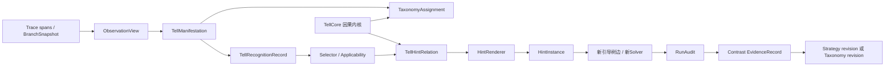

# 388号 · Tell分类学全量研究对非特化体系的吸收审计

**日期**：2026-08-13

**状态**：全量审计完成；目录内冻结语料54/54已归类，外部核心资产已回源；形成对387号的吸收包建议，尚未获授权修改387号或系统实现。

**文档性质**：Tell分类学历史研究与387号非特化证据工厂之间的全量谱系审计；本文件只做研究与设计映射，不启动Solver、不修改系统代码、不写数据库，也不直接修改Tell分类学本体或387号规格。

**主入口**：`Tell分类学研究过程文档/交接文档.md`

**目标题系**：`Tell分类学研究过程文档/387-v0-2026-08-13-非特化证据工厂-持续POC与高维正交验证系统设计.md`

---

## 0. 为什么单独建立本审计

此前Tell分类学研究本来就是为第六代AI数学系统服务的；当前“非特化”研究又在重新定义TellCore、HintRenderer、Case、EvidenceRecord、选择/执行/归责与持续学习。两条研究链存在明显重叠，但不能仅凭术语相同就直接合并：旧分类学包含FCA、trace/tell/hint、Level观察、高Level概念、识别分区和运行时结构；非特化体系强调因果充分取商、机制边界、资源公平、正负变形与版本证据。

本审计要回答的不是“旧文档有没有提到相似词”，而是：

1. 哪些旧对象、区分、失败反例和POC已经构成可复用研究资产；
2. 它们应被吸收到非特化体系的哪一层；
3. 哪些旧结论需要降级、改名或增加因果控制；
4. 哪些重复研究可以停止，哪些关键缺口仍没有被387号覆盖；
5. 吸收后是否会改变387号的TellCore、CaseLab、Selector、审计、版本学习或Golden Slice设计。

---

## 1. 冻结语料边界

### 1.1 目录内全量语料

本轮在388号创建前冻结的历史语料为：

- `Tell分类学研究过程文档/`根目录下54份Markdown；
- 其中52份三位编号文档，编号范围333—387（部分编号存在并列文档）；
- `交接文档.md`；
- 目录索引`README.md`。

388号是本轮审计产物，不计入上述54份；因此审计完成后的目录Markdown实数会比冻结语料多1份。

编号不是连续文件计数：341—343、384—385不在本目录；其中385号工作交接位于`dev-docs/`并作为外部资产回源。352和362各有两份不同文档，均分别计入52份编号语料。不能用编号区间相减替代真实文件库存。

“全量”至少要求对每份目录内文档完成文件级归类与去向判定；不能只深读交接文档后声称覆盖全部研究。

### 1.2 交接文档指向的外部核心资产

目录外但属于分类学知识主链的引用，至少包括：

- 项目根目录`000-v0-2026-08-08-引导树闭环-识别端结构定义.md`；
- `FCA学习笔记/08-先验Tell分类学.md`及交接文档明确要求的FCA前置笔记；
- 第六代系统研发/技术说明书中与Telling AI分区、trace→tell→hint、Pipe结构相关的文档；
- `system/`内已经物化的schema、运行时接口与docs；
- 277—289号历史POC链，以及372、373、381、382、383、386、387号非特化主链。

外部资产不自动全部纳入逐文件穷举；由交接文档和52份编号文档的引用图决定哪些必须回源深读，并在最终覆盖账本中显式记录。

---

## 2. 审计方法与完成判据

本轮使用四层覆盖：

1. **Inventory层**：每份文档记录编号、主题、研究阶段、输入、输出、证据状态；
2. **Schema层**：提取对象、字段、坐标轴、状态机、角色、数据流与不变量；
3. **Evidence层**：区分Positive / Negative / Protocol / Planned，不把设计意图当结果；
4. **Absorption层**：逐项映射到387号，给出`直接吸收 / 校准后吸收 / 仅作历史证据 / 不吸收 / 需要新增实验`。

完成时必须形成：

- 目录内54份Markdown的coverage ledger，遗漏数为0；
- Tell分类学历史主线和关键认知转折；
- 旧分类学对象→非特化对象映射；
- 旧POC→六门与EvidenceRecord映射；
- 可立即吸收、需要校准、存在冲突、仍需验证四类清单；
- 是否建议修订387号及修订范围，但未经用户批准不直接改写387号。

---

## 3. 总Verdict

### 3.1 一句话结论

**可以吸收，而且有一组关键内容必须吸收；但吸收对象不是“把v3五类原样塞进TellCore”，而是把旧研究中已经发现的对象边界、观察层、识别层、分类层、提示映射层和分类学版本审计，接到387号的因果TellCore与证据工厂上。**

两条研究链不是重复关系，而是上下游关系：

```text
Tell分类学研究回答：
候选思维模式怎样被观察、命名、分组、检索、排除、发现覆盖缺口？

非特化研究回答：
哪些候选显现真的是同一因果策略？何时适用？怎样执行？是否有增量效应？
```

分类学不能替代“因果充分取商”，后者也不能只靠一个未定义的`tell_taxonomy_coordinate`承载分类学。正确合流后，应形成：



### 3.2 最重要的七项判断

1. **旧“Tell”一词负担了至少五种不同对象，必须拆开。** `TaxonomyTerm`、`TellCore`、`TellManifestation`、`TellRecognitionRecord`、`HintInstance`不是同一个对象。
2. **v2最有价值的修正必须保留。** `local / non_local / global`是观察trace的粒度，不是TellCore固有属性，也不是root/point分叉位置；同一Core可有多个观察显现。
3. **000号四成分值得吸收，但不应整体塞进TellCore。** 分叉信号、未探索诊断和方向匹配依赖当前运行状态，应进入运行时Recognition记录；TellCore只保存跨题不变的因果内核。
4. **Tell与Hint多对多值得成为一等关系。** 当前`system/schema.py`中的`Hint.tell_id`仍是一对一外键，387号也缺显式关系对象；这会让选择、归责、版本与复用不可审计。
5. **FCA值得保留，但角色必须降准。** 它适合生成候选分类、寻找遗漏显现、组织覆盖与近邻反例；不能单独证明两个显现属于同一因果TellCore，更不能证明Hint有效。
6. **旧分类学v3只是先验ontology。** 五种段结构模式和六个domain可作为`TaxonomySnapshot v3`的候选词典，不得写成已验证的自然完备分类。
7. **旧POC与出题链留下了很好的协议资产和负证据，但没有完成非特化因果验证。** 355/357/358/363的bare淘汰、280的静态抽象Hint失败、383的文档字段消融都应进入EvidenceRecord，但证据类型不同。

### 3.3 对387号的总体处置

建议对387号做一次**窄而明确的“分类学桥接修订”**，而不是重写其因果实验、三审、版本学习和运行工厂：

- 保留387号的TellCore / Applicability / Execution / Renderer / Selector / EvidenceRecord主架构；
- 在其前端补齐Observation、Manifestation、Recognition、Taxonomy与M:N Hint关系；
- 在其版本层补齐TaxonomySnapshot、重分类影响集和分类学修订门；
- 在实验层增加分类路由、观察不变性、高Level解释形态与动态展开的正交实验；
- 明确旧分类学只提供候选结构，不提升任何既有因果证据等级。

本审计没有直接修改387号，因为那将改变已经逐节批准的规格；应在用户批准本吸收包后另行修订。

---

## 4. 历史研究主线：真正留下了什么

### 4.1 识别端根定义：读Tell，给Hint

000号文档的核心不是一个分类表，而是引导树闭环中的二元操作：

```text
从thinking读出未展开分叉（Tell）
  → 选择可走方向（Hint）
  → 在引导树新增边
  → 启动新的Solver走新分支
```

它有三项仍然适用于非特化体系：

- Tell关注“本来可以分叉但没有分叉”，不等于“AI停住了”；
- root branch与point branch决定新child应继承什么prefix；
- 识别结果包含分叉信号、分叉类型、未探索诊断、方向匹配四部分。

需要校准的是：这四部分描述的是一次**运行时读出**，其中只有机制类型的一部分可能跨题稳定。把它们全存入旧`Tell` dataclass，会把状态依赖的诊断和非特化Core混在一起。

### 4.2 333—340：高Level概念研究的可继承核

这一组文档真正贡献了六个结构性区分：

| 来源 | 可继承认知 | 在新体系中的位置 | 校准 |
|---|---|---|---|
| 333 | Tell↔Hint多对多 | `TellHintRelation` | 关系须版本化，并分别记录数学来源与系统因果证据 |
| 333 | 数学案例有效≠对Solver有效 | provenance与efficacy分账 | `case_source`三值不足以表达随机对照、泄漏和模型范围 |
| 334 | 触发依据有元模式、trace症状、题目相关性三层 | Applicability/Selector rationale | 是触发假设，不是合法性证明；必须测误触发和负迁移 |
| 335 | 同一高Level概念需执行型、识别型、判断型三种解释 | `ExplanationBundle` | 三种解释应独立版本、独立可见角色、独立审计 |
| 336 | 分类结构知识与具体内容知识分离 | `TaxonomyTerm` vs Core/Case/Hint | “坐标轴不是点”是有用类比，但不能把术语值和坐标轴本身混称 |
| 337/338 | 分类可用于排除候选 | Selector routing | 337“高Level始终在场”被338修正，不应吸收为生产规则 |
| 340 | 可枚举过程型与开放方向型的处理不同 | `expansion_mode` | 二分法仍是候选假设，允许hybrid，不视为完备类型学 |

335号的三种解释可精确映射为：

```text
recognition explanation → Selector / Applicability / Process Auditor
execution explanation   → ExecutionPolicy / HintRenderer
judgment explanation    → CaseLab / Critic / active-learning reviewer
```

这个映射比“把同一长说明放进所有Agent上下文”更安全，也能避免答案知识从Case/solution侧泄漏到Solver侧。

### 4.3 FCA v3：最有价值的是“对象与观察方式分开”

FCA先验分类学v3提出：

- 候选固有坐标：domain、段结构模式、具体概念；
- 观察参数：local / non_local / global；
- 当前五种段结构模式：构造—分析—排除、探索—诊断—修复、跨域桥接、归约策略、累积—收敛；
- “无尽追逐”是trace症状/子模式，不是独立固有类别。

其中最应吸收的是对象论判断：

> 同一个潜在Tell可在不同题、不同trace范围和不同Level视图中显现；观察范围变化不应自动创建新的TellCore。

09号IMO 2024 P5重分析展示了多Level观察能发现原profile遗漏的非局部/全局显现，但它只能支持“这种观察法可能提高候选召回”。它不能支持：

- 新发现的六个表述是六个独立TellCore；
- FCA分类已经完备；
- 这些显现可被自动Selector稳定识别；
- 对应Hint能提高Solver成功率。

原因包括：单题、看过标准解、没有盲化、没有独立去重、没有随机化干预，也没有迁移holdout。

### 4.4 344—347：从标量Level到候选族与Renderer

344—347先后提出去特化Level连续谱、Tell族、指导力钟形曲线、三步抽象法和三种提示形态。与372/387对照后，应作如下保留与降级：

- 保留“一条source trace可生成多个泛化候选”的`TellFamily`思想；
- 保留IBE、结构保持/表面剥离、可操作性检查，作为候选Core生成gate；
- 保留三种Renderer形态作为可预注册实验因子；
- 废止单一Level与固定钟形曲线作为当前模型；387号的多轴情境效用与Pareto前沿更强；
- 把“抽象/泛化Level”和“local/non_local/global观察Level”改成不同类型与不同字段，禁止继续共用`Level`一词。

建议标准化的Renderer实验标签为：

```text
abstract_label
direction_only
process_scaffold
operation_path
```

280号已经给`abstract_label`留下负证据；后续实验应在同一Core、同一状态和等资源下比较，而不是重新证明“抽象标签通常不够”。

### 4.5 348—370：真正的资产是协议、负例和设障方法

这一大段经常把“提出候选”“生成题目”“真实运行”写在相邻文档中，必须分开：

- 348/350/351是POC设计与委托协议；
- 349/353是思维力候选目录与重组假设；
- 两份352分别是旧观察技术手册与非特化协议审查；
- 354/362主文/365/367/369/370主要是候选题或预注册，不能作为Tell效果；
- 355/357/358/363是真实bare筛选结果；
- 360/361/另一份362是旧十并发复测系统的设计、交接和实施结果；
- 356/364/366/368沉淀了出题方法。

最值得吸收到CaseLab的是：

```text
solution script：正确解答为什么成立
obstacle script：题目怎样诱导自然错路、遮蔽结构、阻断廉价出口

case anatomy：
core + shell + decoy + lock + certificate + margin
```

它们能补强387号`MechanismContract`和`TransformationPlan`，尤其适合构造：

- 结构保持正迁移；
- 表面相似但机制破坏的假朋友；
- 只改变一个承载条件的最小边界；
- 具有严格证书的高距离正交题。

真实bare淘汰也有双重价值：候选题作为阳性Case失败，但`bare资格门`、自然错路分析和证明核验流程获得了负EvidenceRecord。不能只保留最后入选题，把被bare解出的题从研究史中删除。

### 4.6 371—387：非特化主链已经吸收了什么

371—373已完成一次大升级：

- 从“找一个最佳抽象句子”转为语义/操作/触发/退出/迁移/泄漏/成本契约；
- 从标量Level转为多轴Tell假设格；
- 从文本Tell转为TellCore / HintRenderer / HintInstance；
- 从最终成败转为过程因果链和EvidenceRecord；
- 从一次POC转为可选择、可执行、可终止、可组合、可归责、可学习六门。

387号进一步补齐资源公平、Case四轴、三审、随机contrast、版本学习、长期运行和Golden Slice。因此，下列旧内容**不需要重新移植**：

- 固定钟形曲线；
- 静态抽象Hint是否足够；
- 仅凭2/3成功写Tell有效；
- 把题目领域当完整正交坐标；
- 用同一开发题反复修到通过；
- 先全量验证26种思维力再建立小闭环。

真正尚未进入387号的是分类学研究的前端对象模型和专属生命周期，而不是再造一套六门。

### 4.7 374—380：海量失败流是候选供给，不是真值源

这组文档证明现有系统能够持续产生题目、attempt、物理trajectory和失败分类，并提供从数据库到文件的追溯方法。它们对证据工厂的价值是：

- 为`CandidateManifest`提供候选入口；
- 为`BareBaseline`提供多attempt原料；
- 为失败机制分类和抽样提供历史先验；
- 为长期流水线提供幂等、恢复、完整性和查询经验。

但旧`status/verdict`不能直接成为科学结论。尤其：

- `failed_token_limit`是终止原因，不等于稳定认知失败；
- Redis失败队列是快速访问层，不是历史真值；
- 单attempt失败不等于problem-level bare失败；
- 旧文把部分格式失败、工具停滞或答案泄漏归入“AI自身问题”，387号必须按协议重新分层；
- 旧四服务/十并发命令、mitm捕获和直接Arango访问已被当前管道与`system/db.py`规则取代，只能作历史经验。

另有一项安全问题：380号包含不应出现在研究文档中的数据库凭据，并示范直接客户端访问。该内容不应被吸收，应单独做凭据轮换/脱敏与文档修复；本审计不复述该凭据。

---

## 5. 旧术语必须先解缠

### 5.1 “Tell”至少被用来指五种对象

| 旧文中的用法 | 新对象 | 是否跨题不变 | 例子 |
|---|---|---:|---|
| 分类刻度/高Level概念 | `TaxonomyTerm` | 词典版本内相对稳定 | 跨域桥接、归约策略 |
| 非特化策略内核 | `TellCore` | 目标是保持 | 局部—全局表示切换 |
| 某trace上的显现 | `TellManifestation` | 否 | “此处一直在整数式内追逐” |
| 从当前thinking读出的诊断 | `TellRecognitionRecord` | 否 | root分叉、未探索方向、候选Core |
| 实际给Solver的话 | `HintInstance` | 否 | 当前题中绑定到模4分组的提示 |

旧`system/schema.py::Tell`同时保存四个识别成分和分类位置，因此把Core与Recognition混在一起。旧`Hint.tell_id`又把文献已经声明的M:N关系压回1:N。非特化吸收时不能继承这两个建模错误。

### 5.2 “Level”至少有三种含义

| 含义 | 建议字段 | 说明 |
|---|---|---|
| 观察trace的范围 | `observation_granularity` | local / non_local / global |
| 候选Core的泛化程度 | `GeneralizationProfile`多轴 | 不是单标量 |
| Renderer的脚手架具体度 | `scaffold_strength` / `renderer_type` | 同一Core可有多个 |

三者不能继续共用`level`。否则“高Level Tell在局部Level出现”这样的合法情况会在Schema中自相矛盾。

### 5.3 数学有效、系统有效、因果有效必须分开

333号的`case_source: mathematics | system | none`抓住了来源差异，但不能直接变成效力等级：

- 数学证明中出现：说明路线在某个数学案例中成立；
- Solver曾在引导后成功：仍可能是重启、更多token、泄漏或随机性；
- 随机contrast有增量：才支持限定模型/资源/范围内的系统因果效力。

因此建议分为：

```yaml
origin_provenance:
  source_type: mathematical_solution | solver_run | heuristic_generation
  source_refs: []
  solution_accessed: true | false

efficacy_evidence:
  evidence_record_ids: []
  maturity: hypothesis | observational | component_controlled | randomized_contrast | prospective
  model_resource_scope:
```

---

## 6. 建议补入387号的一等对象

### 6.1 `TaxonomySnapshot`与目标限定的`TaxonomyAssignment`

```yaml
TaxonomySnapshot:
  taxonomy_id:
  taxonomy_version:
  attribute_dictionary_version:
  term_manifest_hash:
  formal_context_snapshot_hash:
  parent_versions: []
  status: prior | tested | validated_within_scope | deprecated
  declared_nonclaims: []

TaxonomyAssignment:
  assignment_id:
  target_type: trace_candidate | tell_manifestation | tell_core
  target_id:
  taxonomy_snapshot_id:
  domain_terms: []
  segment_structure_terms: []
  specific_concept_terms: []
  classifier_version:
  evidence_spans: []
  confidence:
  reviewer_status:

FCAContextSnapshot:
  context_snapshot_id:
  taxonomy_snapshot_id:
  object_manifest_hash:
  attribute_dictionary_version:
  incidence_relation_hash:
  lattice_or_implication_artifact_hashes: []
  unclassified_remainder:
  stability_report_ref:
```

使用`target_type`是必要的：trace上的观察标签、Core的声明类别与Case的数学domain不是同一件事，不能都叫`taxonomy_coordinate`。`FCAContextSnapshot`保证一次格分析可重放；只保存“用了v3”不足以知道当时的对象集、属性词典与关系矩阵。

387号当前多处只使用单一`taxonomy_version`，建议拆成至少：

```text
math_taxonomy_release
tell_taxonomy_release
mechanism_label_release
observation_schema_version
attribute_dictionary_release
fca_context_snapshot_hash
```

这几类版本变化对Case、Selector和旧Evidence的影响不同，不能联动成一个模糊版本号。

### 6.2 `ObservationView`与`TellManifestation`

```yaml
ObservationView:
  view_id:
  source_vein_id:
  observation_granularity: local | non_local | global
  source_segment_ids: []
  prefix_or_snapshot_ref:
  construction_method:
  extractor_version:
  artifact_hash:

TellManifestation:
  manifestation_id:
  view_id:
  source_trace_spans: []
  normalized_pattern:
  candidate_tell_core_ids: []
  branch_location: root | point | multiple | not_observable
  manifestation_lineage_group_id:
  taxonomy_assignment_ids: []
  provenance:
  dedup_status:
```

同一Core在三个Level被看见，应生成三个manifestation、一个lineage group，而不是三条独立Core证据。09号“多看到六个”首先应进入manifestation discovery queue，再做去重与因果取商。

### 6.3 `TellRecognitionRecord`

```yaml
TellRecognitionRecord:
  recognition_id:
  branch_snapshot_id:
  observation_view_ids: []
  manifestation_ids: []
  taxonomy_snapshot_id:
  branch_signal:
    location:
    evidence_spans: []
    chosen_path:
    unexamined_options: []
  branch_type_hypotheses: []
  unexplored_diagnosis:
    claim:
    competing_diagnoses: []
    trigger_support_tiers:
      structural_meta_pattern: []
      trace_symptoms: []
      case_specific_relations: []
  direction_matching:
    candidate_tell_core_ids: []
    candidate_relation_ids: []
    selector_scores: []
    abstain_reason:
  observer_version:
  confidence:
```

这个对象把000号四成分和334号三层触发依据保留下来，又不污染TellCore。Process Auditor可以审核“系统读到了什么”，EvidenceRecord再通过跨arm contrast判断这种读出是否有因果价值。所谓“低压力提示”仍是待测Renderer policy，不能因措辞委婉就假定无害。

### 6.4 `TellHintRelation`

```yaml
TellHintRelation:
  relation_id:
  source_tell_core_ids: []
  direction_template_id:
  allowed_renderer_ids: []
  applicability_contract_refs: []
  relation_type: primary | alternative | fallback | distractor | deprecated
  origin_provenance:
  efficacy_evidence_ids: []
  leakage_budget:
  relation_version:
```

M:N关系的两端应是Core与方向模板/Renderer族，不是把一个已绑定到具体题的HintInstance永久挂回某个Tell。实际运行必须保存`relation_id + renderer_id + hint_instance_id`，否则无法区分“Core选对但方向模板错”“模板对但绑定错”“相同Hint由不同Core触发”。

### 6.5 `ExplanationBundle`与`expansion_mode`

```yaml
ExplanationBundle:
  bundle_id:
  taxonomy_term_or_core_id:
  recognition_explanation:
  execution_explanation:
  judgment_explanation:
  allowed_roles_by_view: {}
  example_refs: []
  forbidden_solution_atoms: []
  bundle_version:

TellFamily:
  family_id:
  source_event_lineage_groups: []
  shared_relation_structure:
  member_tell_core_ids: []
  member_generalization_profiles: []
  compatibility_or_exclusion_relations: []
  family_hypothesis_status:

GeneralizationProfile:
  retained_relations: []
  removed_surface_features: []
  parameter_freedom:
  execution_detail:
  declared_transfer_scope:
  leakage_risk:
  expansion_mode: enumerable | open_direction | hybrid
```

`TellFamily`继承345号“一条source trace可产生多个去特化候选”的洞察，但成员不是预设单标量Level上的点，也不预设指导力钟形。`expansion_mode`来自340号，但不把二分类写死为自然定律。对开放方向型概念，动态生成的方向仍须经过Selector、Leakage Auditor和资源成本审计，不能因为“无法穷举”就绕过证据门。

### 6.6 分类学专属修订对象

387号已有`RevisionProposal`处理策略组件，但taxonomy变化会重投影大量历史对象，不能伪装成Core Minor：

```yaml
TaxonomyRevisionProposal:
  proposal_id:
  source_snapshot:
  trigger_cases_and_evidence: []
  proposed_snapshot:
  change_type: add_term | remove_term | redefine | split | merge | move_axis | rename
  theoretical_basis:
  old_to_new_mapping: []
  coverage_preservation_check: []
  reclassification_impact_set: []
  evidence_reuse_policy:
  synchronized_artifacts: []
  prospective_taxonomy_test_pack:
  independent_reviews: []
```

它继承旧audit rule中最好的四要素：触发、修正、理论依据、逐项覆盖检查；同时增加未见数据确认、影响集和证据继承边界。通过后还要生成不可变`TaxonomyMigrationRecord`与逐对象`ReclassificationRecord`。旧记录保留原assignment，不改外键；新坐标通过新Assignment和mapping表达。

---

## 7. FCA在非特化体系中的正确角色

### 7.1 允许FCA做什么

- 从多个trace span生成候选共同属性与候选manifestation；
- 发现局部视图遗漏的跨段模式；
- 建立候选词典、近邻、上位/下位关系与覆盖洞；
- 为Selector提供可审计特征和candidate shard；
- 为CaseLab生成同类正例、近邻假朋友和最小边界候选；
- 检查一次taxonomy revision是否丢掉旧词项表达能力。

### 7.2 不允许FCA单独证明什么

- 不证明多个trace显现共享同一因果TellCore；
- 不证明某个属性是处理前可识别的适用边界；
- 不证明对应Hint对Solver有增量效应；
- 不证明domain-first分区是最佳Selector架构；
- 不证明现有五模式是完备自然分类；
- 不把一个形式概念或闭元素自动计为一个独立科学样本。

旧研究本身已经留下警告：序列划分格、FCA对象—属性概念格和工程上的多Level视图并非天然同一个数学结构；相关文档也明确不能为了使用FCA而强套算法。387号应把FCA定位成`candidate_generator / coverage_auditor`，而不是`causal_core_oracle`。

### 7.3 FCA结果如何进入证据工厂

```text
FCA候选
  → TellManifestation（discovery evidence）
  → 去重与竞争因果解释
  → 候选TellCore / ApplicabilityContract
  → 正变形、假朋友、边界Case
  → 预注册contrast
  → EvidenceRecord
```

只有最后的contrast可以对非特化因果claim写`supports`。FCA输出本身最高是Hypothesis或Protocol证据。

---

## 8. 对387号逐节吸收矩阵

| 387位置 | 已有能力 | 建议新增 | 不应改变 |
|---|---|---|---|
| §5核心对象 | Core/Renderer/Instance、RunAudit/Evidence | Snapshot、Assignment、View、Manifestation、Recognition、TellFamily、TellHintRelation | episode不得直接支持因果 |
| §6坐标 | 数学内容/机制/干预三坐标 | 展开`TellTaxonomyCoordinate`为目标限定Assignment；加入dictionary/snapshot版本 | 不把domain当唯一正交轴 |
| §7 CaseLab | 双视角机制、变换、数学核验 | solution script/obstacle script、六角色case anatomy、taxonomy近邻生成 | 生成题仍须独立VerificationDossier |
| §8实验 | L×D、Renderer、位置、Selector | 观察不变性、taxonomy routing、Renderer形态、enumerate/generate/hybrid实验 | 等资源fresh restart主基线 |
| §9三审 | Process/Proof/Leakage | Recognition与Manifestation事件span；跨view去重审计 | Proof正确不等于目标机制采用 |
| §10版本 | 组件release、RevisionProposal | TaxonomyRevisionProposal、重分类影响集、分类证据继承 | taxonomy改名不得升级Core efficacy |
| §11运行 | manifest、gate、恢复、golden slice | taxonomy snapshot hash、relation hash、classification drift告警 | 首条single-Tell slice仍不能通过组合门 |

CaseLab与InterventionCoordinate还应吸收三个旧研究中已经成形、但387未显式物化的辅助对象：

```yaml
AuthoringBlueprint:
  core:
  shell:
  decoy:
  lock:
  certificate:
  margin:
  solution_script:
  obstacle_script:

SearchSpaceReductionProfile:
  method_families_eliminated: []
  target_objects_or_representations_revealed: []
  theorem_family_revealed:
  open_search_reduced_to_local_completion:
  generic_reflection_control_result:

TellFunctionalType:
  type: execute | discriminate | compare | check | generate
  target_output_contract:
```

`AuthoringBlueprint`是出题provenance，不是新的Evidence轴；`SearchSpaceReductionProfile`进入Leakage/Attribution审计；`TellFunctionalType`进入干预坐标和Renderer输出契约，不成为“第七门”。

### 8.1 新增的确认性实验

#### E-TAX-1：观察不变性与显现去重

同一冻结trajectory生成local/non_local/global视图，盲审：

- 是否指向相同可接受Core集合；
- 新显现是信息增益还是表述重复；
- 观察范围改变是否错误地改变适用边界；
- 去重后独立样本数是否下降。

这验证的是表示与观察稳定性，不验证Hint效力。

#### E-TAX-2：分类路由价值

至少比较：

```text
全库/dense候选
domain-only pruning
v3多轴taxonomy pruning
自动taxonomy + abstain
```

报告positive recall、acceptable-set recall、false-friend rejection、selection loss、calibration、候选数、token/墙钟成本。分类学“排除机制”只有在不造成不可接受召回损失时才成立。

#### E-TAX-3：高Level解释形态

冻结Core与正确trigger，比较`abstract_label / direction_only / process_scaffold / operation_path`。所有arm等调用与等生成预算；额外输入token作为干预成本报告，不用垃圾padding伪等长。

#### E-TAX-4：展开模式

对可枚举、开放方向和混合候选分别比较：预先列表、动态生成、混合检索。最小四臂为`heuristic-only / enumerated-only / both / neither`；测覆盖、误触发、重复分心、泄漏、成本和未见Case成功，不把“生成了一个方向”或“语气低压力”当成功/无害。

#### E-TAX-5：M:N关系特异性

在同一Core对应多个方向、同一方向被多个Core触发的case上，比较正确relation、等具体度distractor relation和abstain。归责到`core / relation / renderer / binding`四层，避免把共享Hint的效果全部记给某个Core。

### 8.2 对六门的增量

| 六门 | 分类学可贡献什么 | 不能替代什么 |
|---|---|---|
| 可选择 | candidate routing、negative pruning、abstain、acceptable-set | Oracle execution与A−N/O−A在线contrast |
| 可执行 | execution explanation与Renderer形态 | target action→valid progress的过程证据 |
| 可终止 | guard/低置信度退出候选 | checkpoint后的neutral continuation contrast |
| 可组合 | 识别依赖、冲突候选 | 两个真实独立TellCore的组合矩阵 |
| 可归责 | manifestation去重、relation ID、识别span | 随机化资源对照与三审 |
| 可学习 | taxonomy revision与覆盖保持 | 多Epoch策略因果学习与prospective efficacy |

M:N Tell↔Hint或同一Core的多个Renderer都**不等于可组合门中的多个独立TellCore**。

---

## 9. 历史证据重新定级

| 证据链 | 正确等级 | 可以支持 | 不可以支持 |
|---|---|---|---|
| 277/278 | Concept + Protocol | 同文本远迁移的强命题和A/B/C骨架 | 强命题已经成立 |
| 280 | Negative Evidence | 同一静态抽象Hint在该题包中无稳定效果 | 所有高Level解释都无效 |
| 283 | Contaminated package positive | lineage+题目化方向+近解答提示的整体包可救回部分题 | 同一具体Hint跨题、TellCore独立效应、自动选择或低泄漏 |
| VMS-9/10 | Mechanical smoke only | 两条硬编码记录上的过滤/关键词计数代码能够运行 | topology泛化识别、近邻Tell可分辨、自动大规模分类或因果适用性 |
| FCA 09单题 | Observational discovery | 多Level观察可能提高manifestation召回 | 六个新Core、分类完备或Hint有效 |
| 344—347 | Hypothesis / Protocol | 候选族、生成gate、Renderer形态值得测试 | 单峰规律或最佳Level已经证实 |
| 355/357/358/363 | Negative Case evidence | 候选题bare gate失败；路线/proof/output需分判 | 对目标题Tell的效力结论 |
| 旧十并发362报告 | Infrastructure positive + prediction negative | harness并发/留证可运行；预测失败不可靠 | 5次token-limit题稳定认知失败 |
| 374/380失败流 | Data/provenance evidence | 可追溯候选池和终止原因 | problem-level能力边界或Tell阳性 |
| 382 | Planned CasePack / math review pending | 候选角色和CaseCard结构 | 已冻结可运行的正确题包 |
| 383 | Design analysis | 字段必要性假设与后续消融计划 | 已做真实字段消融或POC-1因果PASS |
| 387 | Approved specification | 如何建立证据工厂 | 工厂已实现或Tell理论已通过 |

### 9.1 一个必须立即降级的CasePack问题

382号把CC-013标为`verification_status: verified`，并声称递推

```text
x₁=a, x_{n+1}=2x_n+1
```

对应的倒数和极限为`1/(a+1)`。这个结论显然不成立：当`a=1`时，仅第一项`S₁=1`就已经大于声称的极限`1/2`。级数确实因指数增长而收敛，但文档给出的精确值与所谓“telescoping”没有被证明，且为错。

影响是：

- CC-013不得继续标`verified`，应进入`quarantined_math_error`；
- 382号不能称为完成数学冻结的CasePack；
- 383号用CC-013说明negative boundary的相关段落只保留为设计直觉；
- 385/README沿用的“POC-0/1已完成、全部PASS”必须降为“候选题包与结构审查已完成，经验/数学确认未完成”；
- 387号独立VerificationDossier和CaseLab Gate 5因此得到一个真实回归样本。

这不是小错字，而是证明“题包设计者不能同时充当最终数学Judge”的直接反例。

### 9.2 历史anchor必须带版本

359号把1709等列为历史强候选，但后续复测已显示1709 bare成功，而VMS-10中正确的`1709 + T05`干预并未真正运行。它应从387号当前source anchor候选中隔离为`baseline_drift / probabilistic_failure`，直到当前snapshot完成Phase 0。历史`bare failure`必须绑定model/config/resource/source rollout；新模型、新harness或新预算下不得沿用同一标签。387号的`BareBaseline`和`model_resource_regime`应取代“题目永久失败”的索引口径。

### 9.3 旧POC的内容泄漏与自证结构

进一步回源运行资产后，283/VMS-8必须比“多组件混杂”再降一级：

- 1843成功prompt已经给出模4分组、两套因子和用符号相反排除实根的局部证明骨架；
- 1631成功prompt已经给出二次剩余判据、关键精确等式和最后的整除矛盾；
- 1962只得到较宽泛的p-adic方向，最终失败。

因此2/3更像`partial-solution completion`的阳性，不是低泄漏非特化Tell的阳性。它仍可证明“题目化操作路径可能可执行”，但必须由Leakage Auditor标记污染，不能进入确认性Core efficacy。

VMS-9的所谓干扰组只是把1631与1843的高度题特定路线交叉串给另一题，属于明显不匹配提示，而非等具体度near-miss distractor。VMS-9/10实现又只有两条硬编码Tell；标签由字面规则赋值，VMS-10的小概念包含题目身份词，正确T05干预也未真正运行。正确表述应是：

```text
VMS-9  = mechanical filter smoke
VMS-10 = problem-identity token discrimination smoke
```

这两项只能进入实现回归，不得再写成“拓扑Tell已验证”或“小概念已证明能区分近邻Tell”。后续Selector确认必须去题目身份词、自动标注、扩大Tell库并使用未见holdout。

---

## 10. 发现的内部冲突与工程漂移

### 10.1 分类学研究内部

1. 337号“高Level概念始终在场”被338号的专门载体/按需识别逻辑修正，但345号和交接摘要仍复述旧口径。
2. 09号部分段落仍写“6大类”，当前v3明确定义5种段结构模式。
3. 迭代audit文本称“7条铁律”，正文实际继续加入第8、第9条。
4. 08号一方面声明Schema只维护结构知识，另一方面仍混入具体Tell行和形式背景实例。
5. 336号把高Level概念称“坐标轴”，其他段又把“同构之桥”同时作为刻度、子模式、Tell和Hint，术语层级不稳定。
6. FCA、序列划分格、Hasse层级与工程Level视图在若干旧文中被类比得过近；原研究后文已经承认不能强套为同一个算法对象。

### 10.2 跨文档与当前实现

1. AGENTS术语表仍描述旧四层`domain + trace_type + segment_pattern + specific_concept`，后部Schema节则是v3三固有维度+观察参数。
2. `system/docs/schema.md`仍把`trace_type`写成Tell分类第二层，与`system/schema.py`注释和v3原则冲突。
3. `system/docs/references.md`仍引用已删除/旧版字段来源，和实际dataclass不完全一致。
4. `system/schema.py::Hint`只有单个`tell_id`，违反333号M:N关系。
5. `system/schema.py::Tell`把运行时识别四成分和分类坐标混为一个对象。
6. 339号仍标“待执行”，但08号、AGENTS与部分system schema已经局部融合，计划状态与实际状态漂移。
7. 380号的直接数据库凭据和访问方式违反当前凭据卫生与`system/db.py`唯一入口规则。
8. 旧tmux/mitm/四服务命令和并发参数已经过时，不能复制进证据工厂runbook。
9. `system/schema.py::Problem`含答案，而`SolverInput`持有完整Problem，Schema能力边界允许答案误入Solver视图；必须由分权输入类型而非调用者自觉防泄漏。
10. `SolutionRecord.is_verified`默认真，以及未匹配trace可直接进入`KnowledgeDeposit`成为Tell，均绕过387号独立Proof Gate、CaseLab和Revision Gate。
11. 当前`process_solve.py`、`process_absorb.py`和solve侧脉络分析仍有关键`NotImplemented`；`system/docs/architecture.md`也只确认Parser侧部分实现。旧文的POC完成度不能推导“证据工厂已有实现”。
12. `system/db.py`仍有默认数据库/读时建集合等fail-open行为，不满足387号冻结DB身份、strict read、CAS/ledger/outbox要求。
13. 部分`.ref`仍指向已不存在的six路径或说明书文件，且`system/schema.ref`尚未纳入371—387主链；system自包含性当前仍是目标，不是事实。

结论：分类学版本管理不能只同步08号与AGENTS某一节；它必须对`taxonomy snapshot → code schema → system/docs → prompt assets → selector registry → frozen EvidenceRecord`做机器可检查的同步报告。

---

## 11. 推荐吸收包与优先级

### P0：先修证据污染，不改理论

1. 隔离382号CC-013，重新核验所有标`verified`的构造题；建立独立VerificationDossier。
2. 对380号敏感凭据做轮换/脱敏，删除直接客户端示范，改为当前受控DB入口。
3. 建立v1→v2→v3分类映射，列出AGENTS/system/docs/prompt资产的漂移清单；在修完前，运行数据必须保存精确schema/hash，不能只写`taxonomy_version=v3`。
4. 将383/385/README中的POC-0/1措辞统一降级为“结构设计/候选字段审查”，不计经验PASS。
5. 把当前`Problem→SolverInput`答案能力、默认`is_verified=true`和未匹配trace直接升Tell列为Golden Slice硬blocker；在分权输入、Proof Gate和Revision Gate落地前，legacy absorb/solve路径不得生成确认性Evidence。

### P1：修订387号的分类学桥接层

1. 新增§5对象：Snapshot、Assignment、View、Manifestation、Recognition、TellHintRelation、ExplanationBundle。
2. 展开§6的`tell_taxonomy_coordinate`，并把Assignment target与数学内容坐标分开。
3. 在§7吸收`AuthoringBlueprint`的solution/obstacle script与六角色case anatomy，并由`SearchSpaceReductionProfile`审计题目是否把开放搜索泄漏成局部补全。
4. 在§8加入E-TAX-1至E-TAX-5及`TellFunctionalType`；不改变已有Phase 0—5的主contrast，也不新增“第七门”。
5. 在§9让Process Auditor审计识别span、manifestation lineage与目标Core，不让其看Hint/arm。
6. 在§10增加TaxonomyRevisionProposal和重分类影响集；taxonomy变更不能继承Core efficacy。
7. 在§11冻结taxonomy/dictionary/relation/explanation hash，并监控classification drift。

### P2：用户批准规格后再迁移实现

- 重构`system/schema.py`，不兼容变更必须有迁移器，不原地改旧记录；
- 修正`system/docs/schema.md`、`references.md`和AGENTS重复Schema；
- 将具体taxonomy词典移出always-on AGENTS，形成版本化机器资产；
- 为M:N关系建立join/registry，而非单外键；
- 为旧Trace/Tell记录生成migration assessment，不把重分类后的标签写回历史原件；
- 建立taxonomy sync checker与drift alert。

### P3：首批实验顺序

```text
先做 E-TAX-1 观察不变性/显现去重
  → 再做 E-TAX-2 分类路由是否真有价值
  → 再做 E-TAX-3 Renderer形态
  → 开放方向型样本足够后做 E-TAX-4
  → M:N真实冲突case成熟后做 E-TAX-5
```

不要一开始重跑全部455/67,837个profile，也不要先把26种思维力全部词典化。先用当前golden slice的一个Tell家族和少量positive/false-friend/boundary做完整桥接。

---

## 12. 全量目录coverage ledger（冻结语料54/54）

说明：本表的“吸收处置”是对内容的处置，不等于文件质量评级。`388`是审计产物本身，不计入审计启动时冻结的54份历史语料。

| 文件 | 证据性质 | 吸收处置 |
|---|---|---|
| 交接文档 | Handover | 主线入口；事实需回源，不作独立证据 |
| README | Index | 用作库存交叉核验；已发现原索引漏列376—380 |
| 333 | Concept | M:N、效力分账直接吸收；展开主张由340校准 |
| 334 | Hypothesis | 触发依据与pressure策略转为Selector实验 |
| 335 | Concept | 三解释面直接吸收为ExplanationBundle |
| 336 | Concept | 结构/内容分离吸收；轴/刻度/点术语校准 |
| 337 | Superseded hypothesis | 保留排除假设；拒绝“始终在场”生产规则 |
| 338 | Concept correction | 按角色载体与识别任务吸收；不固化AGENTS载体 |
| 339 | Integration plan | 只作历史计划；部分实施状态需重审 |
| 340 | Refined hypothesis | expansion_mode吸收；允许hybrid和经验修订 |
| 344 | Concept | 保留泛化候选族；废止Level重名 |
| 345 | Hypothesis | 保留TellFamily；钟形曲线降级 |
| 346 | Method proposal | 作为Core生成gate，不作有效性证据 |
| 347 | Protocol | Renderer四形态进入正交实验 |
| 348 | POC design | Case/contrast素材；未运行项不计证据 |
| 349 | Candidate inventory | 只作思维力发现集，不作自然分类或效力证据 |
| 350 | Protocol | 匹配/错配/鼓励对照、纯洁性与预注册吸收 |
| 351 | Delegation prompt | 只作任务需求来源，不作研究结果 |
| 352（观察技术） | Historical runbook | artifact思想保留；旧tmux/mitm操作废弃 |
| 352（策略审查） | Protocol review | trigger/exit/function/leakage/intensity/attribution吸收 |
| 353 | Candidate framework | 父类重组作为hypothesis，禁止直接写taxonomy validated |
| 354 | Generated cases | development素材；被后续bare结果更新 |
| 355 | Negative run evidence | 候选淘汰；支持bare admission gate |
| 356 | Case-design protocol | core/shell/decoy/lock/certificate/margin吸收 |
| 357 | Negative run evidence | 候选淘汰；记录廉价出口与阈值问题 |
| 358 | Mixed observational evidence | route/proof/output三层判定吸收 |
| 359 | Historical index | 作为发现入口；anchor随model/resource版本化 |
| 360 | Historical implementation design | 并发留证经验；旧系统不复用 |
| 361 | Implementation handoff | 资源/阶段gate经验吸收；命令已过时 |
| 362（挑战题） | Generated/planned cases | 未跑题为development；已跑题看363 |
| 362（实施报告） | Infrastructure result | 留证/并发阳性；预测失败和token-limit降级 |
| 363 | Negative run evidence | 两道新造题bare淘汰；硬化经验吸收 |
| 364 | Case-design protocol | 母题拆解与自然错路吸收 |
| 365 | Planned queue | 题源候选，不计运行证据 |
| 366 | Method proposal | Level 3—4机制抽取吸收为出题操作，不作效力证据 |
| 367 | Planned queue | 只作候选挑战池 |
| 368 | Case-design protocol | solution/obstacle script与挑战公式直接吸收 |
| 369 | Generated/planned cases | development素材，未运行 |
| 370 | Generated/planned cases | development素材，未运行 |
| 371 | Theoretical synthesis | 重要要求已大体进入372/387；不重复建栈 |
| 372 | Architecture/specification | 非特化理论主核；作为387上游规格 |
| 373 | POC protocol | 六门与CaseCard上游；未运行POC不作结果 |
| 374 | Data/provenance report | 候选追溯入口；旧失败归因需387重分层 |
| 375 | Supply strategy | 题源规划，不是Tell证据 |
| 376 | Operational data report | 候选池供给事实，不是分类学/效力证据 |
| 377 | Historical pipeline implementation | 数据可审计/恢复经验；运行架构已演进 |
| 378 | Test protocol | 完整性测试思想吸收；未执行项保持planned |
| 379 | Historical runbook | 故障/恢复经验；命令与架构不复用 |
| 380 | Data query guide | 失败流入口；敏感凭据与直接DB方式必须修复 |
| 381 | Handover | 372/373入口；旧完成度与证据等级需重校准 |
| 382 | Candidate CasePack | 角色设计可用；数学冻结被CC-013反证 |
| 383 | Design analysis | 字段假设可用；不是实跑消融或因果PASS |
| 386 | Historical index | 正交出题引用图可用；283强度按387校准 |
| 387 | Target specification | 主体保留；补分类学桥接层 |

**账本计数**：编号文档52份 + 交接文档1份 + README 1份 = 54份；已归类54份；遗漏0份；remainder=0。

### 12.1 外部核心资产回源账本

| 资产 | 用途 | 结论 |
|---|---|---|
| 000号根定义 | Tell四成分、root/point、引导树动作 | 吸收到Recognition与Injection语义 |
| FCA 08 | v3先验taxonomy及版本史 | 作为Prior Snapshot，不作validated ontology |
| FCA 09 | 单题多Level重分析 | discovery evidence，需去重/盲化/holdout |
| taxonomy iteration audit rule | 修订覆盖与同步 | 扩展为TaxonomyRevisionProposal |
| taxonomy schema maintenance rule | 结构/内容分离 | 升级为多资产机器同步，不只AGENTS |
| AGENTS Tell Schema | 跨session认知 | 发现旧新口径并存，需迁移 |
| `system/schema.py` | 当前物化Schema | 发现Core/Recognition混合与M:N缺失 |
| `system/docs/schema.md`、`references.md` | 工程说明 | 发现v1/v3漂移 |
| 277—289历史POC | Hint/Tell早期验证 | 按280负证据、283污染性包阳性、VMS9/10机械smoke校准 |
| `dev-docs/384` | AGENTS瘦身元工程 | 编号碰撞；与Tell科学内容无关，不吸收 |
| `dev-docs/385` | TellV3历史交接 | 保留候选结构；POC-0/1完成度按本审计降级 |

### 12.2 关键结论的回源定位

| 结论 | 主要物证位置 |
|---|---|
| Tell↔Hint M:N；数学/系统效力分离 | `333-...md:34-44,172-231` |
| 三种解释面 | `335-...md:42-120` |
| 可展开/开放方向型 | `340-...md:30-138,228-233` |
| v2观察Level修正、v3先验边界 | `FCA学习笔记/08-先验Tell分类学.md:39-56,474-531` |
| 000号四成分与root/point | `000-v0-2026-08-08-引导树闭环-识别端结构定义.md:67-150` |
| Renderer三形态 | `347-...md:13-67,154-168` |
| 真实bare淘汰与route/proof/output分层 | `355-...md:79-196`；`357-...md:60-241`；`358-...md:30-208`；`363-...md:39-266` |
| 1709后续bare成功 | `361-...md:87-95` |
| 旧批量报告7 valid/2 invalid/5 token-limit | `362-...Devin十并发复测系统实施报告.md:41-109` |
| CC-013错误 | `382-...md:1320-1348` |
| 383承认未做经验有效性验证 | `383-...md:609-611` |
| VMS-8近解答提示 | `runs/vms_poc_0/vms8_problem_files/1843_tree.txt:11-30`；`1631_tree.txt:5-34`；`1962_tree.txt:7-28` |
| VMS-9/10硬编码/身份词smoke | `xishujuzhen/vms/poc9_tell_filter.py:25-52,58-174,181-226`；`poc10_tell_disambiguation.py:27-70,106-121,221-268` |
| 当前Schema的M:N矛盾与显现缺口 | `system/schema.py:32-96,249-256` |
| 当前答案/验证/直接升Tell风险 | `system/schema.py:23-30,202-212,281-285,315-324` |
| 387只留未展开taxonomy字段 | `387-...md:538-564,736-743` |

---

## 13. 明确非主张

本审计不主张：

- v3五模式已经完备或具有自然唯一性；
- FCA已经找到真正的因果TellCore；
- 09号单题多发现六个显现等于多发现六个可用Tell；
- domain-first分区已证明优于其他Selector架构；
- “同构之桥”是所有数学迁移的正确统一名称；
- 高Level概念应始终注入每个Solver上下文；
- `case_source=mathematics`意味着对当前Solver有效；
- TellFamily存在固定单峰指导力曲线；
- 382/383已经完成经验POC-0/1；
- 当前387号证据工厂已经实现；
- 本审计已授权修改387、系统代码、数据库或运行Solver。

---

## 14. 最终建议

**建议批准“P0证据修复 + P1分类学桥接修订”，暂不批准P2代码迁移。**

理由是：

1. 旧研究确实补上了387号目前最薄的一层——从trace怎样形成可审计的Tell候选；
2. 387号已经补上旧研究最缺的一层——候选怎样经过因果对照、负例、泄漏审计和版本前瞻确认；
3. 两者合流后，才能把“看见一个模式”“把它分类”“选中一个Core”“给出一个Hint”“AI因此改变路线”逐层区分；
4. 直接改代码会把当前文档中的v1/v3漂移和CC-013式错误固化进数据，因此必须先修规格和证据。

若用户批准，下一步应是：

```text
修订387号（只加分类学桥接层）
  → 对修订稿做因果一致性终审
  → 单独形成旧Schema迁移设计
  → 再决定是否实现E-TAX-1 golden slice
```
