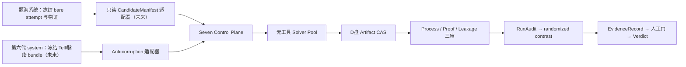

# Seven System 架构与系统边界

## 一句话结论

Seven System 是两套既有系统之间的独立证据控制面：它不做大规模能力扫描，也不直接实现第六代数学推理，而是把冻结输入变成公平实验、可审计证据和有边界的版本结论。

## 用户先看到什么

操作者面对的是一个 `seven` 命令，而不是一组需要手工拼接的 tmux、Redis 和数据库命令。每次工作都属于一个有限 Epoch：

```text
preflight → init-epoch → dry-run → （未来）P2...P9 → verdict → checkpoint
```

一个 Epoch 的输入、代码版本、资源和停止条件一旦冻结就不再修改。配置变化意味着新 Epoch。

## 为什么不能直接扩展现有两套系统

### 题海系统解决的是“发现失败”

大规模高并发系统追求吞吐和能力边界，其实验设计要求Solver不调用工具，从而保持大并发并产生bare成功/失败、trajectory和runtime verdict；现有实现尚不能把Prompt层要求升级为物理无工具能力PASS。

但它的 `candidate_solved` 只表示检测到候选 proof，并不等于数学证明已被独立验证；一次 token limit 也只是输出被截断，不等于稳定的认知失败。Seven System 因此只读使用其冻结物证，不直接拿生产状态当 Tell 因果结论。

### 第六代系统解决的是“未来怎样解题和吸收知识”

`system/` 的目标是让引导树与解题树生长。目前真实实现只覆盖脉络分析的一部分，完整入题、Tell 匹配、知识沉淀和解题侧仍未完成。

Seven System 不 import `system.*`，也不共享它的 `problem_entries/sessions/ai_instances`。未来连接方式是一个版本化 JSON bundle：由 producer 导出，Seven 验证 Schema 和 SHA-256 后导入。

### Seven System 解决的是“这条非特化主张是否真的成立”

它控制资源、随机化、盲化、Proof Judge、泄漏审计和 EvidenceRecord。工厂可以正确地产出 Tell 的负证据；科学假设失败不等于工厂失败。

## 总体数据流



虚线意义上的“未来”接口在 v0.1.0 尚未实现；当前运行Control Plane的P0/P1 scaffold和WP-1离线Strict DB contract。后者是工程前置能力，不提升canonical phase ceiling。

## 控制面与执行面

### 控制面

控制面未来唯一持有：

- 数据库写权限；
- Epoch、Phase、Gate、lease/fence、outbox；
- RuntimeManifest 和 Evidence DAG；
- 人工审批记录；
- stop/reconcile/resume 决策。

### Solver 执行面

Solver 是叶子执行器，而不是系统管理员：

- 不获得 DB、Redis、repo 或 Vault 凭据；
- 不读取题目文件，题面和干预直接进入启动上下文；
- 不调用 read/write/edit/exec/search/browser/web；
- 只产生 reasoning、final response 和运行物证；
- 任意工具事件使该 physical attempt 变为 `invalid_tool_use`；
- 观测证据缺失或解析失败使其变为 `invalid_observability`，不能 fail-open。

题海系统当前的 3 秒启动间隔和历史 60 并发是有价值的站点经验，但不是跨模型永久常数。每个 Epoch 都在 RuntimeManifest 冻结实际并发、启动间隔和资源预算。

### 审计执行面

审计 Worker 可以使用工具，但权限相互隔离：

| 角色 | 可以看到 | 永久不能看到 |
|---|---|---|
| Process Auditor | 题面、去干预文本的轨迹、机制契约 | 答案、真实 arm、Hint 文本、其他审计结论 |
| Proof Judge | 题面、final proof、必要核验材料 | Tell、arm、完整 thinking、其他审计结论 |
| Leakage Auditor | Solver 实际可见 payload、访问记录、最小解答视图 | Process/Proof 结论和实验解释 |

三份报告分别 seal 后才允许组装 RunAudit。单次 RunAudit 只能陈述“发生了什么”；只有预注册 randomized contrast 才能形成 Tell 因果 EvidenceRecord。

## 单 Epoch 阶段

| Phase | 目标 | v0.1.0 |
|---|---|---|
| P0 | 路径、DB、D盘、Vault、Harness、能力报告 preflight | 已实现静态只读检查 |
| P1 | Schema、幂等、冲突拒绝、恢复演练 | 仅实现单文件原语、append-only scaffold Gate/checkpoint/verdict与完整性seal；完整故障恢复矩阵未实现 |
| P2 | CandidateManifest 与 problem-level bare 资格 | 未实现 |
| P3 | CaseLab、数学核验、机制边界 | 未实现 |
| P4 | arms、contrast、资源、盲化、停止规则冻结 | 未实现 |
| P5 | 等资源无工具 Solver 实验 | 未实现 |
| P6 | Process/Proof/Leakage 三审 | 未实现 |
| P7 | contrast EvidenceRecord | 未实现 |
| P8 | 独立 NO_CHANGE 或受控 Revision | 未实现 |
| P9 | 多维 Verdict、Checkpoint 和 Evidence Index | 未实现 |

WP-1不是canonical P1的别名。现行模型把三个层次分开：站点大对象存储`G-WP1-S=PASS`、离线代码契约`G-WP1-C=PASS`；复用原逻辑数据库所需的真实身份/catalog核验`G-WP1-L=NOT_IMPLEMENTED`；Seven Schema初始化`G-WP1-I=NOT_IMPLEMENTED`。Arango engine未由D盘承载保留为非阻塞告警`A-WP1-D=DEFERRED_WARNING`。生产database package只有只读planner，没有site verifier或apply/DDL入口；因此离线contract PASS不能被架构图解读为数据库控制面已经上线。

## 状态与真值源

未来的调度语义是：

```text
at-least-once delivery + idempotent commit
```

不声称 exactly-once。不可变 WorkEvent、sealed artifact 和 Evidence DAG 是真值；Redis 只是可重建投影。

首版已经实现最小原语：

- canonical JSON + SHA-256；
- 同路径同内容返回 `ALREADY_COMMITTED`；
- 同路径不同内容抛出 `ContentConflictError`；
- RuntimeManifest 自哈希验证；
- 真实Seven源码树、卷设备与README指纹冻结；
- 初始/P1两级文件完整性索引与Epoch外local append-once receipt（明确非WORM）；
- append-only P1 GateDecision、后续checkpoint和scaffold verdict；
- 不覆盖已初始化的不同 Epoch 身份。

真实 WorkEvent、lease、fencing、outbox、签名/WORM/DB信任根和Artifact两阶段提交仍未实现。

## 运行停止条件

未来任一条件触发停止领取新任务：

- ExperimentPlan 或统计停止规则完成；
- 总预算达到上限；
- D 盘丢失、设备变化或空间临界；
- `ARANGO_DB` 错误；
- 工具调用或不可审计；
- 答案/Vault/holdout 污染；
- hash 冲突、重复 Solver 启动或 DB/Artifact 无法对账；
- Audit/Review backlog 超阈值；
- 模型、代码、Schema 或 manifest 漂移；
- 用户明确停止。

当前 P0/P1 的停止条件更窄：preflight BLOCK、内容冲突或 dry-run 验证结束。

## 与 388 号分类学吸收结论的接口

首版 RuntimeManifest 为以下对象预留 opaque hash：

- `TaxonomySnapshot`；
- `TellHintRelation`；
- `TellStrategyRelease`；
- `CasePack` 与 `ExperimentPlan`。

这保证未来能接入多观察视图、Tell-Hint M:N 和分类学版本，而不在首版自动生成或修改它们。opaque hash 不是“功能已经实现”。

## 读完应记住的五句话

1. 题海系统发现失败，Seven System 证明或反驳非特化因果主张。
2. 第六代 `system/` 是外部 producer，不能成为 Seven 的内部可变依赖。
3. Solver 无工具是能力契约；Prompt 约束本身不是能力证明。
4. 大对象在 D 盘；Seven复用`xishujuzhen_math_glm52`但只用`seven_*_v1`命名空间，DB存身份、索引、事件和引用，Redis只做可重建投影。
5. v0.1.0 只到 P1；任何科学 Tell 结论都是 `NOT_TESTED`。
