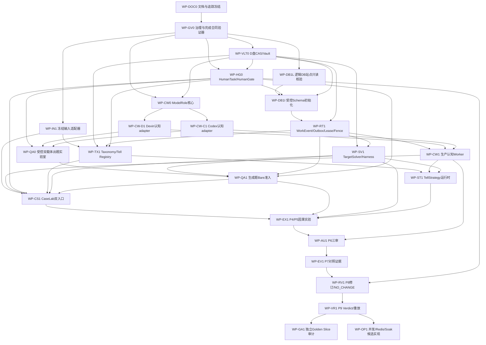

# 完整工作包依赖图

## 一句话结论

另一位 AI 必须按依赖图逐包实现，不能从“出题很有趣”直接跳到模型调用，也不能从“数据库计划已写好”直接跳到真实DDL。每个工作包都必须独立提交，并按canonical DAG的`completion_contract`交付`DOC_BOOTSTRAP_RECORD / IMPLEMENTATION_BUNDLE / AUDIT_RECORD`之一；达到`READY_FOR_AUDIT`后可继续无副作用下游开发并继承审计债。真实激活既要求适用上游达到`AUDITED_PASS`，也要求本次副作用同时持有父级`ExternalExecutionAuthorization`、其不可扩权子集`LiveRunPermit`和原子`AuthorizationConsumptionReceipt(RESERVED)`；未审canary只能在同一完整授权链明确覆盖后运行并标记`UNAUDITED_AUTHORIZED_CANARY`，绝不能取得正式PASS或科学主张。

## 依赖图

[`work-package-dag.v1.json`](work-package-dag.v1.json)是development与activation两类依赖边的唯一机器真值源；下面的Mermaid只投影development边，`work-package-board.md`同时投影两类边。WP-DOC0的链接/完备性检查必须解析该JSON，断言无未知依赖、无环、投影依赖集完全相等；禁止手工改看板却不改canonical DAG。



## 工作包共同模板

机器可验的`WorkPackagePlan`字段和逐包交付下限见[`15-work-package-implementation-contracts.md`](15-work-package-implementation-contracts.md)。

每个工作包开工前必须补齐：

1. 目标、非目标、停止条件；
2. canonical DAG中development/activation依赖工作包的spec/bundle hash与两类status；无副作用开发可依赖`READY_FOR_AUDIT`并继承审计债，激活不得把它写成`AUDITED_PASS`；
3. 精确修改文件与禁止触碰对象；
4. 接口、Schema、状态迁移和版本规则；
5. 权限、答案隔离和外部副作用；
6. 幂等、并发、失败、重试与恢复；
7. blocker tests先于happy path；
8. unit/component/integration/live/fault测试分层；
9. CapabilityReport、Receipt、Gate或Verdict产物；
10. PASS/PARTIAL/FAIL/BLOCKED判据；
11. 明确nonclaims；
12. canonical `completion_contract`对应的完成对象、文档同步和显式commit边界。

`WorkPackagePlan.execution_mode`只能是`SIDE_EFFECT_FREE`或`AUTHORIZED_LIVE_CANARY`。前者三个授权ref必须为null且全部side-effect budget为0；后者必须绑定父级EEA、不可扩权LiveRunPermit、原子预留收据，并至少有一项正的副作用预算。DOC0 bootstrap计划在该字段引入前已冻结，按Schema仅对DOC0隐式解释为`SIDE_EFFECT_FREE`，不能把兼容例外复制给后续工作包。

## WP-DOC0：文档、需求和审计映射冻结

**目标**：建立当前这套实现/审计体系及需求ID，阻止后续AI只读387后自由发挥。

**输出**：

- `implementation/`、`audit/`、`decisions/`；
- RequirementTraceabilityMatrix；
- `NormativeRequirementIndex`、生成器与Schema；
- work-package-board；
- DocBootstrapCompletionRecord/CompletionBundle/AuditRecord目标Schema说明；
- 双载体ADR。

**PASS**：所有跨文档MUST需求族有唯一ID，局部MUST由`NormativeRequirementIndex`稳定枚举并映射，source hash、重复ID与未分类remainder均通过；所有目标组件和P0–P9均有工作包；canonical DAG与看板/Mermaid投影一致；实现与审计入口唯一；交叉链接无断链。DOC0只按`completion_contract=DOC_BOOTSTRAP_RECORD`生成`DocBootstrapCompletionRecord`，不生成或冒充ImplementationCompletionBundle；它不产生任何运行能力主张。

## WP-GV0：治理与完成合同验证器

**目标**：在任何普通工作包CompletionBundle、授权对象或状态命令被接受前，实现唯一的跨对象治理验证核心，消除“各包各写一套semantic check”的旁路。

**唯一核心代码所有权**：WP-GV0拥有`SecurityContractVerifier`和DAG-aware `CompletionContractVerifier`的公共接口、纯语义步骤、固定错误码、golden/negative vectors和side-effect-free reference backend。`CompletionContractVerifier`必须按冻结DAG同时检查`owner_type`、`completion_contract`、提交对象Schema和actor权限；状态值是独立维度，不能把owner编码进自造状态。DOC0 bootstrap record由DOC0检查器先自举，GV0完成后必须先回验该record，再接受任何普通工作包完成对象。

**CAS自托管闭环**：GV0必须复用并硬化v0.1现有D盘append-once artifact-store代码为最小`CompletionArtifactStore`，只提供content-addressed、append-once、hash/byte校验、祖先/叶symlink拒绝和repo/Home/`/tmp` fallback拒绝，用于保存GV0自身及后续普通工作包的CompletionBundle。顺序固定为“以`SIDE_EFFECT_FREE`实现并在隔离fixture测试 → 提交GV0 implementation subject → 在该subject上复验 → 取得覆盖精确D盘写入的EEA/Permit/RESERVED → 用该store生成GV0 ImplementationCompletionBundle”；未获授权时合法停在`IMPLEMENTED_PENDING_EVIDENCE/BLOCKED`，不能改写到repo/Home。它不是DOC0的Git bootstrap例外，也不主张完整Artifact/Vault能力。WP-VLT0随后复用并扩展同一CAS核心，禁止另造第二套bundle store。

**后端边界**：SecurityContractVerifier的原子预留接口由GV0冻结；WP-DB1I只拥有`SCHEMA_BOOTSTRAP_D_VOLUME_LEDGER`后端，WP-RT1只拥有canonical DB expected-revision transaction后端。任一后端不得复制、放宽或跳过GV0的1–7步验证顺序。

**PASS**：三种completion contract均有正向向量；DOC0+ImplementationBundle、auditor-owned+ImplementationBundle、implementer命令写auditor节点、owner/contract错配、伪签名、EEA→Permit扩权、重复ordinal、额度不守恒全部fail-closed；最小CompletionArtifactStore通过掉盘/半写/hash冲突/symlink/fallback/重复提交向量；生成绑定DAG hash、代码hash和完整test IDs的VerifierCapabilityReport及自托管CompletionBundle。GV0不证明完整Artifact/Vault、DB预留、HumanGate、模型或Solver live能力。

## WP-VLT0：D盘Artifact CAS与答案Vault

**目标**：复用GV0最小CompletionArtifactStore的同一CAS核心，把它扩展为所有后续模型调用和Solver运行的唯一大对象落点及答案Vault；禁止另建平行bundle store。

**必须实现**：content-addressed bundle；`live → partial → sealed`；敏感分类；最小view导出；ACL capability；writer drain；原子rename；seal manifest；reconcile API。

**必须拒绝**：祖先/叶symlink逃逸、repo/Home/`/tmp` fallback、sealed覆盖、hash碰撞、Solver读取答案、Editor读取候选解、D卷身份漂移。

**PASS物证**：CAS/Vault CapabilityReport、故障注入收据、越权canary、D盘实际路径与device指纹。

## WP-HG0：人工任务与签名Gate

**目标**：让系统可创建待审任务，但任何模型或自动化都不能自行跨Gate。

**必须实现**：`HumanTaskPort`；actor roster；role/separation policy；payload hash；签名/验签；`HUMAN_PENDING/APPROVED/REJECTED/EXPIRED`；append-only decision。

**必须拒绝**：ModelRole自批、作者审批自己的题、未授权actor、签名后payload变化、超时自动PASS、同一签名复用到另一Gate。

## WP-CW0：provider-neutral ModelRole运行核心

**目标**：先实现不依赖任何真实provider的公共运行合同和fake adapter。

**接口**：`prepare/submit/observe/collect/reattach/cancel/reconcile`；cancel与commit必须携带fence。

**对象**：RoleExecutionContract、CarrierProfile、RoleInvocationAttempt、AIInvocationReceipt、CognitiveWorkerCapabilityReport、ReviewIndependenceRecord。

**PASS**：fake adapter能演练成功、失败、超时、未知启动、partial、reattach、stale fence和敏感输出入Vault；phase代码中不存在provider旁路。

## WP-CW-D1：Devin CLI认知角色adapter

**目标**：使Devin CLI经ModelRolePort承担任意机器认知角色。

**冻结候选profile**：

```yaml
carrier: devin_cli
requested_cli_model_arg: glm-5-2
normalized_reasoning_effort: high
effort_encoding: model_uid
```

**实现要求**：结构化argv；`--prompt-file`；全新print session；禁止resume/continue；强制export；专用config/env/workspace/event/Vault root；ATIF解析；generation-bearing step的generation model核对；角色级tool/network/sandbox policy；usage/cost/termination收据。

**禁止**：调用solver_harness、复用Solver目录或AGENTS、shell拼接prompt、用help/catalog替代能力PASS、失败后自动转Codex。

**PASS**：至少对Architect、Editor、Verifier各跑一个无敏感数据canary；generation UID匹配；错误UID、工具越权、缺export、未知开始均fail-closed。任何live canary必须等待WP-DB1I的v2/等价SchemaState、WP-RT1的DatabaseRuntime与Artifact Reconcile能力，以及VLT0/HG0全部满足激活门；确认性解答调用延后到Vault和授权齐备后。

## WP-CW-C1：Codex认知角色adapter

**目标**：以同一ModelRole合同接入Codex。

**必须探测**：精确model、effort、reasoning mode、single/multi-agent orchestration、sandbox/tool/network、output schema、raw events、usage/cost、cancel/timeout。

**PASS**：每条qualified profile有独立CapabilityReport；未测profile不能继承PASS；敏感request/event/output进入Vault；失败不自动转Devin。真实canary与Devin adapter相同，必须在DB1I/RT1/VLT0/HG0激活条件和逐次授权链全部成立后运行。

## WP-QA0：受控双载体出题实验室

**目标**：development阶段先用fake/stub证明不可变出题链；真实双载体纵切只在DB1I的`DatabaseSchemaStateReport`以及RT1的`DatabaseRuntimeCapabilityReport + ArtifactCommitReconcileCapabilityReport`均有效、permit可原子预留且VLT0/HG0能力满足后执行。QA0不启动Target Solver、不写Redis投影，也不产生bare或P5证据，但真实模型调用、正式HumanGate、WorkEvent和artifact提交必须进入canonical DB/CAS运行链，不能另造file-only旁路。

**流程**：HumanGate签发的`AuthoringBootstrapInputPack`（冻结MechanismContract + CoverageCell + AuthoringEvaluationPack + 来源/用途边界）→ AuthoringBrief → QuestionDraftVersion → statement-only AdversarialReview → VerificationDossier → 人工G-Q-RELEASE → QuestionRelease。bootstrap pack不是生产CasePack，也不能自证机制正确。

**规则**：所有草稿与失败保留；题面变化创建新版本并使旧核验失效；每个adapter先做单adapter纵切，再做盲化`AuthoringBakeoff-A`，只比较数学正确、机制忠实、正交距离、捷径/泄漏、多样性、人工量和成本；不使用Target Solver或bare指标。qualification使用未见brief。

**非主张**：不启动Devin Target Solver，不证明题目bare失败，不形成Tell证据。

## WP-DB1L：逻辑数据库站点v2只读核验

**目标**：复用`xishujuzhen_math_glm52`，只读确认真实数据库身份、server/driver、principal权限、catalog和全部`seven_*_vN`命名空间冲突；`N`必须是正整数，非Seven集合始终只读且不可复用。

**输出**：`DatabaseLogicalSiteCapabilityReport v2`和零写入收据。物理D-backing与专用bind只作独立观测，不再是逻辑site PASS前置。

**禁止**：默认DB、read时建集合、raw client旁路、配置自报PASS。

## WP-DB1I：受控Seven Schema初始化

**目标**：在人工授权下先建立scaffold所需的`seven_*_v1`，再发布同一隔离命名空间内的`seven_*_v2`或更高版本原子结构；v1单独存在不能解锁live，任何版本都不得改用题海/`system/`集合或无版本名称。

**冻结输入**：DB1L的`DatabaseLogicalSiteCapabilityReport`与零写入收据、GV0验证器能力、VLT0 D盘根/CAS能力、HG0签名Gate能力、`ObjectPersistenceMapping + IndexAdequacyReport`、版本化MigrationSpec，以及精确EEA→Permit→RESERVED链。

**流程/唯一输出**：read-only catalog → deterministic `seven_*_vN` plan → plan hash → HumanGateDecision → fenced apply → D盘bootstrap action ledger → verify → `DatabaseSchemaStateReport + SchemaBootstrapReceipt + SchemaBootstrapImportAnchor`。DB1I只实现SecurityContractVerifier的`SCHEMA_BOOTSTRAP_D_VOLUME_LEDGER`预留后端；所有DDL只消费绑定父级EEA的逐运行LiveRunPermit。DB1I不得生成`DatabaseRuntimeCapabilityReport`或`ArtifactCommitReconcileCapabilityReport`，也不得用Schema PASS宣称事务/outbox/reconcile已可用。

**必须故障注入**：每个DDL前/后崩溃、重复apply、部分索引、错误DB、旧fence、计划漂移。未获本次写授权时必须停在`BLOCKED/NOT_REACHED`。

## WP-RT1：真实Work/Event/Lease/Outbox/Reconcile

**冻结输入**：DB1I输出且仍有效的`DatabaseSchemaStateReport + SchemaBootstrapReceipt + SchemaBootstrapImportAnchor`、VLT0 CAS/Vault能力与GV0验证器接口；输入site/spec/plan/DAG hash任一变化都必须停止并重验，不能接受“Schema/runtime capability”合并物。

**目标/唯一输出**：把P1 scaffold升级为canonical运行时真值源，交付`DatabaseRuntimeCapabilityReport + ArtifactCommitReconcileCapabilityReport + RuntimeCheckpoint/recovery receipts`；RT1不得重发或替代`DatabaseSchemaStateReport`。

**必须实现**：append-only WorkEvent；expected sequence/CAS；lease/fence；outbox；DB事务；artifact/DB reconcile；Redis可重建投影；RuntimeCheckpoint；以及SecurityContractVerifier唯一的canonical DB expected-revision reservation backend。该后端只能实现GV0冻结的原子接口，不能复制或跳过签名、不可扩权、ordinal和额度守恒检查。

**核心验收**：重复投递100次只有一次合法commit；过期worker不能提交；DB/artifact任一侧崩溃可恢复；Redis全丢可重建；terminal jobs与artifacts remainder=0。

## WP-SV1：Target Solver与NoTool Harness

**目标**：实现唯一合法的实验Solver执行面。

**必须实现**：TargetSolverPort；DevinSolverAdapter；只经`solver_harness.py launch`；结构化argv/只读prompt file；LaunchReceipt；`trajectory.jsonl` fail-closed tool audit；Harness/NoTool/SafeLaunch/AnswerIsolation报告。

**attempt无效条件**：trajectory缺失/损坏、parser未知、任意tool call、repo内workspace、prompt二次污染、duplicate dispatch、资源与Manifest不一致。

## WP-IN1：冻结输入适配器

**目标**：只读导入题海和第六代system的冻结bundle。

**必须实现**：CandidateManifest；problem-level attempt聚合；来源artifact refs；producer版本；Schema/hash；duplicate lineage。

**禁止**：写生产`math:*`、题目状态、`system/`集合或内部可变状态。

## WP-TX1：Taxonomy/Tell Registry与版本谱系

**目标**：把388号吸收审计和387号Tell模型落为可执行、版本化注册表，而不是继续从Markdown临时读取标签。

**对象**：`TaxonomySnapshot`、`AttributeDictionaryVersion`、`FCAContextSnapshot`、`ObservationView`、`TellManifestation`、`TellRecognitionRecord`、`TellFamily`、`TellCore`、`ApplicabilityBoundary`、`TellHintRelation`、`TellReleaseManifest`、数学有效性记录与系统效力记录。

**必须实现**：结构坐标与Case-grounded Tell分离；同一latent Tell可有多manifestation/view；Tell↔Hint显式M:N；分类学snapshot/hash；alias/deprecation/migration；reclassification impact set；旧证据按exact/subscope/provenance-only继承；冻结registry release与人门。

**禁止**：把旧v3五类或FCA概念格直接冒充已验证TellCore；把观察措辞当因果本体；修改旧Evidence外键；用同一字段混写数学正确性与对某个Solver的系统效力。

## WP-ST1：TellStrategy选择、渲染与执行运行时

**目标**：把冻结`TellCore`编译成可选择、可绑定、可执行、可终止和可组合的运行策略，为P5产生合法arm payload。development阶段只允许使用显式`fixture_pre_state`；canonical/live输入必须来自WP-CS1签发的Case/BranchSnapshot，不能用fixture冒充真实pre-state。

**组件**：`Applicability/Selector`、`Option/ExecutionContract`、`HintRenderer/HintInstance`、`InjectionPolicy`、`Progress/Termination`、`Critic`、`CompositionContract`和精确`TellStrategyRelease` manifest。

**必须实现**：oracle与automatic selector分lane；abstain/guard；trigger/binding/action/progress/termination；renderer具体度和泄漏预算；正确Tell/等具体度distractor；lineage/方向/operation/critic/position可消融；组件独立版本与证据继承规则。

**禁止**：把Hint文本当TellCore；把renderer或selector提升冒充Core增益；从sealed solution生成runtime binding；在P5后改selector、renderer、trigger或停止条件。

## WP-CW1：生产认知Worker扩展

**目标**：把ModelRole扩展到P3N和P6，接入DB-backed work/recovery。

**角色**：Trace/Solution Analyst、Adjudicator、Process Auditor、Proof Judge、Leakage Auditor，以及需要的CaseLab reviewer。

**路由**：每个角色显式选择已qualified的Devin或Codex profile；author/review/judge分别限流；solver pool仍归TargetSolverPort。必须维护`RoleQualificationMatrix`，每个启用的`role × profile × view/tool policy`格有独立状态和CapabilityReport；未测格一律`NOT_TESTED`，`NOT_QUALIFIED`不是v1合法状态。

**恢复/PASS**：接入RoleInvocationAttempt、lease/fence、unknown-start、Vault sink、reattach/reconcile；至少对P3N和P6各类view完成fake/fault矩阵。生产规模宣称前必须补齐全部启用角色格，不得用QA0三角色canary继承。

## WP-CS1：自然题与生成题CaseLab

**目标**：实现两条真实准入DAG和P3C角色冻结。

```text
自然题：P2A → 按需P2B → P3N → P3C
生成题：P3A → P3B → P3C
```

P2B/P3B物理产物是RunArtifactBundle和BareBaseline，判定层只产BareQualificationResult；AdmissionDecision和Case角色只能由P3C签名人门产生。

## WP-QA1：生成题problem-only bare准入

**目标**：只把不可变QuestionRelease交给Target Solver做一次预注册bare资格实验。

**附加评价**：对专用calibration releases执行`AuthoringBakeoff-B`，在作者身份盲化下增加problem-only bare准入指标；结果不能回流修改同一QuestionRelease，也不能进入P5/P7确认性证据。生产默认profile只有在A+B和未见brief qualification均完成后才能确定。

**禁止**：Tell/Hint、P5 claim、看到结果后改题、不断生成直到失败、过滤成功题。所有结果和成本保留，随后交P3C。

## WP-EX1：P4预注册与P5因果实验

**目标**：冻结CasePack、TellStrategyRelease、arms、contrast、随机化、资源、blind、停止和成本后，执行等资源Target Solver矩阵。

**规则**：配置漂移即停；token-limit单独分层；fresh restart problem-only是主baseline；同一problem/source rollout按cluster统计。

**对象/恢复**：ExperimentPlan、RandomizationRecord、BranchSnapshot、ResourceContract、InterventionPayload/InjectionReceipt、SolverExecutionAttempt和RunArtifactBundle；重复dispatch、stale fence、部分artifact与停止中断按08号合同恢复。

**PASS**：随机化可从seed/blocks重放；每个planned arm有合法terminal；资源/调用数相等或按计划明示；negative/invalid/quarantine完整保留。

## WP-AU1：P6三审

**目标**：用三个物理最小view分别产生ProcessAudit、ProofJudgment、LeakageAudit。

三份报告分别seal后才能组装RunAudit；审计者不得看到其他结论后回改；single episode不能写Tell因果supports。

**对象/分歧**：AuditPlan、BlindedView、ProcessAudit、ProofJudgment、LeakageAudit、JudgeDisagreementRecord和RunAudit。分歧/缺失/污染按14号registry进入合法terminal，不允许Aggregator选择最有利Judge。

**PASS**：三视图ACL canary、blind breach、same-context独立性、audit retry与三报告sealed join故障测试全部通过。

## WP-EV1：P7 contrast Evidence

**目标**：只有预注册randomized contrast才生成因果EvidenceRecord；case-family层只能聚合已经存在的contrast evidence。

**验收**：episode/contrast/迁移scope分层；alternative explanations、成本、cluster和leakage状态完整。

**实现合同**：AnalysisMethodRegistry、EvidenceStatusRegistry、missingness/multiplicity/stopping规则见14号；每条EvidenceRecord保存估计器、输入RunAudit集合、cluster权重和全部排除理由。

**PASS**：已知fixture可重算相同效应与状态；删除/复制run、把invalid填0、运行后更换估计器或从episode直写supports均被拒绝。

## WP-RV1：P8 NO_CHANGE与修订闭环

**目标**：读取sealed P7 EvidenceRecord集合及其`ProvenanceSnapshot`，先独立诊断是否需要变化；允许合法NO_CHANGE。最终`EvidenceIndex`由WP-VR1在P9生成，不能反向作为P8输入。只有RevisionProposal冻结后才一次性解封prospective pack；所有版本动作通过WP-TX1注册表形成新release/谱系，不覆盖旧对象。

**禁止**：同一holdout既fit又确认、反复调到通过、renderer成功冒充core升级、selector错误改写成Tell失败。

**状态/PASS**：`INDEPENDENT_DIAGNOSIS → NO_CHANGE`或`REVISION_PROPOSED → CANDIDATE_FROZEN → PROSPECTIVE_EVALUATED → PROMOTED/RESTRICTED/REJECTED/QUARANTINED`。每条路径有签名Gate、一次性holdout token、旧证据继承评估、回归和rollback plan；NO_CHANGE不生成candidate、不消耗holdout。

## WP-VR1：P9 Verdict、重放与remainder

**目标**：生成Machine Verdict、Summary、RuntimeCheckpoint、EvidenceIndex和全链回放。

**PASS**：所有planned jobs、attempts、artifacts、audits、gates和evidence可达；orphan、dangling ref、missing receipt、duplicate scientific sample均为0。

**聚合**：Factory、Scientific、Six-Gate、single-cycle revision和production scale分轴；NOT_TESTED不能升级为PASS，单Tell组合门不能被省略后写Full Six-Gate。

## WP-GA1：独立Golden Slice审计

**目标**：由未参与实现且未修改被审树的独立审计者，冻结implementation subject commits、CompletionBundles、授权与真实运行物证，按`docs/audit/README.md`复跑并签发系统级AuditRecord。

**规则**：GA1是auditor-owned Gate节点，不是普通实施工作包。实施AI只能准备AuditAssignment请求和只读物证，不能把GA1推进为`READY_FOR_AUDIT`；只有站点owner从repo外信任渠道签发AuditAssignment后，受信任actor才能签`AUDITED_*`。若审计者修代码，当前GA1终止，修改回到新implementation attempt。

**PASS**：所有golden-slice依赖包审计债清零；自然/生成双入口、P4–P9、恢复、权限和Evidence replay通过；四轴Verdict分别签名；`remainder=0`。GA1 PASS仍不代表生产规模PASS。

## WP-OP1：规模化、Redis投影与soak

**目标**：在WP-VR1后可先实现无副作用的多worker、carrier/resource pools、backpressure、kill switch、pause/resume和soak候选代码；任何真实激活都必须等待WP-GA1=`AUDITED_PASS`以及JSON activation dependencies、EEA、LiveRunPermit和额度预留全部满足。

**注意**：题海历史60并发和3秒启动间隔只属于Solver站点经验；Devin认知worker从1并发资格测试起，另受carrier-global limiter约束。

**多Epoch**：实现CoverageTensor selection、Epoch create/seal、release pinning、全局/单Epoch预算、跨Epochduplicate/holdout消费、active-learning决策、Redis重建和长期学习Verdict，具体规则见14号。

**PASS**：受控soak中完成create→run→pause/resume→seal→next-Epoch；注入worker/provider/DB/Redis/D盘故障后无重复科学样本、孤儿artifact或版本中途漂移，跨Epoch remainder=0。

## 可以并行与不能颠倒

WP-DOC0之后必须先完成WP-GV0；随后可以并行：`WP-VLT0 / WP-DB1L / WP-CW0 / WP-IN1`；两个ModelRole adapter；TargetSolver adapter与QA0 fake/stub出题链；TX1的纯Schema/迁移测试与运行时其他模块。

Mermaid箭头表达**development顺序**：上游`READY_FOR_AUDIT`即可开始下游无副作用代码与fake测试，但下游必须记录`inherited_audit_debt`。真实DB读写、远程模型、Target Solver、正式HumanGate、canonical阶段运行、Evidence/Revision/active pointer切换为JSON中的**activation顺序**：适用上游必须`AUDITED_PASS`；若父级`ExternalExecutionAuthorization`明确绑定每个未审CompletionBundle hash，可仅对该次标记`UNAUDITED_AUTHORIZED_CANARY`。无论上游是否已审，每个具体副作用还必须同时具备有效父级EEA、不可扩权的`LiveRunPermit`和原子`AuthorizationConsumptionReceipt(RESERVED)`；任一缺失立即BLOCK。

绝不能颠倒：

- 没有Vault不得运行可能产生解答的模型调用；
- 没有HumanGate不得apply Schema或发布QuestionRelease；
- 没有QuestionRelease不得执行生成题bare；
- 没有冻结Taxonomy/Tell release与TellStrategyRelease不得构造guided arm；
- 没有NoTool/SafeLaunch/AnswerIsolation不得运行canonical bare/P5；
- 没有P4预注册不得启动P5；
- 三审未分别seal不得组装RunAudit；
- 没有contrast不得写Tell因果Evidence；
- 没有prospective隔离不得晋级修订；
- 没有独立审计不得宣称完整系统DONE。
